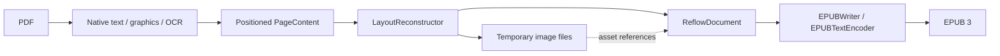

# Architecture

`PDFConverter` composes reconstruction and EPUB writing. It owns validation, the temporary
workspace, overall progress, cleanup and atomic publication. Its public API remains EPUB-only;
the internal reconstruction pipeline and document model are independent of the output format.
There is no application, UI, index, library-store or inference dependency.

The [OS 27 progress-composition evaluation](progress-composition.md) retains ordered,
awaited client callbacks and explicit publication completion; native progress trees remain
a possible client-side presentation choice.

## Two intermediate representations

Both representations are custom Swift values in memory. Neither is HTML, an XML DOM, a PDFKit
object graph or a serialized interchange file.

`PageContent` is the spatial extraction representation. Each physical page contains bounds,
positioned `TextLine` values, font sizes, monospaced/wrap hints, optional validated structure associations, graphic rectangles and fallback
flags. A text line contains `InlineText`: raw Unicode text runs with bold, italic, superscript and subscript style flags.
Geometry remains in unrotated PDF page coordinates with a bottom-left origin. This stage retains
the evidence needed to infer reading order, paragraphs, image crops and word joins.

`ReflowDocument` is the logical, output-independent representation:

| Value | Content |
| --- | --- |
| Metadata | Title, language and optional author |
| Ordered blocks | Paragraph, heading with logical identifier and level, preformatted text, page-bottom footnote, image, source-page boundary |
| Inline text | Text runs carrying bold/italic/superscript/subscript flags, interspersed with source-page boundaries |
| Image block | Logical asset identifier, alternative text and caption |
| Asset registry | Identifier, local file URL and image format |
| Block provenance | Physical source page where the block begins |

Source-page boundaries can occur inside a paragraph or a repaired word. They add no visible
text. This keeps navigation/provenance separate from typography. Hyphen repair edits the text
run itself; it never searches or edits markup. The same value model supports assertions about
reading order, styles and source boundaries without creating a publication.

The logical document deliberately has no XHTML, CSS, EPUB namespaces, ZIP paths or chapter file
boundaries. Raw `<`, `&` and other source characters stay raw until a writer escapes them for
its format. Headings currently form flat navigation; list markers and code use preformatted
blocks backed by the same `InlineText` runs as paragraphs. Preformatted reconstruction retains
native emphasis and scripts; inserted newlines/indentation are unstyled, and the EPUB writer
escapes raw text before adding inline elements inside `<pre>`. Equations and most tables preserved as images are image references, not reconstructed
math trees or semantic tables. A text table whose shaded rows and rules the layout can read is a
table block of rows and cells (header rows, column spans, styled cell text with source-page
boundaries) that the EPUB writer serializes as `<table>` (#54). Output independence does not
imply richer PDF understanding.

## Reconstruction boundary

`PDFReflowLibPipeline.reconstruct` returns the logical document plus conversion counts and warnings.
The caller supplies a workspace and keeps it alive until serialization finishes. The pipeline
can run without calling `EPUBWriter`, as the direct PDF-to-model test demonstrates.

`NativeTextReader` obtains PDFKit line selections, geometry and attributed runs; it immediately
copies text and style flags into values. A process-wide library lock serializes this synchronous
page-extraction step across converter instances to mitigate the observed PDFKit `NSFont` exception
under concurrent attributed extraction (#21). Cancellation is checked before acquisition,
between 50 ms timed waits while the lock is contended, and after acquisition. A cancelled
waiter can return while another extraction still holds the lock; a PDFKit call already
executing cannot be interrupted. The wait interval is not a hard cancellation-latency guarantee,
and each timed wait still blocks its worker thread. Concurrent imports trade extraction
throughput for serialization. The lock is released before
progress callbacks, OCR, graphics work and writing. It preserves attributed styles and does not
marshal work to the main actor. Host PDFKit calls outside `NativeTextReader` do not participate
in the lock, so this is a bounded mitigation rather than a framework-wide thread-safety guarantee.
See [the concurrency evidence](../measurements/pdfkit-concurrency/record.md) and
[contention cancellation evidence](../measurements/extraction-cancellation/record.md).

Explicit Core Text/Foundation baseline offsets preserve
inline scripts; tiny positioning noise and full-line OCR offsets do not become script styles.
Font size alone does not establish a superscript. A bounded native drop-cap pattern uses the
following body runs' font size and a top-aligned body-height `readingRect` for ordering. The
original `rect` remains the full ink bounds for graphic intersections and crop preservation;
paragraph-join geometry is unchanged. A lowered oversized single initial followed by substantial,
consistently sized, normal-baseline prose supplies the evidence. It is not an inline subscript.
Ambiguous styles, monospaced initials and missing native attributes do not supply this evidence.
Initial-word spacing and PDF structure-tag consumption are separate concerns. When adjacent similarly sized attributed runs
jump by more than the inline-script range and one carries a full-line offset, native extraction
inserts a missing word boundary. Existing whitespace and line-ending hyphens remain unchanged;
drop caps with different sizes and opposite inline scripts do not supply this evidence. This
handles PDFKit selections that concatenate multiple visual lines, not arbitrary within-line
spacing or OCR spelling repair. `NativeSpacingReader` scans a page's text-show operators for two
bounded word-boundary repairs: a Type3 TJ array whose tiny adjustment contradicts a PDFKit space
removes that space, and a font change on one baseline whose measured gap (simple-font Widths, Tm
scale, TJ adjustments) is at least 0.15 em between a letter or digit on either side inserts the
space PDFKit drops after a mathematical variable set in its own font (#43). Shows are decoded
through one-byte ToUnicode maps (bfchar and bfrange, ligatures and surrogate pairs) and must spell
the line exactly apart from PDFKit's own spaces; rotated shows, Form XObjects and fonts without
Widths or maps supply no evidence, and unsupported text state still disqualifies the page.
Object-only selections are discarded before attributed-string access
to avoid unnecessary PDFKit image-attachment decoding. `GraphicsReader` scans bounded Core Graphics paint
operations and nested Form XObjects. It resolves shading resources and bounds gradient regions
with conservative clipping, Form bounds and optional shading bounds. Core Graphics rasterizes
the original region; the model stores an image asset, not an editable gradient. Unsafe or
page-spanning bounds retain the page fallback. The reader also records every painted footprint
with whether it was a rectangle-only path (`re`, filled or stroked) painted outside `/Figure`
marked content. `TintDetector` then lets the page's text decide what those rectangles are (#54):
a cluster of them holding at least three wide prose lines that no solid ink touches, making up
at least a third of the block's lines, is a tinted text block (a sidebar frame, a tint band,
cell shading, or four thin strokes closing such a box). Its rectangles seed no crops; the thin
rules inside it that touch only each other are row and column separators; and solid ink inside
it keeps the block's full-width band between the prose above and below it as one image, so a
chart's axis labels that PDFKit cannot extract stay with the chart. A rectangle holding no
text, a bar chart, a flowchart node, a figure whose labels PDFKit merges into short fragments,
a box with fewer than three prose lines and a ruled grid whose cells are not shaded keep their
images exactly as before. The page-sized-graphic review signal still reads the painted regions
before tint removal. `OCRReader` uses Vision when policy requests it.
`StructureTreeReader` parses a separate Core Graphics document into value-only page/MCID
associations and exact owner paths. It checks structural parent links, page identity, RoleMap
resolution, duplicate references and bounded traversal; a false `MarkInfo/Marked` flag alone
is not grounds to discard a populated tree. No Core Graphics object survives the parsing pool.
ParentTree ownership is checked against those exact paths only when extracting the relevant
page, using `PDFPageSource`'s eight-page document window. Sparse ParentTree arrays can contain
many null slots; loading them all into one Core Graphics document causes avoidable peak memory.
`MarkedTextReader` matches explicitly positioned text-show origins to unique native line
rectangles. Unknown glyph-cursor advancement, Form XObjects, missing/duplicate MCIDs, ambiguous
geometry and incomplete groups retain spatial reconstruction. OCR and unverified image-backed
text do not inherit native tags. Origin matching is conservative association evidence, not full
font decoding or proof of the author's semantic correctness.

Supported roles are P and H1–H6 through grouping containers and transparent inline spans.
Complete groups can reorder only within uninterrupted tagged-text runs; unmatched lines and
preserved images are barriers. Captions, list-like text and headings of 200 or more characters
fall back as well. Removed furniture or image-contained lines invalidate incomplete groups.
Validated paragraph identities prevent heuristic cross-page joins into different paragraphs.
Heading levels belong to the neutral model and serialize as h1–h6; navigation remains flat.
`structureFallback` warns about partial/unsupported mapping. A document-wide tree warning is
attached to page 1 and describes document scope. Table/figure/alternate-text semantics, Form
content, generic H roles, general link ownership and arbitrary reading order remain unsupported.
Traversal is bounded to 200,000 visits and depth 64; association caps text anchors/lines at
10,000 each and rectangle comparisons at two million per page. Limit exhaustion uses fallback,
not partial ordering. Cancellation is checked during traversal and text scanning.

`LayoutReconstructor` handles whitespace cuts, paragraphs, styled word joins and
cross-page continuation. A paragraph continues across a source page when the previous page's
last body paragraph and the next page's first body paragraph, in reading order, meet the join
evidence: preserved images, figure captions and bare margin folios that furniture removal kept
are stepped over (and stay on their page, ahead of the joined paragraph); two different
validated paragraph identities refuse; the next text starts lowercase; the previous text lacks
terminal punctuation past closing quotes and superscript note markers; the previous paragraph's
last line reads as prose and fills its column (a justified column's shared right edge, three
quarters of a ragged column's measure, or a line-ending hyphen); the next paragraph's first line
is not a retained running header with a folio word; and no other prose lies below or right of
that last line or above or left of that first line, counting body-sized wide text inside a
preserved region so that a figure which swallowed the real neighbour blocks the join rather
than corrupting the text. A line that begins with a number or single letter followed by a
period or parenthesis and a space, or a number and parenthesis set tight against a minus sign
(`1)− 2`), is a preformatted list item unless it wraps an open paragraph: the
previous line must read as prose, end without terminal punctuation and reach a right edge
that at least three same-size lines of the column share within a quarter body size, and the
line must sit on the column's majority left edge (or outdent from an indented opening line)
at ordinary line spacing. Bullets never continue prose; ragged-right columns, hanging-indent
continuations and OCR lines that Vision marks as unwrapped keep the list representation.
`FootnoteDetector` recognizes page-bottom footnotes: a line of three or more dash characters
after at least three body-size lines, followed to the end of the page only by untagged
proportional lines at most 90% of that body size, in one column at close spacing, each note
opening with a superscript run of one to three digits that count up across the page. The
separator is dropped and each note becomes a footnote block after the body; a marker-less
first note is admitted only when the previous page ended in a footnote, and the pipeline then
joins it to that note with the page boundary inline, so the page's body follows the completed
note (`joinContinuedFootnote`); when `appendPage` has already joined the body across that
page, the boundary stays in the paragraph and the note simply absorbs the continuation. Body
continuation steps over footnote blocks, and a footnote block trailing the continued paragraph
is placed after the joined paragraph rather than ahead of it, because its reference sits inside
that paragraph and note text must not precede its marker; such a note is then reached from
the next page's anchor. A footnote beneath the previous page's last line does not count as
prose below it (`endsColumn`). Drawn rules, symbol markers, recognized or synthetic text
layers, images below the separator and any body-size line after it keep spatial prose. A body
marker that PDFKit detached past a justified line's right edge (one to three digits, below
80% of body size, starting where the line ends and raised inside its box) rejoins that line as
a superscript. Notes carry no reference links. Heading-size evidence excludes text already preserved inside images
when at least three remaining lines and 200 characters support the dominant reflowable font size.
Candidates within 10% of that supported body size are suppressed, while the original 25%
page-size threshold still applies. This retains existing modestly larger section headings. Short titles
beside images retain the existing page evidence. The separate page-size estimate still governs
whitespace cuts and paragraph geometry. Below that threshold, a section label set at least 15%
over the supported body (acmart's `ABSTRACT`, the 9/11 report's `1.1 INSIDE THE FOUR FLIGHTS`)
is a heading when it starts with a capital or digit, ends without sentence punctuation, has clear
space above it or continues a label of the same size, and is either set in capitals or shorter
than the column's prose; list markers, lone folios and pages with three or more folio-ending
labels (a contents page) are excluded, and the pieces of one heading row that PDFKit split at a
gap (`3.1` / `Limitations …`) join. The lines of a title set over several lines are one heading
when each stacks under the previous at the same size and ordinary heading leading, sharing the
left edge, the centre or the right edge, the heading so far does not end a sentence and the line
does not open a numbered or `Chapter N` heading of its own; a run of two or more such lines that
ends in terminal punctuation with at least eight words is a chapter opener's pull quote and
reflows as one paragraph; a line ending in a dot leader of four or more dots (with or without its
folio) is a contents entry and never a heading (#55). A chapter opener's display numeral that
PDFKit fuses with its title (a 70-point `1` before a 24-point `Overview …`) gives the line the
title's size, and a run at least twice the size of every run beside it is never a script, so the
numeral is neither a subscript nor the line's heading size. Each typographic heading block carries its font size; once
every page is reconstructed, the sizes of the whole document rank into tiers 7% apart, the
largest tier keeps level 2 and each smaller tier is one level deeper (to 6), so equal sizes get
equal levels on every page and a title outranks the author names beneath it, while tagged
headings keep their validated levels (#43). Text rotated a quarter turn extracts as a line far taller than wide; one along
at least a quarter of the outer margin of an otherwise horizontal page is a stamp and is omitted
with `furnitureRemoved`, while shorter rotated credits stay paragraphs and rotated text is never
a heading. An `Algorithm N` caption directly beneath a thin rule, over a second rule of the same
extent and a closing rule further down, makes the listing between those rules one preserved
region with the caption reflowed. This spatial fallback does not guarantee heading precision in arbitrary mixed layouts. `FurnitureDetector` removes short outermost margin rows supported by
at least three neighboring or alternating physical pages, stable vertical position and typography.
The top candidate band is the outer 20% of page height, which admits a slip opinion's running
head under a deep head margin (rows at 85% and 82%); the footer band remains 7% to retain existing
whitespace-cut behavior around illustrated rows. Textual headers require separation from inward
content. Beneath an outermost row made only of candidates, the next row inward (within three of
its line heights, at least half a line height clear of the body) is a second header row that is
removed only together with every line of the row above it, so a two-row head (title row with
folio, opinion row) goes as a unit and a repeated line beneath unrepeated titles stays.
Boundary page numbers use a consistent physical-page offset; numeric chapter-page folios retain their chapter prefix and use glyph height
so fallback font estimates do not break matching. Internal digits remain meaningful. Matching
body titles, nearby captions and a page's only text are retained. Each affected page reports
`furnitureRemoved`; clients can disable removal with `removeRepeatedHeadersAndFooters`.
This is conservative spatial evidence, not validated PDF tag consumption or a universal header
classifier. Synthetic invisible-text layers retain the established whole-document repeated-margin
rule in the outer 7%, because their typography does not supply native font evidence. Narrow whitespace cuts require substantial text on both sides, so
short name/description cells do not become independent prose columns. `TableRegionDetector`
recognizes aligned numeric dot-leader rows with a nearby textual header and preserves their
complete region with `imageRegion` warnings. It also recognizes borderless statistical tables
whose column headers are underlined: a row of at least three thin underlines, or one short
piece underlined whole away from the left margin, followed by at least three tightly leaded
rows carrying numbers, becomes one region. It does not infer general table semantics.
`ShadedTableDetector` reads a tinted block of shaded bands and the rules between them as a
table (#54): band edges and rules crossing half the block give the rows (rows reach beyond the
bands only where rules subdivide the rest of the box, so a title and introduction above the
first band stay outside), the lines' shared left edges give the columns, a single first-column
line that crosses the columns or sits on a full-width band of its own is a section row spanning
them, and a first row on its own band with text in two columns is the header, whose cells span
empty columns beside them. One pair of columns reads as one when PDFKit merged a narrow cell
into its neighbour, as the Fed's "Regulation (by letter and name)" header names it. Cell lines
join like paragraph lines. Text outside the rows, a body line crossing a column, a section row
in another size, fewer than two columns or two body rows leave the block to ordinary reflow.
Tinted boxes are read as units: their elements are ordered among themselves, the box follows
the lines beside it and precedes the lines below it, as its image did, and paragraphs never
join across its edge. Small text inside reflowed boxes and tables does not lower the heading
body-size estimate.
A thin painted rule beneath prose is that text's decoration and seeds no crop; a rule inside a
short mathematical line (a radical's vinculum, an exercise bar) or between a word-free term and
a term starting beneath it (a fraction bar) keeps those lines in one crop, and an isolated rule
remains a crop, as before. Rows of divisor bars beneath equations are not table headers. Whole-line expansion admits the lines a graphic
captures and the other pieces of their rows, then trims the crop away from lines it merely
touches. It does not chain from text line to text line through overlapping leading, so a
label underline, a column rule or an inline equation beside tightly leaded prose does not
absorb the paragraph or column (#36); a line whose rectangle genuinely overlaps admitted text
is still admitted whole rather than clipped. Graphic-region merging and expansion repeat until
the bounds stabilize, so a merged crop cannot cut through a newly intersecting text line.
Only text outside those regions reflows. `FractionRegionDetector` groups short horizontal bars with nearby compact
mathematical terms above and below, optionally including a nearby equation prefix. It leaves
long rules, prose, code and connected table grids to existing handling. Whole-line expansion
supplies the crop margin once; fraction detection does not repeatedly enlarge already complete
regions. Arbitrary mathematical structures remain outside this bounded detector. Attachment placeholders become word boundaries at native extraction,
with empty selections discarded before layout, vocabulary, OCR selection and coverage counting.

Existing text over a graphic covering more than 75% of the page gets `unverifiedTextLayer` and
an accompanying source-page image under the default reference policy. This conservative review signal does not establish that
text is OCR, detect every corrupted layer, or assess individual table cells. Fresh OCR keeps
its separate `ocrUsed` notice; image-only fallbacks keep `pageImageFallback`.

`TextEncodingCheck` covers the born-digital counterpart: a simple font in the page resources
(or a nested Form) with a `Differences` encoding of index-style glyph names and no `ToUnicode`
map is structural evidence read from the Core Graphics page dictionary, and an embedded English
function-word list plus a 300-pair common-bigram table judge the extracted words. Both must
agree before extraction reports `damagedTextEncoding`, makes the page an OCR candidate under
automatic policies, recommends a source-page reference and withholds the page's words from the
hyphen-repair vocabulary. No glyph programs are decoded and no network or model is involved.

`GraphicsReader` tracks text rendering mode across saved graphics state and nested forms. When
all observed text uses invisible mode 3 and a graphic covers most of the page, extraction skips
attributed text and marks the page's typography as synthetic. Layout then uses ordinary prose
rather than Courier/code or font-size heading inference; numbered lists retain their existing
representation. Mixed visible/invisible text, text clipping and unsupported streams do not enter
this path. Source images and unverified-layer warnings remain. This does not recover headings
from the scan or correct inherited transcription, and it is not a PDFKit leak fix.

`PageRasterizer` renders source-composited regions to bounded rasters. Client policy independently
selects PNG, JPEG quality, or the smaller encoding for full-page images and cropped regions.
The asset registry records the actual format and file URL; the writer uses matching extensions
and MIME types. Encoding selection retains at most one raster and two candidate files at a time.
Supplementary reference policy is independent of mandatory fallback pages and region preservation.
Omitted recommended references have explicit warnings that refer to the source PDF.
See [conversion options](conversion-options.md). Whole-page crop/rotation is
computed in page units, with explicit scaling to raster pixels. Annotation drawing compensates
for PDFKit's own crop/rotation transform so annotations and source content share coordinates.

`PDFPageSource` reopens the PDF in eight-page windows and between extraction and reconstruction.
Synchronous page work drains autoreleased objects. Image-only fallbacks skip unused formatting
extraction. These limits reduce retained work without imposing a hard cap on Apple framework
allocations or fixing the attributed-text framework leak.

## Two passes over the pages

`PDFReflowLibPipeline.reconstruct` runs extraction as one pass that keeps only document-wide
evidence: the hyphen-repair vocabulary, margin-furniture candidates, note-heading pages, chapter
matches and the running character budget. Each extracted page is handed to a `PageStore`.
Reconstruction is a second pass that loads one page at a time and needs only that page and
its stripped predecessor for cross-page continuation. `FurnitureDetector` is phased to match:
`collect` records one page's candidates, `resolve` decides removals from the whole ledger, and
`apply` edits one page. Its `strip` entry point runs the same phases over an array, so the
array and streamed paths cannot diverge. Furniture warnings keep their position between
extraction and reconstruction warnings.

`PageStore` encodes each extracted page as a binary property list in the workspace and
reloads it once during reconstruction, removing the file on reload and the directory when
reconstruction finishes, so the workspace holds only assets afterwards. Equal values share one
slot in that encoding, so a negative zero can reload as positive zero; no reconstruction step
reads the sign of zero. The structure index is released after extraction. The
[page-retention measurement](../measurements/page-retention/record.md) compared this spill
store with keeping pages resident and with repeating extraction: all three produced
byte-identical output against the pre-change converter on the complete corpus, and spilling
had the lowest peak footprint on every book where retained pages matter, on the Mac and on a
physical iPhone. The alternatives were retired afterwards; the measured sources are retained
as a patch beside the record. The logical blocks still accumulate until writing finishes;
streaming them to the writer is separate work.

## Serialization and resource lifetime

Assets live under a neutral workspace directory, outside the EPUB layout. The model holds URLs
and identifiers, not decoded images or large byte buffers. `EPUBWriter` assigns safe archive
paths from counters and streams those files directly into ZIP entries; it does not copy the
whole image collection into another staging tree. Asset identifiers are opaque and cannot
choose archive paths. Model validation rejects missing/duplicate assets and empty documents.

`EPUBTextEncoder` owns XML escaping, style tags, page markers and figure markup. `EPUBWriter`
owns spine splitting, heading/page navigation, OPF metadata, CSS, resource naming and
ZIPFoundation packaging. It accepts a `ReflowDocument` and an output-size ceiling, with no PDF
or OCR dependency. EPUB progress is combined with pipeline progress by `PDFConverter`; only
publication emits completion. Each stage checks cancellation at its available boundaries.
The writer serializes each block once and writes completed spine documents as it goes. It keeps
one current body string plus navigation/filename lists; it does not first build a second collection
of all chapter blocks. Packing checks the complete UTF-8 body markup against a 60,000-byte target
before admitting a block. A standalone source-page marker travels with the following content;
inline markers retain their exact location. A short trailing run of headings (at most 6,000 bytes)
moves with its navigation entries into the next document instead of ending the previous one, and
stays with an oversized block that follows it. Other oversized individual paragraphs, headings, code
blocks or figures occupy their own document without being split or losing styles. This is a soft body-size
target, excluding document metadata, and is not a memory ceiling.

`ChapterBoundaryReader` separately admits a conservative bookmark scheme: at least two
root-level English `Chapter 1 ...` through `Chapter N ...` entries, consecutive Arabic numbers
and strictly increasing local destination pages. Local direct/named destinations and GoTo
actions are supported. Missing, remote, duplicate or backward chapter destinations reject the
sequence. Nested, Roman-numbered, unnumbered and other-language schemes keep ordinary packing.
Each candidate additionally needs its chapter number and full title on adjacent native text
lines among the first six lines in the upper half of its page. Matching normalizes whitespace
and case, permits a publication-name prefix, and rejects freshly recognized pages and exclusively
invisible image-backed text. It does not detect every inherited OCR layer.
Only matching candidates become chapter boundaries. This is a bounded supported scheme, not
general bookmark interpretation or heading classification.

The logical document carries these physical chapter-start pages; reconstruction keeps their
source markers standalone and prevents cross-boundary paragraph joins. The writer flushes the
preceding document before each such marker, then applies the same byte-size subdivisions within
the chapter. Existing heading/page navigation resolves to the resulting files. Bookmarks do
not manufacture headings or new link semantics. Vocabulary and furniture evidence remain
document-wide; whether positioned pages stay resident is the retention strategy described above.
Progress reports serialization work by input blocks, then metadata completion and archive entries.
The reconstruction endpoint is clamped to its allocated fraction so floating-point rounding cannot
make the first writing update step backward.

The entry-byte budget remains independent of an optional final ZIP-file cap. `PDFConverter`
checks final archive size before publication and uses the same cleanup path on failure.

The model is internal, `Sendable` and `Equatable`. It has no public persistence or compatibility
promise. Another writer can consume it without changing extraction/reconstruction; a public
non-EPUB API or a persistent model would need an explicit resource-lifetime contract. There is
no speculative writer registry or additional export format.

The real-document corpus starts with the FAA handbook, including known fidelity defects and a
Mac memory gate. Broader qualification needs source-derived reading order, text/image coverage
and physical-device measurements. Tagged-PDF semantics, richer structure and stronger detection
belong in reconstruction; new output syntax belongs in writers.

Development corpus acquisition is separate from the Swift runtime. A standard-library Python
fetcher reads pinned URLs, byte counts and SHA-256 identities from `corpus/manifest.json` and
atomically publishes verified PDFs into ignored `corpus/cache/`. Cache hits are reverified;
failed refreshes leave existing copies intact. Conversion and tests remain offline unless a
developer explicitly runs the fetcher. Corpus licenses and owner clearance are separate from
the library's MIT license.

Repository source and test directories follow SwiftPM conventions: `Sources/PDFReflowLib/`,
`Sources/PDFReflowLibCLI/` and `Tests/PDFReflowLibTests/`. Supporting directories and the
`fixtures/` test-resource directory use lowercase names. Public module and product names remain
unchanged. Recorded measurement outputs retain historical paths and hashes from their measured builds.

Opt-in corpus quality signaling is checked separately from EPUB validity and resource limits.
`tools/check_corpus_quality.py` applies manifest expectations to a real-document evaluation:
page-specific warnings on a valid conversion, or an explicitly approved quality-refusal diagnostic
with no published output or false completion. The converter currently has no quality-refusal API;
this development contract exposes gaps without changing runtime behavior.
