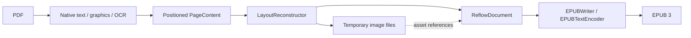

# Architecture

`PDFConverter` composes reconstruction and EPUB writing. It owns validation, the temporary
workspace, overall progress, cleanup and atomic publication. Its public API remains EPUB-only;
the internal reconstruction pipeline and document model are independent of the output format.
There is no application, UI, index, library-store or inference dependency.

## Two intermediate representations

Both representations are custom Swift values in memory. Neither is HTML, an XML DOM, a PDFKit
object graph or a serialized interchange file.

`PageContent` is the spatial extraction representation. Each physical page contains bounds,
positioned `TextLine` values, font sizes, monospaced/wrap hints, graphic rectangles and fallback
flags. A text line contains `InlineText`: raw Unicode text runs with bold/italic style flags.
Geometry remains in unrotated PDF page coordinates with a bottom-left origin. This stage retains
the evidence needed to infer reading order, paragraphs, image crops and word joins.

`ReflowDocument` is the logical, output-independent representation:

| Value | Content |
| --- | --- |
| Metadata | Title, language and optional author |
| Ordered blocks | Paragraph, heading with logical identifier, preformatted text, image, source-page boundary |
| Inline text | Text runs carrying bold/italic flags, interspersed with source-page boundaries |
| Image block | Logical asset identifier, alternative text and caption |
| Asset registry | Identifier, local file URL and image format |
| Block provenance | Physical source page where the block begins |

Source-page boundaries can occur inside a paragraph or a repaired word. They add no visible
text. This keeps navigation/provenance separate from typography. Hyphen repair edits the text
run itself; it never searches or edits markup. The same value model supports assertions about
reading order, styles and source boundaries without creating a publication.

The logical document deliberately has no XHTML, CSS, EPUB namespaces, ZIP paths or chapter file
boundaries. Raw `<`, `&` and other source characters stay raw until a writer escapes them for
its format. Headings currently form flat navigation; list markers and code use preformatted
blocks. Tables/equations preserved as images are image references, not reconstructed semantic
tables or math trees. Output independence does not imply richer PDF understanding.

## Reconstruction boundary

`PDFReflowLibPipeline.reconstruct` returns the logical document plus conversion counts and warnings.
The caller supplies a workspace and keeps it alive until serialization finishes. The pipeline
can run without calling `EPUBWriter`, as the direct PDF-to-model test demonstrates.

`NativeTextReader` obtains PDFKit line selections, geometry and attributed runs; it immediately
copies text and style flags into values. Object-only selections skip attributed-string access
to avoid unnecessary PDFKit image-attachment decoding. `GraphicsReader` scans bounded Core Graphics paint
operations and nested Form XObjects. It resolves shading resources and bounds gradient regions
with conservative clipping, Form bounds and optional shading bounds. Core Graphics rasterizes
the original region; the model stores an image asset, not an editable gradient. Unsafe or
page-spanning bounds retain the page fallback. `OCRReader` uses Vision when policy requests it.
`LayoutReconstructor` handles furniture, whitespace cuts, paragraphs, styled word joins and
cross-page continuation. `PageRasterizer` renders source-composited regions to bounded PNGs.

`PDFPageSource` reopens the PDF in eight-page windows and between extraction and reconstruction.
Synchronous page work drains autoreleased objects. Image-only fallbacks skip unused formatting
extraction. Spatial pages and vocabulary are released when the pipeline returns; the logical
blocks remain until writing finishes. These limits reduce retained work without imposing a
hard cap on Apple framework allocations or fixing the attributed-text framework leak.

## Serialization and resource lifetime

Assets live under a neutral workspace directory, outside the EPUB layout. The model holds URLs
and identifiers, not decoded images or large byte buffers. `EPUBWriter` assigns safe archive
paths from counters and streams those files directly into ZIP entries; it does not copy the
whole image collection into another staging tree. Asset identifiers are opaque and cannot
choose archive paths. Model validation rejects missing/duplicate assets and empty documents.

`EPUBTextEncoder` owns XML escaping, style tags, page markers and figure markup. `EPUBWriter`
owns chapter splitting, heading/page navigation, OPF metadata, CSS, resource naming and
ZIPFoundation packaging. It accepts a `ReflowDocument` and an output-size ceiling, with no PDF
or OCR dependency. EPUB progress is combined with pipeline progress by `PDFConverter`; only
publication emits completion. Each stage checks cancellation at its available boundaries.

The model is internal, `Sendable` and `Equatable`. It has no public persistence or compatibility
promise. Another writer can consume it without changing extraction/reconstruction; a public
non-EPUB API or a persistent model would need an explicit resource-lifetime contract. There is
no speculative writer registry or additional export format.

The real-document corpus starts with the FAA handbook, including known fidelity defects and a
Mac memory gate. Broader qualification needs source-derived reading order, text/image coverage
and physical-device measurements. Tagged-PDF semantics, richer structure and stronger detection
belong in reconstruction; new output syntax belongs in writers.

Development corpus acquisition is separate from the Swift runtime. A standard-library Python
fetcher reads pinned URLs, byte counts and SHA-256 identities from `Corpus/manifest.json` and
atomically publishes verified PDFs into ignored `Corpus/cache/`. Cache hits are reverified;
failed refreshes leave existing copies intact. Conversion and tests remain offline unless a
developer explicitly runs the fetcher. Corpus licenses and owner clearance are separate from
the library's MIT license.
