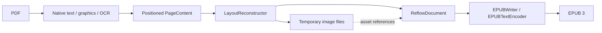

# Architecture

`PDFConverter` composes reconstruction and EPUB writing. It owns validation, the temporary
workspace, overall progress, cleanup and atomic publication. Its public API remains EPUB-only;
the internal reconstruction pipeline and document model are independent of the output format.
There is no application, UI, index, library-store or inference dependency.

The [OS 27 progress-composition evaluation](progress-composition.md) retains ordered,
awaited client callbacks and explicit publication completion; native progress trees remain
a possible client-side presentation choice.

## Two intermediate representations

Both representations are custom Swift values in memory. Neither is HTML, an XML DOM, a PDFKit
object graph or a serialized interchange file.

`PageContent` is the spatial extraction representation. Each physical page contains bounds,
positioned `TextLine` values, font sizes, monospaced/wrap hints, optional validated structure associations, graphic rectangles and fallback
flags. A text line contains `InlineText`: raw Unicode text runs with bold, italic, maths italic, superscript and subscript style flags.
The one exception to raw text is the Latin ligatures U+FB00–U+FB06, which extraction writes as the
letters they join (`ff` as `ff`, `ſt` as `ſt`; `InlineText.spellingOutLigatures`, #189). Native
extraction does it as its last step, because the steps before it match line text to the page's
shows, where a ligature is one character; recognized lines and the PDF's own title are spelled
out too. So no rule and no writer sees a presentation form, and a reading font without one
(Charter, Times New Roman, Avenir Next) never falls back to another font inside a word.
Geometry remains in unrotated PDF page coordinates with a bottom-left origin. This stage retains
the evidence needed to infer reading order, paragraphs, image crops and word joins.

`ReflowDocument` is the logical, output-independent representation:

| Value | Content |
| --- | --- |
| Metadata | Title, language and optional author |
| Ordered blocks | Paragraph, heading with logical identifier and level, preformatted text, list item, page-bottom footnote, image, source-page boundary |
| List item | Text without its printed marker, the marker, the printed number of a numbered item, kind (bulleted or numbered), depth and whether it opens a list element |
| Inline text | Text runs carrying bold/italic/maths-italic/superscript/subscript flags, interspersed with source-page boundaries |
| Image block | Logical asset identifier, alternative text, provenance and, for a crop read as mathematics, its MathML expressions (#190) |
| Asset registry | Identifier, local file URL and image format |
| Block provenance | Physical source page where the block begins |

Source-page boundaries can occur inside a paragraph or a repaired word. They add no visible
text. This keeps navigation/provenance separate from typography. Hyphen repair edits the text
run itself; it never searches or edits markup. The same value model supports assertions about
reading order, styles and source boundaries without creating a publication.

The logical document deliberately has no XHTML, CSS, EPUB namespaces, ZIP paths or chapter file
boundaries. Raw `<`, `&` and other source characters stay raw until a writer escapes them for
its format. Headings currently form flat navigation. Code, coded weather reports and list-shaped
lines the list pass does not verify use preformatted blocks, and verified bulleted and numbered
runs use list items (#194); both are backed by the same `InlineText` runs as paragraphs. Preformatted reconstruction retains
native emphasis and scripts; inserted newlines/indentation are unstyled, and the EPUB writer
escapes raw text before adding inline elements inside `<pre>`. Equations and most tables preserved as images are image references, not reconstructed
math trees or semantic tables. A text table whose shaded rows and rules the layout can read is a
table block of rows and cells (header rows, column spans, styled cell text with source-page
boundaries) that the EPUB writer serializes as `<table>` (#54). A table's own title and description
are caption paragraphs of that block, serialized as `
` elements of the table's `<caption>`, not
headings or prose before it (#113). A body cell that names its row is a row-header cell, serialized
as `<th scope="row">`; a borderless table with capital column headings is a table block too (#121),
and so is a table whose columns only their alignment draws, under a header (#150).
A section row, one header cell spanning every column, names the rows beneath it: it opens its own
`<tbody>` and is serialized as `<th scope="rowgroup">` (#124).
Output independence does not
imply richer PDF understanding.

## Reconstruction boundary

`PDFReflowLibPipeline.reconstruct` returns the logical document plus conversion counts and warnings.
The caller supplies a workspace and keeps it alive until serialization finishes. The pipeline
can run without calling `EPUBWriter`, as the direct PDF-to-model test demonstrates.

`NativeTextReader` obtains PDFKit line selections, geometry and attributed runs; it immediately
copies text and style flags into values. A process-wide library lock serializes this synchronous
page-extraction step across converter instances to mitigate the observed PDFKit `NSFont` exception
under concurrent attributed extraction (#21). Cancellation is checked before acquisition,
between 50 ms timed waits while the lock is contended, and after acquisition. A cancelled
waiter can return while another extraction still holds the lock; a PDFKit call already
executing cannot be interrupted. The wait interval is not a hard cancellation-latency guarantee,
and each timed wait still blocks its worker thread. Concurrent imports trade extraction
throughput for serialization. The lock is released before
progress callbacks, OCR, graphics work and writing. It preserves attributed styles and does not
marshal work to the main actor. Host PDFKit calls outside `NativeTextReader` do not participate
in the lock, so this is a bounded mitigation rather than a framework-wide thread-safety guarantee.
See [the concurrency evidence](../measurements/pdfkit-concurrency/record.md) and
[contention cancellation evidence](../measurements/extraction-cancellation/record.md).

A run is bold when PDFKit's font name contains `bold`, or when the page's own font resource
drawing it is bold (#125). PDFKit names an embedded font only when the system has one by that
name (every Fed, 9/11, Wallace, Our Flag, DGA and NOAA run reports `Helvetica`), and runs in two
embedded fonts of one colour merge. `FontWeightReader` scans a page's text shows, following Form
XObjects, and classifies each font resource: a `BaseFont` naming a bold weight (`Bold`, `Demi`,
`Dm`, `Semibold`, `SemiBd`, `Heavy`, `Black`, TeX's `cmbx`/`cmmib`/`dcbx`, Libertine's `TB`/`TZ`) is bold unless a
descriptor `FontWeight` below 500 contradicts a weight other than `Bold`; a name stating a lighter
weight (`Book`, `Medium`, `Light`, `Regular`) is never bold; a name stating none is bold for
`FontWeight` 600 or more or the `ForceBold` flag. `StemV` is not used. A PDFKit line is marked only
where its shows (origin in the line's bounds; a show inside several lines' bounds belongs to a
clearly tighter one) explain it: the leftmost starts within half an em of the line's edge, and
either every show is one bold weight or the shows' decoded text spells the line, giving
each character its weight. Whitespace follows PDFKit's run, a display initial or numeral gains no
emphasis, and anything else is left as PDFKit read it. See
[the font weight evidence](../measurements/font-weight-detection/record.md).

A run is italic in the same way when its font resource sets italic text (#133): a name stating
`Italic`, `Oblique`, `Kursiv` or a style-suffix `It` (`BkIt`), a TeX, EC or cm-super italic or
slanted shape (`cmti`, `cmsl`, `dcti`, `SFTI`) or Libertine's `TI`; for a name stating neither
slope nor roman, the descriptor's `Italic` flag or an `ItalicAngle` of 5° or more, unless the font
is symbolic or a script face. Maths italic (`CMMI`, `LibertineMathMI`, `NewTXMI`, `txmi`) sets
variables, not emphasis, so it is never italic; it is a style of its own (#142, below). The shows decode through a simple font's ToUnicode
map under any codespace, a Type1 font's WinAnsi encoding where it has no map (Wallace), an
`Identity-H` composite font's two-byte map (DGA, NOAA), or the characters established for an
index-glyph font (Census, #143), so a line mixing styles is marked character
by character; a style every show on a line shares needs no decoding. A leading marker without a
letter or digit in a style its item does not share (DGA's bold `+` bullets) gains no emphasis.
A run set in a maths italic font carries a **maths italic** style of its own, which
`EPUBTextEncoder` writes `<i>` (#142). That element was chosen over the two alternatives on the
evidence available: `<em>` states spoken stress, which a variable is not and which assistive
reading would voice, and `<var>` asserts a named variable of a program or an expression, which a
maths italic font alone does not establish. `<i>` states the slope and nothing more, which is
exactly what the font states. A character that already slopes needs no element, so the style is
read only where the font's map gives an ordinary letter: TeX's Computer Modern draws Wallace's
`x` and `y` as plain letters, while newtx gives arXiv's `RepCl` as Mathematical Alphanumeric
Symbols (U+1D400–U+1D7FF, with Letterlike Symbols filling that block's holes). A maths font also
sets relations and punctuation (`.`, `,`, `=`), which are upright notation, so a show without a
letter is left alone, and a maths italic line whose shows do not spell it is left unmarked.
Marking part of a run would split it, and every baseline and script rule reads a run's
neighbours, so the pieces PDFKit reported as one run are measured as one and written apart only
when the line's styles are known.

`EPUBTextEncoder` writes adjacent runs of one style as one element
(`<strong>FAA-H-8083-25C</strong>`), nesting where they share a style rather than repeating it
(`<strong><em>Demand</em> Shocks</strong>`, #142); ``/`` enclose `<strong>`, which
encloses `<em>`, which encloses `<i>`. A line join contributes a space of its own that carries
no style; between two runs it takes the bold and italic they share, so the text either side of it
is one element. A raised or lowered space would move, so it takes nothing where an outer element
would still divide it. See [the font style evidence](../measurements/font-style-detection/record.md)
and [the maths italic and nesting evidence](../measurements/math-italic-and-nesting/record.md).

Explicit Core Text/Foundation baseline offsets preserve
inline scripts; tiny positioning noise and full-line OCR offsets do not become script styles.
Font size alone does not establish a superscript. PDFKit can measure a split piece's baseline on
the note marker it holds (9/11 page 362's `”12`, after a closing quote kerned back over the
period): a piece of closing punctuation uniformly lowered by 0.2–0.5 of its size, each followed
by a one- to three-digit run at 0.4–0.7 of that size at offset zero, is re-measured from the
punctuation, so the marker reads as raised (#11). A shifted run needs another visible run of at
least nearly its size in its selection (#138). PDFKit measures every run from one baseline, so a
script beside a base that is itself shifted (Wallace page 255's denominator `6a²b`, 7.8 points below
the comment beside it) is measured from that base: a run followed, with no space, by a clearly
smaller run shifted to the same side and against it is the base and no script, and a base-size run
after the script on the base's baseline resumes it; a base that is itself a smaller script of the run
before it (a nested index) keeps the stated offsets (#144). A line's opening bullets and the spaces
after them are never scripts (#144). Reconstruction attaches such a piece, on the
previous line's row and within half a body size of its end, to that line without a space, as it
attaches a detached digit marker. A bounded native drop-cap pattern uses the
following body runs' font size and a top-aligned body-height `readingRect` for ordering. The
original `rect` remains the full ink bounds for graphic intersections and crop preservation;
paragraph-join geometry is unchanged. A lowered oversized single initial followed by substantial,
consistently sized, normal-baseline prose supplies the evidence. It is not an inline subscript.
Ambiguous styles, monospaced initials and missing native attributes do not supply this evidence.
Reconstruction joins such an initial to its word, removing the space glyph Our Flag draws after it (`T he` → `The`, #135); `A`, `I` and `O` keep the space only when the book spells the fragment as a word and never the joined word, and a drop-cap line adds its joined word, not its fragment, to the hyphen vocabulary ([drop-cap word evidence](../measurements/drop-cap-words/record.md)). PDF structure-tag consumption is a separate concern. When adjacent similarly sized attributed runs
jump by more than the inline-script range and one carries a full-line offset, native extraction
inserts a missing word boundary. Existing whitespace and line-ending hyphens remain unchanged;
drop caps with different sizes and opposite inline scripts do not supply this evidence. This
handles PDFKit selections that concatenate multiple visual lines, not arbitrary within-line
spacing or OCR spelling repair. `NativeSpacingReader` scans a page's text-show operators for bounded
word-boundary repairs: a Type3 TJ array whose tiny adjustment contradicts a PDFKit space
removes that space, and a font change on one baseline whose measured gap (simple-font Widths, Tm
scale, character and word spacing, TJ adjustments that precede a string; a trailing adjustment or
character spacing moves no glyph of its show) is at least 0.15 em between a letter or digit on
either side inserts the space PDFKit drops after a mathematical variable or digit set in its own
font (#43; Wallace's CMR12 digits before EC-font prose, #110). Same-font spaces are inserted in two
forms (#119, the 9/11 report). Inside one show that sets nonzero `Tc` or `Tw` (a justified
Distiller line), a TJ adjustment between two glyphs with no space glyph is a word space when
min(adjustment, adjustment + Tc) reaches the book's word-space mode: 0.066 em before a letter,
digit or `(`, or 0.005 em before an overhanging `A T V W Y` or opening quote after a lowercase
letter or punctuation, where the space's kern falls into the gap; a period or colon between digits,
mathematical letters and letter-spaced one-glyph runs are excluded. And a raised show of one to
four digits at most 0.8 of the next show's size, followed by a capital at a 0.066 em gap of its
own size, is a note reference whose space PDFKit drops. PDFKit keeps every space glyph and spaces
adjustments from about 0.14 em, so only narrower ones are repaired. A sentence space that the kern
before a capital absorbs entirely (`casualties.The`, #128) has no gap, so in the same justified shows
a character rule decides it: sentence punctuation after a word (`. , ; : ? !`, optionally closing
quotes or brackets) before a capital not followed by a period or an opening quote before a letter,
excluding apostrophes after a letter, ellipses, addresses, an initial before a short capitalized
abbreviation (`H.Doc.`) and a number that opens its show (`10.August`), at gaps of -0.15 to 1 em.
The rule also crosses show boundaries on one baseline (a semibold speaker label, `FAA:|Yes.`) and
completes a word that an italic title or a split show cuts off (`Encyclopedia|.Six`). A chained
initial (`C.|A.`) takes the letter threshold. #120 adds three bounded repairs: a show that continues
the text cursor is placed from the previous show's measured advance, spacing and adjustments
included; a two-glyph show whose character spacing is 0.5–10 em splits there (FAA's chart tables,
`(52)` at 1.465 em; letter-spacing stays at or below 0.2 em); and the font-change rule accepts
`) ] , ; :` that close a word or formula before a letter (Wallace's `6)|when`). Where a TJ array's
adjustments offset a character spacing of 0.1 em or more by at least half of it (the Census
report's Distiller, Tc 0.46 em with +446 between letters, #143), a gap is adjustment plus spacing,
a zero adjustment is a boundary, and two glyphs of one string stand the spacing apart (at most
1 em). Shows are decoded
through one-byte ToUnicode maps (bfchar and bfrange, ligatures and surrogate pairs; for a simple
font, Adobe PDF Library's one-byte entries under a `<0000> <FFFF>` codespace are read as one byte,
as `MarkedTextReader` reads its space codes, #104), or, for a Type1 font with no ToUnicode map,
through a `WinAnsiEncoding` (codes 32–126 as ASCII, `Differences` names from a small glyph-name
table, #110), or through the characters `GlyphIndexDecoder` established for an index-glyph font
(#143), and must spell
the line exactly apart from PDFKit's own spaces (a trailing source space glyph PDFKit trims is
allowed). Where PDFKit splits one show's row into several lines (9/11 page 254's `…had
arrived.Hawsawi ` and a line `told` of its own, #177), the line is read as a piece of its row: the
pieces on its baseline side by side, no gap wider than a line's height unless a show that starts in
the left piece measures past the right one's start (the appendix's name and description columns,
page 455), whose shows each belong to
one piece alone and together spell the pieces joined by a space; the row's spaces are read as one
line's, and each piece takes those inside its own text. A soft hyphen (U+00AD) the last show draws
at a line's end and PDFKit leaves out is put back when the shows otherwise spell the line, any
whitespace PDFKit sets standing for a space glyph (#177, Our Flag's line-end hyphens). Letter-spaced
type that PDFKit spells a space apart reads whole (#198, FAA page 410's `( M i l e s )`): a run of
at least three glyphs of one show, most of them letters and none a space or a mathematical operator, whose
gaps (character and word spacing plus adjustments) are equal within 0.02 em and between 0.1 and
0.5 em, standing whole-word apart from its neighbours (a space glyph, an operator, the show's edge
or a gap 0.05 em wider), loses the spaces PDFKit sets between its characters where the run appears
exactly once in the line holding its first glyph, and the line's other repairs then read it whole.
Justified TeX's one-letter word between two equal word spaces (`d|o a q|uick`) is not whole-word
apart, and the 9/11 report's spaced ellipses (`need . . . a`) are mostly periods. Rotated shows, Form XObjects and fonts without Widths or maps supply no evidence, Type3
space removal ignores shows with character or word spacing, and unsupported text state still
disqualifies the page: a `gs` whose ExtGState sets a font or does not resolve, nonzero `Ts`, `Tr`,
`Tz`, `Tc` or `Tw` beyond 1000 units, and a show without its own positioning that follows a show
without complete widths.
A line that only overprints another — the same text in the same size on the same rectangle to
within a twentieth of a point — is dropped before anything reads the page (#165). A source can
stack two text boxes with the same words in one place: the Earthdata deck, exported from Google
Slides, keeps each build step's boxes on the finished slide, so slides 13–21 draw `Cumulus` once
alone and once above `Data` / `Archive`, and slides 19 and 20 draw `End-User` / `Interpretation`
twice over; Blue Book page 25 returns one scan artefact four times. The second drawing lands glyph
for glyph on the first and adds no ink, but PDFKit returns a line for each and reflow read them as
separate paragraphs. Fake bold drawn twice offsets its copy by a fraction of an em, well past this
tolerance, and a word genuinely repeated on a page has its own rectangle, so both keep two lines.
Object-only selections are discarded before attributed-string access
to avoid unnecessary PDFKit image-attachment decoding. `GraphicsReader` scans bounded Core Graphics paint
operations and nested Form XObjects. It resolves shading resources and bounds gradient regions
with conservative clipping, Form bounds and optional shading bounds. Core Graphics rasterizes
the original region; the model stores an image asset, not an editable gradient. Unsafe or
page-spanning bounds retain the page fallback. A path's, image's or form box's footprint is only
the part the clip in force lets show (the clip is a conservative bounding rectangle, so no visible
mark is lost), and a path or image wholly outside its clip paints nothing: illustrations routinely
draw streamlines, arrows, photographs and maps far beyond the frame that clips them, and their raw
extents claimed the column beside the figure (#77, #98, #52). The same clipped footprints feed the
page-sized-graphic signal, so an image merely placed larger than the page no longer marks a page
image-backed. A form's box records no footprint of its own where the form's own paints already
cover it, which marks the widest of them `grouped` instead (#158): a drop shadow, a tint or an
opacity effect makes InDesign wrap one object in a transparency group whose box is exactly what it
paints, and that box read as solid ink over the prose on it, so a magazine's masthead box, caption
band and pull quote could not be read as decoration. The box is the object grown by its effect's
spread, so "cover" means within two points or over nine tenths of the box's area (#181): NOAA's
overview pages wrap their 30%-opacity corner art in a group whose feathered box stands eight points
above the art, and that border read as ink over the left column, a sub-heading and a figure's
captions (page 48). A box that keeps more than a tenth of itself beyond its paints is still recorded.
A shading painted across the whole page is
recorded like any other paint rather than forcing the page image: it is the page's background, and
the page-sized-graphic signal takes it from there, so the magazine's boxed-title articles reflow
with a source-page reference instead of losing their title and text to an image. The reader also
records every painted footprint
with whether it was a rectangle-only path (`re`, filled or stroked) painted outside `/Figure`
marked content. `TintDetector` then lets the page's text decide what those rectangles are (#54):
a cluster of them holding at least three wide prose lines that no solid ink touches, making up
at least a third of the block's lines, is a tinted text block (a sidebar frame, a tint band,
cell shading, or four thin strokes closing such a box). Its rectangles seed no crops; the thin
rules inside it that touch only each other are row and column separators; and solid ink inside
it keeps the block's full-width band between the prose above and below it as one image, so a
chart's axis labels that PDFKit cannot extract stay with the chart. A rectangle holding no
text, a bar chart, a flowchart node, a figure whose labels PDFKit merges into short fragments,
a box with fewer than three prose lines and a ruled grid whose cells are not shaded keep their
images exactly as before, unless the table reader reads that grid as a text table with a header
on its own band and two body rows, no ink inside and no text below or beside it (Fed page 46's
Table 3.1, #65). PDFKit returns such a table's cells on one baseline as one line, so extraction
first finds the grid's column joints (collinear rule segments abutting at the same x in at least
three rule rows) and splits a line crossing a joint where PDFKit's own rectangle selections show
at least one em of whitespace around it and the pieces spell the line exactly; titles and prose
crossing a joint have only word spaces and stay whole. A borderless table's merged rows are split
the same way without rules (#121, FAA page 131): where PDFKit keeps one row's two short cells apart
(two to ten ems, each at most fifteen ems wide), the rows chained to that pair at no more than 1.8
ems' leading, in the same size, are read against that gap, and their crossing lines are cut where
the selections show two ems of whitespace, only when the run opens with a heading in capitals on
both sides, at least three rows hold text on both sides, an em of whitespace is common to every
row and nothing painted lies within it. A table of aligned columns under a header (#150, Census's
`rnkswp05 0.8861 0.9620`, FAA page 410's `T 12,000' and below 25`) is split last: where at least
three lines end in a number at one right edge, the lines around them are measured glyph by glyph
into words, `ColumnGrid` reads the words' grid (below), and each line whose words fall into more
than one cell is cut between them. A cell takes its words' share of the line's own styled,
repaired text when the line has one word per glyph word (PDFKit's selections inside a Census row
report the index glyphs undecoded), and PDFKit's rectangle selections otherwise; the cuts are kept
only when every line of the grid cuts, spelling it exactly, and layout reads the same grid from
the cut lines. Before any of those, a line whose content-stream shows
stand at least eight ems and a quarter of the page apart is cut there (#14, the *Dietary Guidelines*
cover's `& Healthy Fats` and `& Fruits`, which label the two sides of the food pyramid on one
baseline): PDFKit's character positions on such a page need not follow the text, but its rectangle
selections do, and the split is taken only when the pieces spell the line, stand on their own sides
of the cut and leave every neighbouring pair that distance apart with more empty page between them
than their own ink. The reader also marks image XObject footprints and paths
painted by a fill operator (#117), and composition applies three more rules before clustering.
A filled vector shape that is not a rectangle and holds no other paint (a rounded callout box)
is a tint candidate on the same prose evidence, with any filled shape touching it that holds only
lines fitting inside it (the box's title tab). Each non-rectangle vector paint, with the non-image
paints it touches inside its own height, is judged by the title-art rule below before clustering,
so a section band abutting an icon or photograph is judged on its own; a stacked title of one size
and left edge counts as one title there, and a row lying inside another paint (a boxed figure's
title bar) is not judged. Finally, a thin rule standing more than two bodies clear of every line,
or underlining exactly one line, does not bridge a cluster whose hull would meet at least two
prose lines that none of its other parts meets (DGA's margin timeline, an icon's connector to the
banner, footnote link underlines above a footer band). Their cost is bounded on vector-dense
drawings: title backdrops are not judged on a page with more than 500 candidate paints, a paint is
judged only when a title-size line reaches into its height and its row is read from paints sorted
by lower edge, a callout shape pays for its no-other-paint scan only after its prose evidence, and
connector rules are sought only in hulls holding one, up to a fixed amount of rule-by-hull and
hull-by-seed work; past those limits the page clusters as before. After clustering, text set on
a band across a photograph's edge leaves the photograph's crop (#141, DGA page 2's header title on
a tab and welcome line on a band): when every line a crop meets is a title (1.25 body, carrying a
word) or a line of four words, each set on a filled paint, the painted backdrops span 90% of the
crop's width, and those lines and backdrops form a strip at its top or bottom edge beyond which
images cover 90% of a remainder at least a third of the crop's height, the crop becomes the
images' part of that remainder. Labels set on the art itself or on boxes narrower than it (chart
and map labels, callouts) keep their crops, as does a figure whose tinted box runs beneath its
title past both edges; a page whose crops times its images, lines and filled paints exceed the
same work limit keeps its crops.

Crops no longer hold a page's running text (#158, #166). `TintDetector.blockText` reads the page's
blocks of it first: a run of at least three lines of one size, each within nine tenths of a line of
the one above, overlapping its measure and standing on the block's left edge give or take three
sizes, of which at least two read as prose (four words of two letters) or open in the middle of a
sentence. A column, a caption, a sidebar's paragraphs and an index's hanging entries qualify; a
derivation's annotations beside its steps, a column of variables, a chart's tick labels and an
illustration's callouts do not, and a page of more than 2,000 lines has none. Four rules follow.
Before anything clusters, an image the page's text is set over gives up what the text covers: one
holding at least three prose lines of body size that make up a third of the lines inside it is a
background and seeds nothing when less than half of it lies beyond that text or another picture
covers what does (a faded flag, a decorative line drawing), keeps only the part beyond the text
when that text's block runs on past it, and is otherwise left with the text inside it (a caption
set inside a photograph). An image a title or a prose line crosses but lies mostly beyond gives up
that side, as does one under a caption on its own filled band, while it keeps at least half of
itself. Clustering then joins art by its bounding box only where the box takes no block text that
neither part takes, so an index's ornament no longer bridges the rule under its title across three
columns of entries, a signature box no longer bridges the running-foot rule across the feet of
three columns, and a gallery's pictures no longer bridge the captions beneath the shorter ones. A
filled rectangle that holds text and no grid of rules is a tint on two more kinds of evidence: a
band at least four fifths of the page wide standing against its top or bottom edge whose rows all
read as prose or a title and whose art stands clear of them (a web print's header band with its
insignia), and a panel holding at least three lines of block text that all stand on one edge with
the panel's other lines (a web print's sidebar of headings, labelled fields and a contents list).
Art inside such a block that stands beside its text rather than between its lines keeps its own
extent instead of a full-width band. The page-sized-graphic review signal still reads the painted regions
before tint removal. `OCRReader` uses Vision when policy requests it.
`StructureTreeReader` parses a separate Core Graphics document into value-only page/MCID
associations and exact owner paths. It checks structural parent links, page identity, RoleMap
resolution, duplicate references and bounded traversal; a false `MarkInfo/Marked` flag alone
is not grounds to discard a populated tree. No Core Graphics object survives the parsing pool.
ParentTree ownership is checked against those exact paths only when extracting the relevant
page, using `PDFPageSource`'s eight-page document window. Sparse ParentTree arrays can contain
many null slots; loading them all into one Core Graphics document causes avoidable peak memory.
`MarkedTextReader` matches explicitly positioned text-show origins to unique native line
rectangles. Unknown glyph-cursor advancement, Form XObjects that could show text, missing/duplicate
MCIDs, ambiguous geometry and incomplete groups retain spatial reconstruction. A form, and every
form it draws, is scanned once per page (bounded depth and operator budget): one that runs no
text-showing operator cannot place or own a line and leaves the page's tags standing (the Dietary
Guidelines' and FAA handbook's figures, #75); a form that shows text, draws an unresolvable
resource or exhausts the budget still invalidates the page. OCR text and image-backed pages
with any invisible (mode 3) text do not inherit native tags; visible native text drawn over a
page-sized background image or tint (a chapter opener's photograph) keeps its validated tags while
still reporting `unverifiedTextLayer` (#72). Invisible text never associates in any case: a show
in rendering mode 3 outside an `/Artifact` invalidates the page, while one inside an artifact, which
carries no structure, costs nothing (the Fed's running head, #91). A show whose every code the current
simple font maps to U+0020 (through its ToUnicode map, or code 32 under a standard named encoding)
draws nothing, so it places no line and costs no group; its identifier still counts as shown (PDFKit
trims trailing spaces from line boxes, so such shows often lie past every line: FAA, DGA). A validated `P` group set in heading type keeps its tag above the
text it introduces when its lines read as a pull quote (the rule below). Such a group is read as a
title when the next text in its column is ordinary text on its edge (#67), or when every line is
set in a heading or label style the book repeats on three or more pages, even directly above
another heading: extraction records the size, body size and all-bold flag of each page's
heading-size lines outside painted graphics and running heads, as it records label styles (FAA's
16-point `Chapter 4` over its 48-point title, #84), or when it stands directly over a smaller title
on its left edge (at most 90% of its size), which it introduces (DGA page 7's `Special Populations &
Considerations` over `Infancy & Early Childhood`, #111). A one-off title-page imprint stays a paragraph. Origin matching is conservative association evidence, not full
font decoding or proof of the author's semantic correctness.

Supported roles are P and H1–H6 through grouping containers and transparent inline spans. List
roles (`L`, `LI`, `Lbl`, `LBody`) form no group, so their content is still reconstructed spatially
and still reported as a structure fallback, but they are read (#194): each marked-content item
under an `LI` records its list, its item, the number of enclosing `L` elements and whether it sits in
the `Lbl`. The associations are validated against the parent tree like group tags and dropped
silently when they fail, and `MarkedTextReader` gives a line the item every one of its shows names.
A line of the open item's `LI` continues that item wherever it stands, and a line of another item
never does; the list pass takes depth and list identity from the tags.
Complete groups can reorder only within uninterrupted tagged-text runs; unmatched lines and
preserved images are barriers. Captions, list-like text and headings of 200 or more characters
fall back as well, with one exception: a paragraph group whose only list line opens it and was
rejoined from a marker piece PDFKit split off (the FAA handbook tags each bullet item as one `P`)
is exactly one item. It keeps its tag order, loses the absorbed piece from its line count, and is
emitted as the list item the same text is when untagged (#81). A group whose only list line opens it
with a `+` bullet is one item the same way (#194): the dietary guidelines tag each such item as a
paragraph, which held no list line until `+` became a bullet. A validated heading tag is refused
where the page's own tags and typography contradict it: a group set no larger than the page's body
text, in a type the page's paragraph groups also use, that closes a sentence (past closing quotes,
over 40 characters) or opens lowercase is a paragraph. The NASA Word paper tags eight of its
page-19 references, a DOI line and a wrapped reference line `H1` in the references' 9-point type
(#154); Our Flag's body-size bold `§174. Time and occasions for display` closes no sentence, and a
heading tag with no paragraph in its type on the page keeps its identity. A paragraph group that holds a
heading-type line above body text falls back too (FAA page 203 tags `Introduction`, its paragraph
and the next section as one `P`, #84). A source can also tag one paragraph in pieces: where a
paragraph group's first line continues the previous group's last line (same edge and type, ordinary
leading, the upper line filling the page's justified measure, and either a lowercase start, a
hyphen or slash break, or a column that marks its paragraphs with space or is justified and sets
space somewhere on its edge), the two read as one paragraph, and a group continuing a caption or
list group that falls back falls back with it (#75). The same evidence joins a paragraph group to
the untagged paragraph above it, and an untagged line to the group above it, where the other piece's
group fell back beside a figure (#89); a table row, which spreads few characters over the measure,
never joins. A paragraph group that reads as a title (a capital first, no closing punctuation, no
leader on it or on the entry beneath, not centred over the column's text) is emitted as a heading
ranked by size when every line is bold in a recurring label or heading style, or when it is one
body-size line wholly in italic and title case over a wider body line on its own edge (#90) or over the list it
heads, its marker on that edge or up to 2.5 em inside it (#97). Removed furniture or
image-contained lines invalidate incomplete groups.
Validated paragraph identities prevent heuristic cross-page joins into different paragraphs.
Heading levels belong to the neutral model and serialize as h1–h6; navigation remains flat.
`structureFallback` warns about partial/unsupported mapping. A document-wide tree warning is
attached to page 1 and describes document scope. Table/figure/alternate-text semantics, Form
content, generic H roles, general link ownership and arbitrary reading order remain unsupported.
Traversal is bounded to 200,000 visits and depth 64; association caps text anchors/lines at
10,000 each and rectangle comparisons at two million per page. Limit exhaustion uses fallback,
not partial ordering. Cancellation is checked during traversal and text scanning.

`LayoutReconstructor` handles whitespace cuts, paragraphs, styled word joins and
cross-page continuation. A paragraph continues across a source page when the previous page's
last body paragraph and the next page's first body paragraph, in reading order, meet the join
evidence: preserved images, figure captions and bare margin folios that furniture removal kept
are stepped over (and stay on their page, ahead of the joined paragraph, while headings directly
above that paragraph move with it past them, #63); two different
validated paragraph identities refuse; the next text starts lowercase, or (#118) after a last word
that cannot end a sentence (an article, preposition, conjunction, auxiliary, determiner or
possessive), after a last sentence that leaves a parenthesis open, or where the source's structure
tree holds the anchor's last line and the continuation's first line in one paragraph (#145) opens
with a capital, digit or quote in the anchor's type size on a first line that
fills its column or closes its sentence; the previous text lacks
terminal punctuation past closing quotes and superscript note markers; the previous paragraph's
last line reads as prose, or ends in a word break the book's own words resolve without a warning,
which is evidence of its own whatever else the line carries (#148: Loper Bright page 11's
`§§1854(d)(2)(B), 1862(b)(2)(E). And in general, it author-` is under half letters); it
fills its column (a justified column's shared right edge, three
quarters of a ragged column's measure, or a line-ending hyphen), or, before a lowercase opening,
ends on a comma after a word in the page's body size, at least three words and twelve bodies wide
(#145: FAA pages 221 and 438 set a text frame's last line short in print); the next paragraph's first line
is not a retained running header with a folio word; and no other prose lies below or right of
that last line or above or left of that first line, counting body-sized wide text inside a
preserved region so that a figure which swallowed the real neighbour blocks the join rather
than corrupting the text. A caption's wrapped lines, set smaller than the anchor, belong to the
caption and do not compete (#118). Up to two reflowed pages between that hold only preserved images,
captions and folios, and no prose line even inside their regions, are stepped over (#118): their page
markers join the next page's at the text boundary and their figures follow the joined paragraph.
Failing that reading, a tinted box at the page's foot is stepped over too (#177, the Fed's Box 3.5
under `…The vast major-` on page 47): every block the walk passes lies in one of the page's boxes
(its first and last lines inside it), each such box stands beneath the anchor's last line and over
its measure, the anchor is in no box, and the next page does not open inside one; the boxes' lines
then do not compete with the anchor, and their blocks stay on their page ahead of the joined
paragraph, as a figure's do. The first reading, which stops at the box's own last paragraph, is
tried first, so a sidebar continued onto the next page keeps continuing there.
The same evidence joins a paragraph at one column's foot to the next
paragraph at a column head to its right on the same page (#111): they are adjacent in reading order
apart from figures, captions and folios (which then follow the joined paragraph); the head line is
higher than the foot line, or lower only beneath a figure standing over it that reaches above the
foot line, in the anchor's type (#118); and no prose lies below the foot line in its span, between
the two columns, or above the head line in its span, searched only up to the top of the lowest
line, figure or box over the head line that crosses the gutter (that element itself set aside, body
prose a crossing region swallowed still counting), so a section band bounds its section from the
stacked sections above. A paragraph also continues in the next line of its own column when reading
order set a figure or caption beside it between the two (#118): same size and left edge, directly
below at no more than one and a half line heights, with no line between. It continues, too, in the
next line of a paragraph wrapped around a box or figure inset into its column's left edge (#177,
the Fed's page 28, `…Short-term interest` / `rates would decline…` beside the sidebar and `…short-term
interest` / `rates would rise…` beneath it): same size, directly below at the paragraph's pitch with
no line between, right edges within two bodies, left edges more than half a body apart, and an inset
that starts at the wider line's edge, ends at the narrower line's, stands within a pitch of the
narrower line and clear of the wider one. Where a box's blocks were read between the two lines, the
paragraph reaches past them to that next line (in its column or around the inset) at a word
boundary as `joinWordBreaks` does at a broken word, and the box follows the paragraph. Before those joins, a
figure or table caption that leaves its sentence open takes back the line it wraps onto when reading
order read something else between them (#145, a caption at a column's foot interleaved with the
prose beside it): a later paragraph on the page whose first line lies directly beneath the caption's
last line, on its left edge or centre, at ordinary leading, no more than 15% larger and smaller than the
page's body type, with no line between; where the paragraph rule read the two lines in sequence and set them apart, they stay apart. A line that begins with a number or single letter followed by a
period or parenthesis and a space, or a number and parenthesis set tight against a minus sign
(`1)− 2`), is a preformatted list item unless it wraps an open paragraph: the
previous line must read as prose, end without terminal punctuation and reach a right edge
that at least three same-size lines of the column share within a quarter body size, and the
line must sit on the column's majority left edge (or outdent from an indented opening line)
at ordinary line spacing. That right edge is the one most lines of the column share within a
quarter body of its furthest line, not the furthest line itself, since a book can set a few lines
past its measure (the 9/11 report hangs lines 2.9 points past the column on pages 179, 206, 215
and 229; #146). Bullets never continue prose; ragged-right columns, hanging-indent
continuations and OCR lines that Vision marks as unwrapped keep the list representation.
A numbered or lettered marker that no other marker continues is a further exception, since a list
is a sequence: a marker has a sibling when a line of this page, or of the page before or after it,
opens with a marker of the same kind and punctuation one or two values away in the same type size
(extraction records each page's markers, so the 9/11 report's page-146 item `1.` keeps its
representation because page 147 prints `2.` and `3.`, and Wallace's answer keys, which print the
odd exercises only, keep theirs). A marker without a sibling continues an open paragraph on the
evidence above except that its previous line need only run three quarters of the column's measure,
so a ragged column joins too (Fed page 92's `…was established in` / `1913. At that time,…`); it
opens a paragraph of its own where it runs on into the line directly beneath it — the marker line
leaves its sentence open, reads as words, runs three quarters of the measure its edge shares, and
the line beneath sits on its own left edge at ordinary leading in its type and opens no list (9/11
page 288's `2000. They decided … he should be` over `found.`; FAA page 18's `P. E. Fansler, a
Florida businessman…`; #146); and it wraps an open list item at that item's hanging indent (NOAA's
reference author lists, `S. Martinuzzi, A.D. Syphard, …`).
The pieces of a prose row PDFKit splits at inline mathematics rejoin before classification (#95).
The pieces of a prose row PDFKit splits rejoin before classification (#95, #148). Every such row
reads as prose on its paragraph's measure; a row that carries no inline mathematics must be a full
line of that measure, sharing both edges with the lines around it, and its text must run on across
each junction: no junction wider than half the type size, and at each one the left piece leaves its
sentence open or the right piece opens with a raised note marker, which closes the line it was
raised over with no space (9/11 page 220's `…for the Cole.` and `178 In March 2001, the CIA's
brief-`, page 438's `…to conduct oversight of` and `the intel-`). PDFKit measures a line from its
first run, so a piece opening with such a marker carries the marker's size; a piece of that shape
whose rectangle is the page's ordinary line at the body size is read as body type. Where either
reading admits a row, no piece of the page may stand in one of its junctions, so a period PDFKit
split from the marker after it keeps the pieces apart.
A joined row whose radicand opens it with a minus sign before a number or variable (`− 1 √ , and
it is…`) reads as prose, while a line that opens with a minus on its own keeps the list
representation (#109). Paragraph lines attach at ordinary spacing, overlapping by up to 0.4 body
sizes, on left edges within one and a half bodies. A paragraph's only line so far may stand further
out when the page shows why (#147): an opening line indented up to three bodies (Our Flag's two
ems) that opens with a capital, reads as words over at least twelve bodies, fills the measure three
lines on the lower line's edge share, and was set apart from the text above by more than its edge
(a short or sentence-ending line, space, a tag, a heading or the top of the text); a hanging-indent
entry's first line with space above it exceeding the leading beneath by 0.4 body; and a drop-cap
line (`readingRect`), whose next lines stand beside the initial within its depth and width before
returning to its edge, its gap measured from the reading rectangle.
A list whose entries are set with no space between them shows its hanging indent in the runs of
wrapped lines instead (#162; IEEEtran's bibliography, its algorithm steps and the 9/11 report's
page-50 timeline). `hangingRun` reads the page for at least two lines at one indent whose nearest
line above stands on the entries' edge, at least one whose nearest line above is itself at that
indent, and an indented line reaching the edge lines' own right margin. A first-line indent never
sets two lines in a row at the indent, because the paragraph returns to the edge beneath its opening
line; #134's sentence test cannot separate them, since a reference's first line routinely ends in a
full stop or a semicolon. On that evidence the indent may reach four bodies (the steps hang 3.4 ems
under `Step 10.`), and the entry's first line need only carry three real words rather than read as
words, since a reference opens on a list of initials (`[7] J. L. Rios, I. S. Smith, …`). A paragraph group whose only
line is such an indented opening continues into a group or untagged line beneath it that opens
lowercase or follows a hyphen (Our Flag's quotations, tagged one line per group).
On an edge whose entries wrap into a hanging indent (#134's `hangingEntryEdges`), an entry's first
line also runs on into a line in that indent wider than a paragraph's drift (NOAA's front matter wraps
its staff entries 1.8 ems in, #181), when the wrapped line opens with a letter, digit or bracket,
neither line sets arithmetic, and the first line was full: three of the edge's lines with a line
hanging beneath them end within a size of the widest, and the wrapped line's first word would not
have fitted before it. A lone entry unspaced from the line above keeps #147's answer, and a poem's
couplets broken short keep their lines. One-line entries that never wrap show no hanging indent at all; they
show added space instead (#181, NOAA's author and contributor blocks, `Robert G. Byron, …` / `Amy E.
East, …`). `spacedEntryEdges` reads an edge's wrap — the least gap under a line reaching the measure
three lines share, to the line beneath it, or where the edge has no such measure the book's wrap at
that body size, the median of its pages' collected during extraction (`bookWraps`) — and qualifies the
edge when at least three lines on it stand at one even gap (within a tenth of a size) at least a fifth
of a size over that wrap, none of them reaching the measure. Lists, code, leader entries, wholly bold
labels and lines out of the body's size are no evidence. On such an edge a line opens the next entry
by #134's ends-early test, and only where it stands that far below the line above, so an entry's own
wrapped line at the wrap continues it. A line that an inline expression makes taller than the page's ordinary line at its size
(Wallace's minus, times and radical glyphs extend a rectangle 8.5 points past the type), at most
twice that height and set as prose on its paragraph's measure, may overlap by its extra height
as well, and its gap is not taken as the paragraph's leading for the added-space rule (#71, #109).
A list item's wrapped line joins the item under the same allowance; an item's own line also
earns it when it reads as a sentence, because it is set on the item's measure rather than the
paragraph's (Wallace page 2's 17-point license bullets over 9.9-point lines, #115). A line opening
with a capital that sits at least half a body further below the item than the page's ordinary gap
between wrapped lines at its size (the lower quartile of each line's gap to the line directly
beneath it on its left edge) is a display line of its own, not more of the item (Wallace page 64's
`Three more than a number becomes x + 3`, #123).
A coded weather report set over several lines is one preformatted block (#96). A run opens on a
line holding only report characters (capitals, digits, `/ + -`) with at least three groups of the
METAR, TAF or PIREP formats (date-time `161753Z`, wind `14021G26KT`, visibility `3/4SM`, sky
`OVC012CB`, temperature `18/17`, altimeter `A2970`, valid period `1112/1212`, change groups,
report types and modifiers, coded weather, PIREP fields, and a station before its date-time
group), or on a lone report type above such a line. It continues through lines in the same column
at ordinary leading and size that hold only report characters, carry a group (or follow `RMK`)
and do not open another report. A wrapped line joins with a space; the line after a lone report
type and a line opening a TAF change group (`FM1500`, `TEMPO`, `BECMG`, `PROB30`) keep their
break. The source sets each report line as a paragraph of its own, so this format evidence, not
layout, is what separates a wrapped METAR from a TAF's change groups.
Joined lines meet at a space except in three cases. A line-ending hyphen before a lowercase
letter is removed when the book's vocabulary knows the joined word and not the compound. When it
knows neither, the hyphen is also removed when the book uses another inflected form of the joined
word (an ending `s es d ed ing ly` taken off, a dropped `e` restored, and an ending put back:
`sep-` + `arates` beside `separate`), no such form of the compound, and the halves are not both
book words, with at least six letters in all (#115). In a document declared English, a break the
book's words leave undecided is then decided by the system's English lexicon (the one
`TextLayerPlausibility` reads): the hyphen goes when the lexicon holds the joined word and the halves
are not both words of the lexicon or the book, with the same lengths (#186: the magazine's `com-` +
`panies`, the 9/11 report's `excep-` + `tional`). A hyphen PDFKit lost (#157) still needs the book's
own evidence. Otherwise it is kept. The vocabulary skips the word that opens a lowercase line after a line-end hyphen
or soft hyphen, because it is the rest of a broken word (`es-` + `timates.html`), unless it holds
a hyphen of its own (`straight-` + `and-level`); the same letters seen anywhere else count (#101). A
word printed with a Latin ligature (U+FB00–U+FB06) reaches the vocabulary spelled out, as all text
does (#189), so Wallace's `different` vouches for `dif-` + `ferent` (#123). A slash after a letter, digit or slash before a letter or digit joins
(`runway/` + `taxiway`, #70). A break inside a web address joins (#79). The address is the run
of URL characters ending the line: it has a scheme, starts with `www.` or opens with a domain
and a slash, and holds a dot. It continues without a space after `_ = & ? # % ~` that follows a
letter or digit, or after a percent escape. It also continues after a dot that follows a letter
or digit when the next line starts lowercase or with a word that is not a bare number
(`https://www.` + `federalreserve.gov`, `10.1080/14693062.` + `2022.2061405`), after a hyphen
before a digit or capital, and before a line opening with `/ . _ ? # = & % ~` and a letter or
digit. A hyphen before a lowercase letter inside an address is decided by the book's own
addresses (#88), because typesetters hyphenate inside addresses (`federalreserve.gov/monetary-` +
`policy/…`) as well as breaking at real hyphens (`page1-` + `econ/…`). Vocabulary collection also
records every address seen on a line, lowercased and without scheme or `www.`: its prefixes that
end at `/ . ? # & = :`, and its segments between them. An address ending its line gives up its
last segment, and a line's first word without a scheme or `www.` gives up its first segment. The
hyphen goes when the address through the broken segment is seen joined and not hyphenated, and
stays when it is seen hyphenated and not joined; failing that, the broken segment decides the
same way. Failing both, it goes only when the letters beside it, with no digit next to them, join
into a book word and are not both words (`communi-` + `cations.htm`; NOAA's `es-` + `timates.html`,
where `es` is a book word from DOI segments). Otherwise it stays and the
page warns (`uncertainHyphen`). A period after a closing parenthesis, or before a capital, ends
the sentence. The same test keeps a list item's first wrapped line after a marker line ending
inside an address (`(AIM)—www.faa.` + `gov/…`). A bulleted item's wrapped line continues it after
a sentence too when the page's other items with that bullet on that edge wrap to the same indent
(FAA page 211's `• Green arc—…of the aircraft.` over `Most flying occurs within this range.`, #194);
a numbered or lettered marker has no such evidence. A hyphen inside an alphanumeric code before a
digit or capital joins without a space and keeps the hyphen (#127: `265A-NY-` + `280350-HQ`,
`CTC 2002-` + `30060CH`, `C-` + `130H`, `PA-` + `23`). The code is the run of ASCII letters,
digits and hyphens ending the line (not after an address character) and the run opening the
next, which ends at a space or closing punctuation. Every hyphen-separated segment is capitals
and digits or digits with a one- or two-letter lowercase suffix (`7e`), and one segment mixes
digits and letters, or the line ends in a segment of two or more capitals before a digit.
Outside addresses and codes, a line-end hyphen after a word before a capital keeps the hyphen with
no space, as a compound whose second half is a name or acronym (#131: `non-` + `Muslims`,
`Single-` + `Pilot`, `pre-` + `APA`), unless the book prints the halves as one word and never the
compound, when it goes (`CENT-` + `COM` beside `CENTCOM`). A word of two or more letters before a
digit keeps its hyphen only where the book sets that word before a number inside a line
(`mid-` + `1990s` beside `mid-1980s`); vocabulary collection records such words under a key no
word can hold, since word splitting leaves `mid-` for every line ending `mid-` too. Otherwise the
space stays (`Airplanes-` + `14 CFR`, a hyphen set for a dash; `pres-` + `62`, a word before a
folio). A number before a number joins with its hyphen when both runs are digits and hyphens
standing apart from other words and one number has two digits (`CTC 96-` + `30015`, `pp. 105-` +
`106`); a number before a capital is a citation running into the next (`601-` + `CE 1318`) and
keeps the space. A hyphen after a number before a lowercase word joins with no space as a compound
(`45-` + `degree-increment`, #155): nothing breaks a word inside a number, and the letters after the
hyphen alone would otherwise read as the joined word. After a page's blocks are built (and its column continuations joined), a
paragraph or list item ending in a hyphen after two letters joins the next block when that block
is a paragraph opening lowercase and opening no note, neither with a validated role other than
a paragraph: the halves of one word cannot stand in two paragraphs, whatever split them (9/11
page 220's `brief-` + `ing` after a detached note marker, page 438's `intel-` split from its
row). Where the next block is not the continuation, the first later block on the page that is
joins instead, provided its first line is the next line of the anchor's own column — directly
beneath it, on its edge, in its type, with no line between — so a tinted box or figure read
between the halves no longer cuts the word (#148, the Fed's sidebars on pages 22, 28, 56, 57 and
80: `…banking insti-`, the box, then `tutions. Stress tests are required…`), or the next line of a
paragraph wrapped around an inset box (#177, page 84's `…maintain a mini-` beside the sidebar and
`mum liquidity buffer…` beneath it); the box keeps its place and follows the joined paragraph. The hyphen policy above decides that join, and the blocks
stay apart where it has no evidence and would warn, since reading order can set a broken fragment
beside the wrong neighbour (NOAA's `acidifica-` before `oceans, animal…`).
A compound the source sets with a space after its hyphen, inside one printed line, closes up on
the same evidence before reconstruction reads the page (#148): the run of letters and hyphens
ending in `- `, which must open its word, joins when the book prints that compound as one word
(the Fed's `check- collection` beside `check-collection`, the FAA's `low- wing`, `self- imposed`
and `Service- Broadcast`). Both halves are letters, so a hyphen between numbers is never touched,
and a suspended hyphen keeps its space because no book prints `low-and`. Failing that, an em dash
the book itself sets between the same two tokens replaces the hyphen and its space, and only
before a digit or a capital, since a suspended hyphen always carries on in lower case (FAA page
73's `Commuter Category Airplanes- 14 CFR part 23` beside `Transport Category Airplanes—14 CFR
part 25`). Vocabulary collection records such dash pairs under a key no word can hold.
A book's line-end hyphen can also be lost in extraction (#157). PDFKit drops the glyph from some
of Our Flag's justified lines, and the line's rectangle loses its advance with it, so the break
reads as a word space. The measure of a type size on a native page is the line end most of its
lines share — the commonest, not the furthest, since a line ending in the book's own hyphen
overhangs it — when at least three lines and a quarter of that size's lines reach it. A line
ending in a letter between a fifth and a half of its type size inside that measure lost a hyphen:
the book's words then decide the break as they decide a printed one, and only a break the policy
resolves by removing the hyphen closes up (`bom` + `barded` where the book prints `bombarded`;
`real` + `ity`, which it never prints, keeps its space on this evidence). The glyph itself is better
evidence where the shows carry it: Our Flag maps its line-end hyphen to U+00AD, which extraction now
restores (above), and a soft hyphen always joins (#177, `reality`). Vocabulary collection skips the word
after such a line as it skips the word after a printed hyphen, and carries the line the page
before carried on with, so a word a page break cut in half is skipped too. A recognized or
synthetic page has no such measure.
Collection runs before furniture removal, so it reads a page's own text stream to know what the
page carries on with (#107): the lines set in the body's size that print a letter which is no
capital, so a script without case reads as text wherever it is set. A
running head or a folio the book sets in the body's own size prints none beside its page number
(the 9/11 report's `84 THE 9/11 COMMISSION REPORT`, Wallace's `62`), and a note under the last
body line is set smaller (the Fed's page 33). Such a line neither ends the carry nor replaces it:
the carried line stands until the page's first text-stream line, and the line carried on is the
last one. Every line still stands as the line above the one below it, so a break among a page's
opening lines is read as well (Fed page 13's `…public charac-` over `teristics`). A running head
the book sets in the body's size with ordinary capitalization (NOAA's `23-29 | US Caribbean`) has
no evidence of its own on one page and still hides its break; furniture removal, which reads the
whole book, is where that case belongs.
A book may print its line-end hyphen as another glyph. The 9/11 report's chapters 5–9 set every
word break with the embedded Bembo's `equal` glyph (width 667, a two-bar outline, ToUnicode
U+003D), so it extracts as `=` (#126). Extraction counts, over the book's native pages, lines
that end in `=` directly after two ASCII letters, hold no other `=` and whose last word is not an
address, followed by a line opening lowercase, against every other line holding `=`. At least 100
such breaks, outnumbering the other lines ten to one, mark `=` as the book's hyphen (9/11: 993
against 5 URL-query lines; no other corpus book has one). Before reconstruction every accepted
line end in such a book becomes `-`, so the formula seed no longer reads it as an equation and
the hyphen policy above decides the join. Vocabulary collection skips the word after an accepted
`=` line end as it does after `-`.
`FootnoteDetector` recognizes page-bottom footnotes: a line of three or more dash characters
after at least three body-size lines, followed to the end of the page only by untagged
proportional lines at most 90% of that body size, in one column at close spacing, each note
opening with a superscript run of one to three digits that count up across the page. The
separator is dropped and each note becomes a footnote block after the body; a marker-less
first note is admitted only when the previous page ended in a footnote, and the pipeline then
joins it to that note with the page boundary inline, so the page's body follows the completed
note (`joinContinuedFootnote`); when `appendPage` has already joined the body across that
page, the boundary stays in the paragraph and the note simply absorbs the continuation. Body
continuation steps over footnote blocks, and a footnote block trailing the continued paragraph
is placed after the joined paragraph rather than ahead of it, because its reference sits inside
that paragraph and note text must not precede its marker; such a note is then reached from
the next page's anchor. A footnote beneath the previous page's last line does not count as
prose below it (`endsColumn`). Drawn rules, symbol markers, recognized or synthetic text
layers, images below the separator and any body-size line after it keep spatial prose. Notes
this detector does not take still read in number order where the reading-order sort would read
them along rows (#141, DGA page 2's four notes, two to a column, numbered down each column, with
no whitespace to cut): a contiguous run of lines under 0.9 body opening with a raised number, in
at least two columns that do not overlap, with at least three markers counting up by one down
each column and on from one column to the next, reads column by column; and a line opening with
a raised number after a paragraph that opened with one starts a paragraph of its own. A body
marker that PDFKit detached past a justified line's right edge (one to three digits, below
80% of body size, starting where the line ends and raised inside its box) rejoins that line as
a superscript. `NumberedNoteDetector` recognizes a chapter's endnotes on a page whose running
head reads `NOTES TO CHAPTER N`: consecutive numbered starts at one indent, wrapped lines at
one dedented edge (which may open with `p. 11` or an initial), an unnumbered line at the
indent as a further paragraph of the current note, and a larger `N+1 Title` line followed by
note 1 as the next chapter's opening, which switches the scope mid-page. A head naming two
consecutive chapters (`NOTES TO CHAPTERS 9-10`) opens with the first and is accepted only when the
page switches to the second. A list inside a note continues that note (#80). It opens after at
most 1.6 body sizes of space, with a bullet at or inside the note indent or with `1.` (or
`1 and 2.`) one to three body sizes inside it. Bullets wrap to one hanging edge; numbered items
count up and wrap back to the note indent, and an unnumbered line at their edge is a further
paragraph. Each item is a further paragraph of the note, and the next note may follow a numbered
list after the same added space. A numbered list whose last line runs to the list's right edge
is still open at the page's end; the pipeline hands it to the next physical page (#87), which
resumes it from its first line when the item the list expects comes at or before the page's
first note start: either above the open note's successor, at the list's inset inside that
note's indent (9/11 page 545's `10.` above note 108), or as the page's first start, numbered
as the list expects rather than as the chapter's next note (page 544's items 7–9 under note
107). A resumed page may hold no note of its own; one whose resumed reading refuses is read
on its own. The pipeline also hands each notes page's last note to the next physical page (#11).
When that page's first note start is the next note of the same chapter, the lines above it are
that note's text if every one reads as note text: a wrapped line at the dedented edge the page's
notes share, or an unnumbered line of at least ten letters at the note indent opening a further
paragraph, in the notes' type at their spacing. Otherwise those lines stay spatial prose. A first
line at the dedented edge continues the previous page's last paragraph whatever opens it (a
capital, a digit, a quote or a bracket: 9/11 pages 473, 508, 532, 546 and 580–582), so the page
join takes that reading in place of the lowercase and sentence-end tests, while the previous
paragraph's last line must still fill its column (page 583's last bullet ends short and page
584's flush-left paragraph after it stays separate) and no prose may lie below it or above the
first line. The first start is the
first numbered line on the edge most numbered lines share, so a dedented `5.This` or a year
does not set the indent. Each note paragraph carries a `NoteKey` (number, chapter scope); a
page-bottom footnote carries one with page scope; a note's later paragraphs and marker-less
continuations carry none. Images, tags, OCR or synthetic text, lettered lists and list items
that do not follow those shapes still refuse the page. Heading-size evidence excludes text already preserved inside images
when at least three remaining lines and 200 characters support the dominant reflowable font size.
Candidates within 10% of that supported body size are suppressed, while the original 25%
page-size threshold still applies. A page whose reflowable text supports no body of its own (a
cover, a back cover) must also set its headings 10% over the document's body, the size most of
its native text is set in, and so must a label its size alone sets apart; a heading-size line
standing alone that opens in lowercase heads nothing (#186: the magazine's return address and
`pages 2, 4-14`, the 9/11 report's `official government edition`). This retains existing modestly larger section headings. Short titles
beside images retain the existing page evidence. The separate page-size estimate still governs
whitespace cuts and paragraph geometry. Below that threshold, a section label set at least 15%
over the supported body (acmart's `ABSTRACT`, the 9/11 report's `1.1 INSIDE THE FOUR FLIGHTS`)
is a heading when it starts with a capital or digit, ends without sentence punctuation, has clear
space above it or continues a label of the same size, and is either set in capitals or shorter
than the column's prose. A list marker bars a label, with one exception: a numbered section title,
a one- or two-digit number and period before a title wholly in capitals or wholly bold, not ending
in a folio and with no other line on the page opening a marker that continues its number (the NASA
Word paper's 12-point bold `2. TEST DESCRIPTION` over 10-point prose, against the 9/11 report's
contents entries `10.` to `13.` and Wallace's body-size answer keys; #154). A wider line that still fits the column qualifies when it is set in a
label style the book establishes: the extraction pass records, per page, the size, body size
and all-bold flag of the narrow labels outside painted graphics and margins, and a style seen on
three or more pages admits a title set nearly the column's width (FAA's `Crew Resource Management
(CRM) and`, #73). A book's smallest sub-headings, set in bold at body size up to 15% over it
(FAA's 10-point Helvetica-Bold `Radius of Turn` and 11-point Times-BoldItalic `Fixed-Pitch
Propeller` over 10-point Times), are labels only in such a recurring style: the line is entirely
bold, no wider than 90% of the column's prose, has clear space above it, and a paragraph opens
directly beneath it on its left edge in non-bold body type; extraction records these styles
beside the larger ones, and their smaller sizes rank below the book's titles (#76). Where no tag
sets it apart, a body-size line wholly in italic is such a label in a recurring italic style
(`LabelStyle` flags italic only on a line that is not bold), when it is in title case, not a figure
or table caption, and opens body text that is not italic on its edge or the list it heads (FAA's
untagged `Southerly Turning Errors`, `Drugs`; #97). A sub-heading of either kind set over two
lines is one label when both lines share a style the book already repeats, the second stacks
under the first on its edge at heading leading and ends no sentence, and the paragraph opens
beneath the second line (FAA's `The Professional Air Traffic Controllers` / `Organization (PATCO)
Strike`; the pair is no style evidence of its own; #102). The paragraph may also open past a
picture set directly beneath the title (no thin rule, within four fifths of a body, spanning the
title's left edge) and the smaller type under the picture, within four bodies of it: a sidebar's
title over the sidebar's photograph (the magazine's `Fighting Filth Flies`; #186).
A two-column academic paper sets both its heading levels at the body's own size, which neither the
threshold nor a `LabelStyle` can reach, so `academicSectionTitles` reads them from the column's
measure instead (#162; the IEEEtran conference paper `ntrs-20190030725-dasc-2019`). The measure is
the left and right edges at least three lines of the column's own dominant size share. A **section
title** is a line of that size or up to a quarter over it, wholly in capitals and not bold, inset
from both edges of the measure by insets that agree within three quarters of its size, set off above
by more than half a body or standing under another such title, and over text no larger than the body
on the measure's own edge or its first-line indent: a centred line over centred text is a table's or
display's title instead (FAA page 416's `NONDIRECTIONAL RADIO BEACON (NDB)` over `(Usable radius
distances for all altitudes)`). It must take its place in the paper's section sequence — a Roman
numeral and a period (`I.` and `V.` also read as one-letter list markers, which this admits), an
appendix, or one of the standard unnumbered heads (`REFERENCES`, `BIBLIOGRAPHY`, `NOMENCLATURE`,
`ACKNOWLEDGMENT(S)`) — so a slip opinion's centred caption line and its bare part numerals `I`–`III`
are not titles. IEEEtran sets these in small capitals, so the title's next line can carry only small
capitals, at 0.65–0.95 of the size PDFKit measures from the full-size initial; `continuesCentredTitle`
stacks such a line on the title's centre where `stacksUnderHeading` reads the two sizes as different
(`VII. COMPATIBILITY WITH A DISTRIBUTED SYSTEM FOR` / `MANAGING ARRIVAL AIR TRAFFIC`). A **subsection
title** is a single capital letter and period before a capital, wholly italic at the body size, on the
measure's left edge and an em clear of its right, set off above and below by more than half a body and
no more than two, with the section's first paragraph opening beneath it in upright body type on the
measure's edge or its first-line indent (`A. Input data`, `B. Output data: the format of a
“schedule”`). Title case is not asked: IEEEtran sets these in sentence case. Both are refused on
recognized and synthetic text, on a caption, a leader entry and a line that closes a sentence.
A tinted box's top line is a title
in the box's own text size when the box's next lines continue on its edge at that size and the
title is set off from them by more than their leading (a two-line title keeps its lines at that
leading or tighter), reads as a title, and ends no sentence before any note marker: the Fed's
8-point demibold sidebar titles, which PDFKit reports without bold (#100). A leading
bracket or quote is skipped for the capital test (`(EMAS)`). A figure caption paragraph ends at
a line at least 15% larger than the caption line above it and at body size or above, so it never
absorbs the title that follows it (#63), and at a body-size line at least 5% larger that shares
neither the caption line's left edge nor its centre (#82); list markers, lone folios and pages with three or more folio-ending
labels (a contents page) are excluded, and the pieces of one heading row that PDFKit split at a
gap (`3.1` / `Limitations …`) join when no more than three ems apart, so two columns' titles on
one row stay two headings. The lines of a title set over several lines are one heading
when each stacks under the previous at the same size and ordinary heading leading, sharing the
left edge, the centre or the right edge (or, under a numbered first line, hanging past the number
by no more than 0.6 em per character of the number and an em for its space: Replay Clocks'
`OVERHEAD`, #83), the heading so far does not end a sentence and the line
does not open a numbered or `Chapter N` heading of its own; a run of two or more such lines that
ends in terminal punctuation with at least eight words is a chapter opener's pull quote and
reflows as one paragraph; a line ending in a dot leader of four or more dots (with or without its
folio, which can be numbered within a chapter or a lettered part: `…1-1`, `…G-1`, #97) is a contents
entry and never a heading (#55). A chapter opener's display numeral that
PDFKit fuses with its title (a 70-point `1` before a 24-point `Overview …`) gives the line the
title's size, and a run at least twice the size of every run beside it is never a script, so the
numeral is neither a subscript nor the line's heading size. Each typographic heading block carries its font size; once
every page is reconstructed, the sizes of the whole document rank into tiers 7% apart, the
largest tier keeps level 2 and each smaller tier is one level deeper (to 6), so equal sizes get
equal levels on every page and a title outranks the author names beneath it, while tagged
headings keep their validated levels (#43).
A slide deck ranks otherwise, because a slide carries one title and a deck sets each title to fit
the words on it (#165): the Earthdata deck's titles run 52, 32, 30, 28 and 26 points, which rank
into four tiers of one rank, so every ranked heading of a deck is level 2. A deck is decided document-wide before
reconstruction: at least three pages, every page the same landscape size, and two thirds of the
pages carrying text are slides. A *slide* is such a page holding one screenful of text (at most 600
characters, against a slide's 346 at most here) under a *slide title*: the topmost line, its top
within the outer eighth of the page, reading as a title with no other line on its row, followed by
the lines that stack under it as a heading's do, and set off from the text below by at least half
its own height. On a slide that title is a heading whatever its size, and nothing set smaller than
it is one. Neither decision can come from type size: a slide's few body words leave the
character-weighted body estimate reading the title's own type (`Over time, EOSDIS archive volumes`
/ `increase exponentially` against the one word beside its chart), a title can be set smaller than
the statement beneath it (`Architectural Concept` at 26 points over 28), and a diagram slide's body
runs from 14-point boxes to an 8-point note, so the smallest of them made the boxes `<h5>` and
`<h6>`. A page in unrotated page space is what counts, so a landscape book stored rotated (NOAA)
is portrait here and never a deck, as its 2,800-character pages would not be anyway; a deck's own
title slide, whose title is centred rather than set in the head band, keeps the ordinary rules.
Text rotated a quarter turn extracts as a line far taller than wide; one along
at least a quarter of the outer margin of an otherwise horizontal page is a stamp and is omitted
with `furnitureRemoved`, while shorter rotated credits stay paragraphs and rotated text is never
a heading. An `Algorithm N` caption directly beneath a thin rule, over a second rule of the same
extent and a closing rule further down, makes the listing between those rules one preserved
region with the caption reflowed. This spatial fallback does not guarantee heading precision in arbitrary mixed layouts. `FurnitureDetector` removes short outermost margin rows supported by
at least three neighboring or alternating physical pages, stable vertical position and typography.
The top candidate band is the outer 20% of page height, which admits a slip opinion's running
head under a deep head margin (rows at 85% and 82%); the footer band remains 7% to retain existing
whitespace-cut behavior around illustrated rows. Textual headers require separation from inward
content. Beneath an outermost row made only of candidates, the next row inward (within three of
its line heights, at least half a line height clear of the body) is a second header row that is
removed only together with every line of the row above it, so a two-row head (title row with
folio, opinion row) goes as a unit and a repeated line beneath unrepeated titles stays.
Boundary page numbers use a consistent physical-page offset; chapter-page folios, numbered (`5-17`) or lettered for an appendix (`C-2`, #90), retain their prefix and use glyph height
so fallback font estimates do not break matching; a bare folio is a candidate even on a page with no
other line. A line that is nothing but a canonical Roman numeral in 1–400 (one letter included) is a
bare folio keyed by its offset the same way, so the FAA's front-matter folios `iii` … `xvi` go (#105). Internal digits remain meaningful. Matching body titles, nearby captions and a page's
only text are retained, except a blank page's lone folio in a folio run (FAA `A-8` and `G-36`,
Wallace pages 175 and 437; #97), which leaves the page's boundary without text. A margin line that
explains a marker printed on its own page is a note, not furniture, however many pages repeat it
(#165): it opens with a raised number that another line of the page carries raised inside its text.
The Earthdata deck footnotes its `AODS¹` box on nine slides with `¹ Analytics Optimized Data
Store`, and the five slides that set it low enough to fall in the foot band lost it to the
three-page rule while the four that set it two points higher kept it. The pairing, not the
repetition, is the evidence, so folios (never raised) and real running heads stay candidates.
Each affected page reports
`furnitureRemoved`; clients can disable removal with `removeRepeatedHeadersAndFooters`.
This is conservative spatial evidence, not validated PDF tag consumption or a universal header
classifier. Synthetic invisible-text layers retain the established whole-document repeated-margin
rule in the outer 7%, because their typography does not supply native font evidence. Narrow whitespace cuts require substantial text on both sides, so
short name/description cells do not become independent prose columns; a figure or table preserved
at a column's measure counts beside at least one such line, so a table crop under its caption is
column content (#153). Before a column gutter is
cut, a single text line that stands alone between horizontal whitespace bands (at 0.8 body) is
cut off first when both columns still run beside each other beneath it, so a centred title or a
section label heads every column rather than the one the widest gutter leaves it in (#47); a
band of two or more lines is column content, and a column whose neighbour has ended keeps its
own tail. When no gutter separates every element and no horizontal band exists, a gutter
measured over text lines alone is cut provided every element still lies wholly on one side, so a
figure whose rectangle overhangs the prose joins the column it heads (#56); a row-banded grid is
cut into its rows first. A horizontal cut that leaves one or two heading-type lines (1.25 body, not
list lines) alone beneath the last band of more than 1.1 body in the part above is moved to that band,
so the heading reads with the content below it rather than inside the columns above it; and where
no cut exists at all, a heading-type line and the figures in its row, with nothing else reaching into
the row's height, separate the content above the row from the content below it, each part cut on its
own (DGA pages 4 and 9, #103). Whichever band is cut, the cut is taken at the band's middle unless an element crosses it: where
prose runs beside prose the cut moves inside the band to a line nothing crosses, so a figure
overhanging its column by a few points joins that column (DASC page 4), and otherwise the next
widest band is tried, so a figure covering the first two of three columns still leaves the second
gutter (the USDA magazine, #153).

Content set wholly above or below two prose columns can cross their gutter and leave the page with
no cut at all: a folio centred in the gutter under the columns' last lines (the Word paper's 6 pt),
a running foot's rule across the page (the USDA magazine), or a figure over both columns with its
caption. The region's whitespace bands, from the top and from the bottom, are tried in turn (eight
from each end): what lies above a head band and below a foot band is set aside, and the rest must
be cut by its text-measured gutter into prose columns running beside each other while the region as
a whole is not. Prose beside prose means at least two lines 12 bodies wide on each side, carrying
two thirds of that side's characters, four fifths of them letters or spaces once contents leaders
are discounted, and set in the page's body type, so a scanned table's halves of figures, a contents
page's entry numbers and lines that merge a margin rule into the text beside them are not columns.
The set-aside content crosses the gutter and holds no prose beside prose itself; it reads before
and after the columns (#153).

The same evidence keeps two columns reading down each column where they break a paragraph at the
same height: a horizontal band no wider than paragraph spacing gives way to the gutter when both
columns hold content on both sides of it and the whitespace around it reaches no more than 4.5
bodies on either side, so a section that ends higher in one column still reads as a section (DGA
page 3) while the Word paper's abstract and DASC page 9's appendices read column by column (#153).
A paragraph that continues onto the next page takes that page's figures and captions with it,
ahead of the page after: their markers lie inside the joined text, and they would otherwise read
inside the page before it (the Word paper's Figure 16, #153).

One numbered key stacked under another is separated by its numbering, because nothing else on the
page separates them (#178). Wallace's answer keys set short numeric entries in two or three columns
numbered down each column, one key under the next, each under a title that runs across every
gutter: no vertical band of whitespace divides the page, the entries are nowhere near the twelve
bodies a narrow gutter's prose test asks, and the keys sit closer than the 1.1 bodies a horizontal
cut asks, so page 486's second key read `1) 0`, `15) 1`, `29) 0`, `2)− 1`… along its rows. Once the
whitespace cuts, the spanning figures, the heading row, the bullet columns and the margin bands
have all declined, the region is cut at its highest whitespace band whose `N)` markers below it
read down their columns — at least two columns on their own left edges, at least two markers each,
each column counting up from its top, and each column's numbers standing wholly below the column
left of it — and open at a number no higher than any number above the band. That restart is what
makes two keys: a band inside one key leaves that key's own first entry above it, and a key the
entries above continue opens higher still. Each part is then cut on its own, by its own gutters.
A grid numbered along its rows (#78's graphs, the exercise sets set two to a row) interleaves its
columns' numbers and is refused at every band.

A list of names set beside their descriptions reads entry by entry before any whitespace cut is
tried (#161, `namedEntries`). The 9/11 report's Table of Names sets each name flush left and its
description on the name's baseline 108 points in, both wrapping one em into a hanging indent. A long
name leaves too little gutter for the narrow-gutter prose test on most pages, and the row sort then
took a wrapped name's second line between its description's lines; where the longest name leaves
17–35 points the gutter test passed and the page read every name, then every description (pages 450
and 456). The region's lines in its most common size must all stand on the names' edge, the
descriptions' edge or either one's indent; at least four names, and two thirds of them, share a
baseline with a description's first line on one edge; and the widest name is at most three fifths
of the widest description, so two prose columns never qualify. Each name then reads with its wrapped
lines and its description, lines in any other size keep their place between entries, and a
description continued from the previous page reads first.

Where no cut and no bullet-column split applies, the reading-order
sort still reads two centred units set beside each other whole (#122, CDC pages 14, 23 and 34): the
region's lines are grouped from the top into stacks at ordinary leading, and when they form exactly
two, both centred (line centres spread less than half as far as left edges), their centres apart by
more than a quarter of the wider measure, sharing at most a third of the smaller's baselines and
alternating at least three times in the sort, the left stack reads before the right. Regions with a
list line or anything but plain lines keep the sort; across the fifteen English corpus books only
those three CDC pages qualify. Recognized lines Vision reports more than 45° from left to right carry
their reading direction (`TextLine.readingDirection`, from the quadrilateral's top edge, scaled back
to page proportions for a banded retry), and a region made only of lines rotated the same way reads
in the order the text advances rather than by row (CDC pages 16 and 17). `TableRegionDetector`
recognizes aligned numeric dot-leader rows with a nearby textual header and preserves their
complete region with `imageRegion` warnings. It also recognizes borderless statistical tables
whose column headers are underlined: a row of at least three thin underlines, or one short
piece underlined whole away from the left margin, followed by at least three tightly leaded
rows carrying numbers, becomes one region. It does not infer general table semantics.
`ShadedTableDetector` reads a tinted block of shaded bands and the rules between them as a
table (#54): band edges and rules crossing half the block give the rows (rows reach beyond the
bands only where rules subdivide the rest of the box, so a title and introduction above the
first band stay outside), the lines' shared left edges give the columns, a single first-column
line that crosses the columns or sits on a full-width band of its own is a section row spanning
them (a header cell naming the rows beneath it: the Fed tags all ten such rows `TH`, #124), and a first row on its own band with text in two columns is the header, whose cells span
empty columns beside them. The header's band may be split into one band per column (Fed page
97, #121): at least two side-by-side bands through the row, together spanning 90% of the table,
each holding some of the row's lines and no other row's, with every line of the row on one.
When at least two body rows have a first cell with a letter in it, a value beside it and a
label no other row repeats, those first cells are row headers; an empty first cell stays a data
cell, and one labelled row, a repeated label or a label without a value leaves every cell a
data cell (the Fed tags exactly these cells `TH /Scope /Row`; PDFKit reports every Fed table
font as the same face, so a bold label column is not visible). When the header row is two or more
cells that each span at least two columns and together span the body's columns (Table A on Fed page
47: `Assets` over asset names and amounts beside `Liabilities` over liability names and amounts),
each spanned group is judged alone by the same rule, its first column the labels, so both label
columns name their rows (#124; the Fed tags both `TH /Scope /Row`). One pair of columns reads as one when PDFKit merged a narrow cell
into its neighbour, as the Fed's "Regulation (by letter and name)" header names it. Cell lines
join like paragraph lines. Text outside the rows, a body line crossing a column, a section row
in another size, fewer than two columns or two body rows (a header on column bands counts as one,
as it did when it was read as a body row) leave the block to ordinary reflow.
The lines inside the block above the table's first row are its caption when, scanned upward from
the table, they are body-sized description lines (at most six) under one to three title lines at
least 15% larger, one line per row on one left edge and no more than two body sizes apart; the
scan stops at anything else, such as a box's own prose above the table, and without a title line
there is no caption (#113). Tagged `Table`/`TR`/`TH`/`TD` structure is not consumed: the tag
survey found every table the geometry reads cell-for-cell identical to its tags, and the remaining
tagged tables either lie inside preserved figures or share merged lines between cells (see the
[table caption and tag evidence](../measurements/table-captions-and-tags/record.md)).
`BorderlessTableDetector` reads untagged lines under a heading of two or more capital lines on one
baseline (each at most fifteen ems wide, two to ten ems apart) as a table: the baselines beneath
it at no more than 1.8 ems' leading, in the same size and at most fifteen ems wide, among the lines
overlapping the heading's width widened by an em, with each line in the column whose heading it
overlaps most and an em of whitespace between neighbouring columns. A baseline with text in two
columns starts a row, one with text in a single column continues the row above, and every body
row must fill every column, with at least two body rows; no row headers are inferred (FAA tags
page 131's first cells `TD`). See the
[table header and borderless-table evidence](../measurements/table-headers-and-borderless/record.md).
`BorderlessTableDetector.alignedTables` reads a table whose columns only their alignment draws,
with no rules, bands or capital headings (#150; `ColumnGrid`, Census pages 12 and 15, FAA page 410).
Candidates are three or more cells ending in a number at one right edge; the window around them is
the run of columns of cells at most fifteen ems wide, so a page column of prose beside the table
stays out. The body is a run of baselines at no more than 1.8 ems' leading in one size whose pieces
fall into columns: ink between channels at least 0.6 em wide clear through every baseline and at
least twice any gap inside a cell, and, where numbers stand a word space apart (Census Table 8), a
stack of numbers ending every baseline of a column at one right edge splits off as a column of its
own. Every column is flush left or right and at most fifteen ems wide; a baseline with first-column
text opens a row and one without continues it, adding to at most one cell that already holds text
(FAA's wrapped altitude and the distance set on its last line), and every row fills every column,
at least three of them. One column holds one number in every row, no column opens every row with a
list marker, and no row holds dot leaders. A header of one to three baselines stands directly above
the body inside its width: its lowest row places cells in at least two columns (a line whose words
are each centred on a column divides there, Census's `d metric l metric`), with a heading over every
column of numbers, and a row with first-column text over numbers reads as a body row, so no body row
heads the rest (years may head their columns over an empty label heading); a higher row's cell that ends on a column's
flush edge within a tenth of an em, as the heading beneath it does, continues that heading
(`Distance` above `(Miles)`), and its other cells share the columns beneath by nearest centre
(`d Metric` over three scores). A body without a header is no table, and none of its rows heads the
rest. Text within two ems of the grid's edge on at least half its body's baselines, found only beside
its rows, continues the grid past that edge (a label column too wide to be one), so it is no table; a
page column beside a table runs on above or below it. Lines tagged as headings are never cells, and a line tagged as a paragraph is one only when
its whole paragraph is inside the table. Header cells span the columns they head; first cells name
their rows by #121's rule (Census's labels do, FAA's repeated `H` does not). Worked examples beside
their comments, contents lists, glossaries, rosters, answer grids and dot-leader charts have no
numeric column, no header, a marker column or leaders, and keep their reflow; FAA's glossary page
columns, 9/11's staff roster, abbreviation list and flight timelines and Our Flag's committee roster
are among them. See the [aligned-column table evidence](../measurements/aligned-column-tables/record.md).
Both borderless readers take a title set in the cells' own size as the table's caption (#198): the
lines directly above the table within its width widened by an em, the nearest within three body
sizes of its top and each higher one within two of the line beneath, each alone on its baseline
there, untagged or tagged as text, in the cells' size and sharing a left edge or a centre, up to a
line that opens with a table label closed by a period, a colon, a dash or a capital, or standing
alone (Census's `Table 2. Domingo Data Reidentification Rates`), three lines at most. Without the
label the lines stay prose (FAA page 410's `Normal Usable Altitudes and Radius Distances`), and a
sentence that names a table (`Table 2 shows…`) is no title. See the
[table follow-up evidence](../measurements/table-follow-ups/record.md).
Tinted boxes are read as units: their elements are ordered among themselves, the box follows
the lines beside it and precedes the lines below it, as its image did, and paragraphs never
join across its edge. Small text inside reflowed boxes and tables does not lower the heading
body-size estimate.
A thin painted rule beneath prose is that text's decoration and seeds no crop; a rule inside a
short mathematical line (a radical's vinculum, an exercise bar) or between a word-free term and
a term starting beneath it (a fraction bar) keeps those lines in one crop, and an isolated rule
remains a crop unless it is page decoration (#66): touching no other graphic or crop seed and
spanning at least half of the page's text, with no text within one body size of it, or only a
running head's row of text no larger than 1.2× body between it and the page edge (within the
outer 12% of the page) with all other text beyond it. A rule directly beneath a heading keeps
its crop. Art behind a title is judged from the title lines (at least 1.25 body, carrying a word)
that a painted cluster touches (#111, #112): a drop shadow, which the titles' rectangles cover for at
least 60% and which reaches no further than one type size beyond them while other lines at most graze
it, is decoration (FAA's appendix and chapter-opener titles); a band no taller than twice its one
title's row, level with it and touching no other text, keeps only its part beyond a title that
overhangs its end, and is dropped when it holds the whole title (DGA's section bands). A region
holding no text, set within two bodies left of a heading-size line whose middle it spans and no
taller than three such lines, is ordered at that line's height (DGA's section icons, #117), and
#103's trailing heading keeps such an icon with its heading. Paint order
is not in the page model, so a figure behind a title is told apart by extending well beyond it or
holding other text. A line with an equals sign seeds a formula crop only when that sign
is outside a web address's query string (`print.php3?ReportID=145`, `item_id=1645&content_type_id=7`),
so notes citing such addresses keep their text (#80), and never in a bold title that spells out a
mnemonic's letter (`V = EnVironment`, `A = Aircraft`: one capital, the sign, then words; #97), nor
in a contents entry with its leader (FAA page 6's plain `A = Aircraft……2-8`, Wallace's `6.3
Trinomials where a =1……221`; #102). A formula candidate that continues in lower case, from the left
edge or hanging indent of the one line above it, a sentence that line leaves open is that sentence's
end, not a display (FAA page 251's `Remember` / `“weight x arm = moment.”`), and a formula's margin
stops short of a sentence on its own row (a capital, a full stop, function words, no term or
operator: page 298's `The height of the cloud base is 3,180 feet AGL.`; #112). Rows of divisor bars beneath equations are not table headers. Whole-line expansion admits the lines a graphic
captures and the other pieces of their rows, then trims the crop away from lines it merely
touches. It does not chain from text line to text line through overlapping leading, so a
label underline, a column rule or an inline equation beside tightly leaded prose does not
absorb the paragraph or column (#36); a line whose rectangle genuinely overlaps admitted text
is still admitted whole rather than clipped. A crop captures a line against the painted parts it
was clustered from, not the box around them, and only where a part overlaps the line by more than
a point in both directions, so a cluster's empty corner and an ornament's edge take nothing
(#158). Where trimming cannot cut the crop away from a line of the page's running text, the crop
gives up the outermost point of its own art rather than the column that line opens. A drawing
also takes its own labels, set a word space
from its ink (#179): Wallace's trigonometry answers letter each right triangle's vertices 1 to 11 pt
clear of the crop, too far for the piece-of-a-row rule's three quarters of a point, so they reflowed
as one-character paragraphs around the image. A line of one or two letters or digits joins the crop
when it overlaps the crop's span in one direction and stands at most one body size clear in the
other, the crop is bounded by a painted region at least one body wide and one body tall, and the
crop holds nothing but labels itself (at most eight lines, none over eight characters and none
carrying a word). A fraction bar is painted a body wide and four points tall, so a worked example is
no drawing and its terms' digits keep their text; an exercise number carries its parenthesis, which
is what tells page 483's `5)` half a point from its graph from a vertex letter. Graphic-region merging and expansion repeat until
the bounds stabilize, so a merged crop cannot cut through a newly intersecting text line; two
crops that do not overlap stay apart when the box around them would take running text that
neither of them takes.
Only text outside those regions reflows. `FractionRegionDetector` groups short horizontal bars with nearby compact
mathematical terms above and below, optionally including a nearby equation prefix. It leaves
long rules, prose, code and connected table grids to existing handling. Whole-line expansion
supplies the crop margin once; fraction detection does not repeatedly enlarge already complete
regions. Arbitrary mathematical structures remain outside this bounded detector.

An `equation` crop on a born-digital page is then offered to `MathRecognizer` (#190), which reads
it from the content stream glyph by glyph (`NativeSpacingReader.read(recordingGlyphs:)`: each
glyph's character, advance, baseline and size; a `CMSY` symbol its ToUnicode map leaves out reads
through its `Differences` glyph name) rather than from PDFKit's lines, which join a label, a
numerator and an operator into one. It proves three structures and nothing else: a bar fraction
(a thin painted rule with one row just above and one just below, each centred on it, the wider
spanning it, the bar on its row's maths axis, nothing else touching the stack), a superscript (a
smaller glyph raised a fifth to three quarters of the row's size straight after a number, a
variable or a bracketed group) and a row of numbers, maths italic variables, operators and
brackets on one baseline with no gap over three quarters of an em, balanced brackets, operators
between operands and operands side by side only when set close. A crop may hold several rows and
a row several exercises, each opened by its printed label (`52)`). Every glyph, rule and text line
in the crop must be accounted for; a word, an upright letter, a bold glyph, a subscript, a
radical, an undecodable show or any other mark leaves the whole crop an image. A read crop becomes
an image block carrying `math` expressions: the writer emits each row as `
label
<math alttext="…" altimg="…">…</math>
`, where `altimg` is the row's own crop (MathML's fallback
for a reading system without it) and `alttext` a linear form (`(−1)/9 ÷ (−1)/2`); a sign after an
operator is grouped with its operand so it renders and speaks as a prefix, and a fraction whose
terms are body size is wrapped in `<mstyle displaystyle="true">`. Spine documents holding MathML
carry the manifest property `mathml`. The page's `imageRegion` warning names only crops that stay
images. Evidence and coverage are in the [MathML record](../measurements/mathml/record.md).

Attachment placeholders become word boundaries at native extraction,
with empty selections discarded before layout, vocabulary, OCR selection and coverage counting.

Existing text over a graphic covering more than 75% of the page gets `unverifiedTextLayer` and
an accompanying source-page image under the default reference policy. The painted region counts
when one paint that is not the page's backdrop covers more than 75% of the page (a scan, a
chapter opener's photograph, the full-page border the Fed's colophon draws around its tint),
when any text is invisible, or unless the page's crops come apart
(`PDFReflowLibPipeline.layoutComesApart`, #117): after tint composition and label expansion no
crop covers 75% of the page and the crops take at most a tenth of its words. DGA
pages 3–5 cluster section bands, circular photo icons, callout boxes and a margin timeline into
one page-sized region whose crops leave only the running foot; they reflow beside those crops.
NOAA's photo-and-chart pages, whose crops would still hold their text, keep the signal. This conservative review signal does not establish that
text is OCR, detect every corrupted layer, or assess individual table cells. Fresh OCR keeps
its separate `ocrUsed` notice; image-only fallbacks keep `pageImageFallback`.

A page whose every page-sized paint is a flat fill paints only its own backdrop
(`PDFReflowLibPipeline.paintsOnlyItsBackdrop`, #164): a background colour behind visible native
text is the ground the page writes on, not a picture of it. `artBesideBackdrops` then composes
that page without its backdrops — the page-sized fill, every other vector paint holding a line
the page reflows (a presentation tool's placeholders, panels and outlined boxes), and the marks
drawn inside those boxes (its connectors) — so only its images and the vector art that holds no
text seed crops. Because those crops are the page's own figures, which may hold their labels,
such a page is a picture of itself only when its crops hold *more than half* its words: the DGA
cover's outlined lettering and 45 images hold 10 of its 16, while the busiest slide of the
Earthdata deck reaches 5 of 20. A backdrop page that comes apart but whose figures would still
take a word (the deck's pipeline icons are drawn over their labels) gives up its crops for a
source-page reference and reflows its whole text, with no review warning: its text is native and
complete, and only the art needs the image.

`TextLayerPlausibility` then judges such a layer before any recognition (#93), in English books
only and not on pages already flagged `damagedTextEncoding`. Its word test sorts whitespace
words against the system English lexicon (`NLEmbedding.wordEmbedding(for: .english)`, a
vocabulary lookup serialized behind a mutex; no network or download) into English, damaged
(unknown lower-case words, irregular capitals, stray lower-case letters) and neutral (unknown
capitalized names and abbreviations, words broken by symbols) words, and fails fewer than half
English among at least 20 judged words unless a fifth of the tokens hold digits. When the layer
holds fewer than 32 English words, its ink test renders the page at 180 DPI and measures the
layer's line boxes with `OCRTextCoverage`; it fails when at least 75% of the text-shaped ink, in at
least seven rows, lies outside them and the layer holds fewer English words than those rows.
A failing page reports `implausibleTextLayer` under every policy (written after recognition, so the
message says whether OCR replaced the layer, left a page image or the policy kept it) and becomes an
OCR candidate under
`.automatic` (as under `.automaticIncludingImageBackedText` and `.always`);
`.automaticKeepingImageBackedText` and `.never` keep the layer with its `unverifiedTextLayer`
warning and reference. See [conversion options](conversion-options.md#implausible-inherited-text).

A third word test (#7) fails a layer that reads as English but misreads a tenth of its words in
place: damaged words of three or more letters, or irregular capitals, that no neighbouring word
completes (`WordCounts.misread`). Under `.automatic` such a page is extracted as an unverified page
*and* recognized (`comparesLayer`); recognition replaces the layer only if it reads as English and
misreads a smaller share (`readsBetter`), otherwise the extracted layer stands and the recognition
is dropped. Every recognition in an English book is then judged by the English-share test
(`judgeRecognized`): a reading under half English that the language recognizer does not confidently
name as another language is noise, reported as `implausibleRecognition`, and the page becomes a page
image (or keeps its crops, for a page recognized for its drawn writing). `LayoutReconstructor`
admits a recognized line in an English book as a heading only when `readsAsWords` holds, so table
cells and handwriting read at heading size stay out of the navigation.

The same ink evidence answers the opposite question (#176). A page whose text layer holds **no
letter** — nothing, or only a folio — reflows no word of its own, and its writing, if it has any,
is in its art. `TextLayerPlausibility.judgeImageOnly` renders such a page at 180 DPI and, when at
least two rows of text-shaped ink stand outside the layer's lines and outside its placed and inline
images, treats it as a page with no text layer at all: every automatic policy recognizes it, so its
words reach the reading order instead of being lost with the artwork. A page whose art forms no such
row — a chart, an answer key of bare surds — is never recognized on this evidence and keeps its
crops, and neither is a page whose only rows are what a photograph shows (a blackboard, a mountain
face), which is the picture's content and not the page's. A page with a word of its own is never
rendered. English books only. When recognition of such a page reads
nothing, the page is left exactly as it was extracted, with its crops, rather than becoming one
page-sized image, and says so with `ocrFailed`.

`OCRTextCoverage` reads ink against the page's own background. A slide printed white on dark blue
puts almost every pixel below any ink threshold, so the darker side is one page-sized component
and no text row is found at all; when a measurement finds no row and the darker side covers more
than half the page, that side is the background and the page is measured again inverted (#176).
A page whose dark ink already forms rows is never inverted, so no reading that works today changes.

`AnnotationEvidence` decides which annotations earn a source-page reference (#151). A form widget is
read for what it holds: a push button is a viewer control, an unchecked box and a field that is
empty or whose value the page already prints under it show nothing beyond the printed page, while a
checked box or an unprinted value shows. Every other annotation is judged by its drawing, as
`PageRasterizer` would draw it: alone over transparency within its bounds, then — if it inks — over
the page's own rendering of that area, where fewer than three levels of change on every channel is
no change (a white highlight). Hidden and NoView annotations, which PDFKit's drawing does not skip,
are never judged. A page whose annotations all draw nothing keeps its `annotationsNotConverted`
warning, worded for the lost interaction, and takes no image; checkbox widgets also rewrite the box
glyph printed under them as `☐`/`☒` when every occurrence in the line lies under a box. See the
[annotation evidence](../measurements/annotation-page-images/record.md).

A form's text and choice fields also name its ruled blanks (#152). `FormBlank.blanks` pairs each
visible field with the thin rules printed along its lower edge; those rules are printed structure,
so extraction leaves them out of the paints that seed crops and records them on `PageContent.blanks`.
Where PDFKit reads a row across a one-line field's blank as one line (`State of (name).`),
`NativeTextReader` cuts it at the blank, provided nothing but the two characters PDFKit stretched
over the gap stands on the rule. Reconstruction then sets the blank back into its row
(`joiningBlankRows`): the pieces and blanks of a row read left to right as one line, each blank
written `____`, and a row that ends in its blank does not wrap into the next, so a stacked label is
its own paragraph and a fill-in sentence reads whole. A field taller than two lines of its row is an
answer area whose closing rule joins nothing. A page's outline labels (`I.`, `A.`, `1.` on nested tab
stops, at least one tier bold) are headings ranked by tier beneath the size scale
(`outlineSectionLabels`, `rankHeadingLevels`); a column of lone bracket glyphs is a caption's brace,
kept as a reading-order boundary but not as text; and furniture removal takes a counted folio
(`Page 3 of 5`) and a page-wide rule set against a removed running head with it. See the
[form evidence](../measurements/form-blanks-and-outlines/record.md).

A page without text is an image-only fallback unless it is blank (#132). `BlankPageDetector`
requires both kinds of evidence before recognition: the drawing places nothing (no extracted line,
annotation that shows, text show, painted footprint, region or inline image, and nothing unsupported; a white
fill is no footprint), and the crop box rendered at one pixel per point in device RGB over white
has no channel of any pixel below 254. Such a page contributes only its source-page boundary, with
no image, recognition or warning (eight 9/11 pages including 162 and 342, six Fed pages). A light tint, a hairline, a scan of an empty sheet (an image is a footprint) or an
annotation keeps the page image. See the [blank-page evidence](../measurements/blank-pages/record.md).

`GraphicsReader` handles inline images (`BI … ID … EI`, which `CGPDFScanner` reports as one `EI`
whose operand is the image stream) as the unit square under the CTM, like image XObjects, after
validating the dictionary (positive `W`/`H`, `IM true` or a device/indexed colour space with a
valid `BPC`) and, for decoded data, the full sample length; anything else keeps the page image.
On a page whose invisible OCR layer lies over a page-sized scan, those inline images are OCR
evidence rather than crops (#37): Adobe Paper Capture places them over what recognition could not
transcribe, as strips of a figure or part of an equation. `ScanEvidenceRegions` renders the page at
four pixels per point into a one-point ink grid and grows the evidence over it, with prose rows
(`isProseRow`) and captions as walls. Evidence above a `FIGURE N.` caption, over its measure with
no prose between, is merged into one figure that grows within a 1.25-body margin and down to the
caption, so labels between the drawing and its caption stay in the crop. Other evidence, and the
formula crops layout would make from the OCR text, grow across their column row within a
0.6-body margin, keeping multi-line displays and equation numbers whole. A figure that would reach
prose sends the page to its image; an equation that would keeps only its own box's ink. Evidence
outside the text block's measure or over blank paper is dropped. Only on these pages do sub-page
paints survive beside the grown regions; every other image-backed page still clears its graphics,
since art behind visible text (DGA, CDC) would take that text into crops.

`TextEncodingCheck` covers the born-digital counterpart: a simple font in the page resources
(or a nested Form) with a `Differences` encoding of index-style glyph names and no `ToUnicode`
map is structural evidence read from the Core Graphics page dictionary, and an embedded English
function-word list plus a 300-pair common-bigram table judge the extracted words. Both must
agree before extraction reports `damagedTextEncoding`, makes the page an OCR candidate under
automatic policies, recommends a source-page reference and withholds the page's words from the
hyphen-repair vocabulary. No glyph programs are decoded and no network or model is involved.

Before that judgment, `GlyphIndexDecoder` tries to establish such fonts' characters from the
document's own words (#143). Before any page is read it scans the shows of pages with index-style
fonts: a simple font without `ToUnicode` whose `Differences` names at least half its codes `G<n>`,
`g<n>`, `C<n>` or `c<n>` (PDFKit reports such a glyph as U+n) is keyed by subtype, `BaseFont` and
its whole `Differences` array, and its shows are split into words at gaps of 0.15 em. Every offset
k that reads at least half the glyphs as ASCII letters (index n as code n − k) is judged with the
same English tables; a font is decoded only when exactly one offset has at least 20 words (10 of
four letters or more), 10% function words, at most 10% rare letter pairs, 50% lowercase letters, a
capitalized word and at most 2% words with a capital after a lowercase letter, which rejects the
case-swapped offset, a font of capitals read as lowercase and mathematics. Codes then read through
TeX's Cork table for an EC or DC font name, or through letters, digits and the punctuation standard
and TeX encodings share. `NativeTextReader` rewrites each PDFKit line whose shows all decode and
whose PDFKit characters they spell (`FontWeightReader.repairIndexGlyphs`: a glyph PDFKit reports as
nothing, a ligature, joins a neighbour in its word; glyphs PDFKit continues on a following line of
the row carry over) before spacing and style repair read it. Where a carry continues the row in
words (at least three words of three letters, letters half the visible characters), the two PDFKit
lines are one typeset line split inside one show (Census page 17's `[2]` and its entry), so they are
read as one line over their union, which then holds every show of the row for repair, spacing and
style (#149); a continuation in figures (page 12's row labels and rates) stays in its pieces for the
table path. A page keeps the font evidence unless every line with index-glyph shows was repaired and its
lines hold no numeric grid outside the tables of aligned columns layout reads (three rows of at
least two decimal numbers making up half their words, which would reflow as run-together cells
while recognition keeps table images; #150: extraction has split a read table's rows into cells),
and the English statistics judge PDFKit's own text. Census pages 3, 12, 15 and 17 reflow natively,
pages 12 and 15 with their four tables; pages with math fonts, which follow no constant offset,
keep `damagedTextEncoding`. See also the
[aligned-column table evidence](../measurements/aligned-column-tables/record.md). See the
[index-glyph evidence](../measurements/glyph-index-decoding/record.md) and the
[follow-up evidence](../measurements/index-glyph-follow-ups/record.md) (#149), which records why
the math fonts stay undecoded: `cmmi`'s letters sit at their own codes but its Greek 134 and 136
places on, the font programs name only `G<n>` glyphs, and the math pages also draw Type3 bitmap
fonts.

Symbol fonts give PDFKit private-use code points (#155): Word writes a TrueType symbol font's
built-in code `xx` as U+F0xx in its ToUnicode map (the NASA paper's alpha as U+F061, Supreme Court
and NASA bullets as U+F0B7), and Adobe's glyph list assigns the Symbol font's bracket and brace
pieces to U+F8E6–U+F8FE, which PDFKit reports for TeX's `CMEX10` pieces with or without a map.
`PrivateUseDecoder` reads a page's font resources (following Form XObjects) the first time one of
its lines holds such a character, and decodes each code point from the evidence of the font that
yields it: a glyph name for the code (`Differences`, an embedded Type 1 program's built-in encoding,
the descriptor's `CharSet`), else the Symbol encoding for a font named Symbol (`BaseFont`, `FontName`
or `FontFamily`; Word marks SymbolMT `Nonsymbolic`, so the flag is not evidence) and Word's
Wingdings bullets. A code point a font yields without evidence, or that two fonts on the page decode
differently, stays. `NativeTextReader` replaces the characters last, one UTF-16 unit each, after
spacing and style evidence have compared PDFKit's text with the shows' own maps. See the
[symbol-font and script-base evidence](../measurements/symbol-fonts-and-script-bases/record.md).

A map can also report a character the glyph does not draw without any private-use value (#186).
A dingbat font (`ZapfDingbats`, `ITC Zapf Dingbats`, `Monotype Sorts`) addresses its pictographs by
ASCII codes, and a map that copies them reports letters: the magazine's bullet reads `l`, the Zapf
Dingbats code for ●. A non-symbolic Type 1 font whose map contradicts its encoding in case only,
with the encoding's glyph and not the map's in its `CharSet`, draws the encoding's letter (the
magazine's credits read `BRAD FRITz`). `FontWeightReader` records each such glyph beside the
character it draws, and `redrawGlyphs` rewrites a line's characters where the line's decoded shows
spell it, after spacing and style evidence; a line the page draws twice in one place counts once.
A bullet a word space from the words on both sides separates them and is no superscript.

`GraphicsReader` tracks text rendering mode across saved graphics state and nested forms. When
all observed text uses invisible mode 3 and a graphic covers most of the page, extraction skips
attributed text and marks the page's typography as synthetic. Layout then uses ordinary prose
rather than Courier/code or font-size heading inference; numbered lists retain their existing
representation. Mixed visible/invisible text, text clipping and unsupported streams do not enter
this path. Source images and unverified-layer warnings remain. This does not recover headings
from the scan or correct inherited transcription, and it is not a PDFKit leak fix.

PDFKit extracts text the rendering never shows, and its selections carry no paint order or clip
(#74, #85). `GraphicsReader` therefore also places every text show without decoding glyphs: in
horizontal writing each show's baseline is exact and its start is exact after a positioning
operator, otherwise a lower bound (glyph advances are never negative; kerning and negative
spacing are counted). Rotated, mirrored and vertical text is a thick ray from its origin. Each
show records the clip in force as an over-approximating bounding box (an empty clipping path
changes nothing). An image or single-rectangle fill is an opaque cover only when nothing can let
what is beneath it show through: full fill alpha, Normal blend, no soft mask, no overprint, no
pattern, no image mask, soft mask or optional content, outside transparency-group forms, and
bounded by exact axis-aligned rectangle clips. After tag association, `HiddenTextFilter` drops a
native line only when a positioned show starts inside it and every show that could put a glyph on
it is hidden for the line's whole bounds: wholly outside its clip, or beneath a later cover. A run
that visibly starts in another native line on a baseline apart from every hidden start does not
count against the line (the clipped FAA caption overprinting the visible one it replaced). Rotated
text keeps every line its ray could reach. Pages with unsupported drawing, unplaceable text or any
invisible (mode 3) text are skipped, and when covers would hide at least half a page's lines the
text is the image's transcription layer (the CDC comic letters its balloons under the artwork), so
only the clip applies there. Tagged groups that lose a line keep true line counts. No warning is
added; a removed head that furniture removal used to take no longer reports `furnitureRemoved`.

`PageRasterizer` renders source-composited regions to bounded rasters. Client policy independently
selects PNG, JPEG quality, or the smaller encoding for full-page images and cropped regions, or
leaves the default, `.automatic(jpegQuality: 0.90)`, which is decided per image (#193).
`ImageContentClassifier` reads the raster before it is encoded, in the pipeline's `saveImage`,
which knows the two things the rasterizer does not: the image's role (a supplementary page
reference, or a crop; a required fallback is its page's only copy and is judged as a crop) and
whether its page draws its type from an image (no text layer, or text over a page-sized graphic;
recorded during extraction). One pass over the pixels gives the survey prototype's features (the
modal colour and the shares near it, the share whose hue differs from it, the distinct colours,
and the flat, step-edge and ramp shares of the grey gradient), plus one pass per batch of
candidate grounds for the exact modal colour. They are read through `PageRasterizer.image`'s
`inspect` hook from the bitmap context's own buffer, because reading a finished `CGImage`'s
pixels copies them. Lossy is permitted for neutral images, photographs, tonal scans, continuous-tone
art (except crops that are drawn illustration, at least 30% flat) and full-page `mixed`
references; the permitted image goes through `.smallest`, the rest through `.png`, so
`PageRasterizer.encode` keeps its contract and an explicitly named encoding bypasses the
classifier. See [conversion options](conversion-options.md#automatic-encoding).
The asset registry records the actual format and file URL; the writer uses matching extensions
and MIME types. Encoding selection retains at most one raster and two candidate files at a time.
Each raster is drawn over an opaque white fill, so its alpha channel is a constant 255 plane;
writing relabels the image opaque over its own pixel buffer, copying nothing, so PNG records
three channels instead of four. Recognition, the text-layer tests and annotation evidence keep
the unrelabelled raster, so only the written file changes
([evidence](../measurements/opaque-page-rasters/record.md)).
Supplementary reference policy is independent of mandatory fallback pages and region preservation.
Omitted recommended references have explicit warnings that refer to the source PDF.
See [conversion options](conversion-options.md). Whole-page crop/rotation is
computed in page units, with explicit scaling to raster pixels. Annotation drawing compensates
for PDFKit's own crop/rotation transform so annotations and source content share coordinates.

`PDFPageSource` reopens the PDF in eight-page windows and between extraction and reconstruction.
Synchronous page work drains autoreleased objects. Image-only fallbacks skip unused formatting
extraction. These limits reduce retained work without imposing a hard cap on Apple framework
allocations or fixing the attributed-text framework leak.

## Two passes over the pages

`PDFReflowLibPipeline.reconstruct` runs extraction as one pass that keeps only document-wide
evidence: the hyphen-repair vocabulary, margin-furniture candidates, note-heading pages, chapter
matches and the running character budget. Each extracted page is handed to a `PageStore`.
Reconstruction is a second pass that loads one page at a time and needs only that page and
its stripped predecessor for cross-page continuation. `FurnitureDetector` is phased to match:
`collect` records one page's candidates, `resolve` decides removals from the whole ledger, and
`apply` edits one page. Its `strip` entry point runs the same phases over an array, so the
array and streamed paths cannot diverge. Furniture warnings keep their position between
extraction and reconstruction warnings.

Reconstruction is a function of the page, so no decision may be read out of a `Dictionary` or a
`Set` in its own order: that order changes from process to process, and a decision made in it
makes two runs of one binary differ. Where a reduction can tie — the page's body size is the
rounded type size carrying the most characters — the tie is broken by the value, not by the
collection (#140). Sets and dictionaries are still used for membership, counting and grouping,
where the result does not depend on the order they are read in.

`PageStore` encodes each extracted page as a binary property list in the workspace and
reloads it once during reconstruction, removing the file on reload and the directory when
reconstruction finishes, so the workspace holds only assets afterwards. Equal values share one
slot in that encoding, so a negative zero can reload as positive zero; no reconstruction step
reads the sign of zero. The structure index is released after extraction. The
[page-retention measurement](../measurements/page-retention/record.md) compared this spill
store with keeping pages resident and with repeating extraction: all three produced
byte-identical output against the pre-change converter on the complete corpus, and spilling
had the lowest peak footprint on every book where retained pages matter, on the Mac and on a
physical iPhone. The alternatives were retired afterwards; the measured sources are retained
as a patch beside the record. The logical blocks still accumulate until writing finishes;
streaming them to the writer is separate work.

## Serialization and resource lifetime

Assets live under a neutral workspace directory, outside the EPUB layout. The model holds URLs
and identifiers, not decoded images or large byte buffers. `EPUBWriter` assigns safe archive
paths from counters and streams those files directly into ZIP entries; it does not copy the
whole image collection into another staging tree. Asset identifiers are opaque and cannot
choose archive paths. Model validation rejects missing/duplicate assets and empty documents.

`EPUBTextEncoder` owns XML escaping, style tags, page markers and figure markup. A preserved image
is `<figure></figure>` with no `<figcaption>` (#187): the converter has no
caption of its own to print, and a caption the source prints is already its own block beside the
figure, where `captionedImages` checks it. `alt` names the content and `title` keeps the provenance
(`Preserved region from page N`, or `Source page N` for a whole page). The alternative text is the
source's own caption where the page leaves no doubt which crop it names
(`LayoutReconstructor.sourceCaptions`: exactly one line opening with a printed label — `Figure 3.2`,
`Fig. 1`, `TABLE I`, `Algorithm 2`, `Box 18.1` — stands within one and a half bodies above or below
the crop, over its measure, and against no other crop; its wrapped lines follow at its own tight
leading and size; over 200 characters it keeps the sentences that fit). Otherwise it is the crop's
kind, read from the seeds that made it (`classifiedGraphics`): a table region's claim (`Table kept
as an image`), an algorithm float (`Algorithm listing`), painted art at least a body size each way
(`Illustration`), a displayed formula line (`Mathematical expression`), and, for a crop that only
marks seeded — a fraction bar, a rule inside a letter-free line, a free-standing rule no longer than
six bodies (a worked step's underline), a mark smaller than the type — the
lines it holds: text when at least half are prose of eight tokens or more (`Text kept as an image`),
mathematics otherwise. A page that does not reflow is `Whole page kept as an image`; a source-page
reference is `The printed page, for comparison`. A chart, a line drawing and a photograph are one
kind of evidence to a converter that never decodes the image (placed rasters hold the FAA's
drawings, NOAA's charts, the comic's panels and Warren's scans alike), so art is never called a
photograph or a chart. See the [alternative-text evidence](../measurements/preserved-image-alt-text/record.md).
`EPUBWriter`
owns spine splitting, heading/page navigation, OPF metadata, CSS, resource naming and
ZIPFoundation packaging. It accepts a `ReflowDocument` and an output-size ceiling, with no PDF
or OCR dependency. EPUB progress is combined with pipeline progress by `PDFConverter`; only
publication emits completion. Each stage checks cancellation at its available boundaries.
The writer serializes each block once and writes completed spine documents as it goes. It keeps
one current body string plus navigation/filename lists; it does not first build a second collection
of all chapter blocks. Packing checks the complete UTF-8 body markup against a 60,000-byte target
before admitting a block. A standalone source-page marker travels with the following content;
inline markers retain their exact location. A short trailing run of headings (at most 6,000 bytes)
moves with its navigation entries into the next document instead of ending the previous one, and
stays with an oversized block that follows it. Other oversized individual paragraphs, headings, code
blocks, lists or figures occupy their own document without being split or losing styles. This is a
soft body-size target, excluding document metadata, and is not a memory ceiling.

A list is packed as one unit, like a table (#194). The writer buffers consecutive list items and
admits the list when a block that is not an item, a chapter opening or the end arrives, so a spine
document never ends inside a list. A list may contain only items, so a source-page marker before an
item is written as the item's first child, and a marker for an empty page between two items ends
the open item. An item opens a `<ul>` or an `<ol>` (with `start` when its printed number is not 1)
when it opens a list or is deeper than the open item, which then holds the nested list; a shallower
item closes the deeper lists first.

`ChapterBoundaryReader` separately admits a conservative bookmark scheme: at least two
root-level English `Chapter 1 ...` through `Chapter N ...` entries, consecutive Arabic numbers
and strictly increasing local destination pages. Local direct/named destinations and GoTo
actions are supported. Missing, remote, duplicate or backward chapter destinations reject the
sequence. Nested, Roman-numbered, unnumbered and other-language schemes keep ordinary packing.
Each candidate additionally needs its chapter number and full title on adjacent native text
lines among the first six lines in the upper half of its page. Matching normalizes whitespace
and case, permits a publication-name prefix, and rejects freshly recognized pages and exclusively
invisible image-backed text. It does not detect every inherited OCR layer.
Only matching candidates become chapter boundaries. This is a bounded supported scheme, not
general bookmark interpretation or heading classification.

A root outline that numbers its chapters without the word (`1 “WE HAVE SOME PLANES”`) is read
under a separate `numbered` scheme, matched on its page by a bare numeral line plus the title
with spaces ignored (outline labels lose them: `AIMS ATTHE`). It supplies chapter evidence for
note references only and never a spine boundary.

Before linking, `NumberedNoteDetector.scopeByContinuity` keys a notes page to the chapter its
numbering continues when the printed head is contradicted from both sides (#87): the head names
one chapter M and the page's notes, not starting at 1, continue the previous physical page's
last note in another chapter N; M's note 1 is on another page and M's numbers collide with
this page's there; and N claims none of them. 9/11 page 496, headed `NOTES TO CHAPTER 4` over
chapter 3's notes 93–112, is the case. Numbers restarting at 1 never move a page, and each
decision is recorded in the link summary (`rescopedPages`).

`ListBuilder` runs after `NoteLinker`, once the document is complete (#194). Reconstruction reads a
line that opens with a list marker as a preformatted block and records its marker line's left edge,
type size, tagged list item and whether the text is a scan's transcription (recognized, or an
inherited invisible layer); every join keeps that evidence. The pass makes list items of two kinds:
bulleted items (`•`, `-`, `+`, `*`, not `−`, which opens derivation rows) in a run of at least two
with one bullet, and numbered items (one to three digits with one punctuation) in a run of at least
two whose printed numbers ascend by one. A candidate's text past its marker must read as words
(letters in words of three or more make up at least 35% of it), and it may not be a contents entry
or a transcription. A run chains each candidate to the latest candidate of its family on the same
page or the next, whatever blocks stand between; other families between are nested items; any
other list-shaped block ends every run; a `1` opens a new run. A numbered run stays preformatted
when it has a gap or a step back, when its items each stand alone between other blocks (numbered
titles), when most of its items end on a folio or carry section numbers (a contents list), give
quantities and ask for one (an exercise set), or cite a year and colon, a DOI or an address (a
reference list), or when its pages hold more numbered entries that read as no item than it has
items (an answer key). A lone bullet set deeper between two items of an accepted list is nested in
it. Accepted items with only page boundaries and other items between them form one list element:
a marker set deeper on the same page (0.8 to 5 ems), or on the next page left of which the parent
list's next item stands, nests; a marker on an open level's edge, or like its marker where the edges
say nothing, returns to that level; a change of run or kind at one depth opens a new list. Tags,
where present, decide depth and list identity instead. The printed marker is removed from the
item's text; a numbered list keeps its first printed number as `start`.

`NoteLinker` runs after every join, just before `ListBuilder`. A superscript run of one to three
digits in a body paragraph or a preserved list item (a `preformatted` block opening with a
list marker; code is never scanned) is a reference marker; a linked list item stays
preformatted, with only its marker changed; its page (the block's page, advanced by inline
boundaries) selects the scope: a page-bottom footnote of that number on the same page, else
the chapter endnote of that number in the page's chapter, where the chapter is the last matched
chapter opening at or before the page and a `NOTES TO CHAPTER N` page is not body. A marker
whose chapter is unknown, whose number has no note in scope, or whose number two notes claim
in one scope stays a plain superscript; equal numbers are never joined across chapters. Linked
markers become `InlineText.Element.noteReference` (digits, remaining styles, `NoteKey`), and
the pipeline result carries a `NoteLinker.Summary` of markers found, linked, unscoped, missing
and ambiguous. `EPUBWriter` serializes a reference as `<a epub:type="noteref"
role="doc-noteref" href="…#note-c1-4">4</a>`, the first reference to a note carrying
`id="noteref-c1-4"`, and gives a referenced note its id (`
`, or the id on `div.footnote`) with its printed number wrapped in
`<a role="doc-backlink" epub:type="backlink">` back to that first reference. Ids are
content-derived (`c<chapter>-<number>`, `p<page>-<number>`), so they survive any spine split;
links are written as fragments, packing reserves the longest file name for each, and the
writer qualifies links that cross spine files once every document is packed. Unreferenced
notes and unlinked markers are written exactly as before, so a book without recognized notes
is byte-identical.

The logical document carries these physical chapter-start pages; reconstruction keeps their
source markers standalone and prevents cross-boundary paragraph joins. The writer flushes the
preceding document before each such marker, then applies the same byte-size subdivisions within
the chapter. Existing heading/page navigation resolves to the resulting files. Bookmarks do
not manufacture headings or new link semantics. Vocabulary and furniture evidence remain
document-wide; whether positioned pages stay resident is the retention strategy described above.
Progress reports serialization work by input blocks, then metadata completion and archive entries.
The reconstruction endpoint is clamped to its allocated fraction so floating-point rounding cannot
make the first writing update step backward.

The entry-byte budget remains independent of an optional final ZIP-file cap. `PDFConverter`
checks final archive size before publication and uses the same cleanup path on failure.

The model is internal, `Sendable` and `Equatable`. It has no public persistence or compatibility
promise. Another writer can consume it without changing extraction/reconstruction; a public
non-EPUB API or a persistent model would need an explicit resource-lifetime contract. There is
no speculative writer registry or additional export format.

The real-document corpus starts with the FAA handbook, including known fidelity defects and a
Mac memory gate. Broader qualification needs source-derived reading order, text/image coverage
and physical-device measurements. Tagged-PDF semantics, richer structure and stronger detection
belong in reconstruction; new output syntax belongs in writers.

Development corpus acquisition is separate from the Swift runtime. A standard-library Python
fetcher reads pinned URLs, byte counts and SHA-256 identities from `corpus/manifest.json` and
atomically publishes verified PDFs into ignored `corpus/cache/`. Cache hits are reverified;
failed refreshes leave existing copies intact. Conversion and tests remain offline unless a
developer explicitly runs the fetcher. Corpus licenses and owner clearance are separate from
the library's MIT license.

Repository source and test directories follow SwiftPM conventions: `Sources/PDFReflowLib/`,
`Sources/PDFReflowLibCLI/` and `Tests/PDFReflowLibTests/`. Supporting directories and the
`fixtures/` test-resource directory use lowercase names. Public module and product names remain
unchanged. Recorded measurement outputs retain historical paths and hashes from their measured builds.

Opt-in corpus quality signaling is checked separately from EPUB validity and resource limits.
`tools/check_corpus_quality.py` applies manifest expectations to a real-document evaluation:
page-specific warnings on a valid conversion, or an explicitly approved quality-refusal diagnostic
with no published output or false completion. The converter currently has no quality-refusal API;
this development contract exposes gaps without changing runtime behavior.
