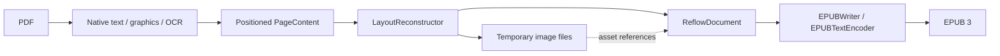

# Architecture

`PDFConverter` composes reconstruction and EPUB writing. It owns validation, the temporary
workspace, overall progress, cleanup and atomic publication. Its public API remains EPUB-only;
the internal reconstruction pipeline and document model are independent of the output format.
There is no application, UI, index, library-store or inference dependency.

The [OS 27 progress-composition evaluation](progress-composition.md) retains ordered,
awaited client callbacks and explicit publication completion; native progress trees remain
a possible client-side presentation choice.

## Two intermediate representations

Both representations are custom Swift values in memory. Neither is HTML, an XML DOM, a PDFKit
object graph or a serialized interchange file.

`PageContent` is the spatial extraction representation. Each physical page contains bounds,
positioned `TextLine` values, font sizes, monospaced/wrap hints, optional validated structure associations, graphic rectangles and fallback
flags. A text line contains `InlineText`: raw Unicode text runs with bold, italic, superscript and subscript style flags.
Geometry remains in unrotated PDF page coordinates with a bottom-left origin. This stage retains
the evidence needed to infer reading order, paragraphs, image crops and word joins.

`ReflowDocument` is the logical, output-independent representation:

| Value | Content |
| --- | --- |
| Metadata | Title, language and optional author |
| Ordered blocks | Paragraph, heading with logical identifier and level, preformatted text, image, source-page boundary |
| Inline text | Text runs carrying bold/italic/superscript/subscript flags, interspersed with source-page boundaries |
| Image block | Logical asset identifier, alternative text and caption |
| Asset registry | Identifier, local file URL and image format |
| Block provenance | Physical source page where the block begins |

Source-page boundaries can occur inside a paragraph or a repaired word. They add no visible
text. This keeps navigation/provenance separate from typography. Hyphen repair edits the text
run itself; it never searches or edits markup. The same value model supports assertions about
reading order, styles and source boundaries without creating a publication.

The logical document deliberately has no XHTML, CSS, EPUB namespaces, ZIP paths or chapter file
boundaries. Raw `<`, `&` and other source characters stay raw until a writer escapes them for
its format. Headings currently form flat navigation; list markers and code use preformatted
blocks backed by the same `InlineText` runs as paragraphs. Preformatted reconstruction retains
native emphasis and scripts; inserted newlines/indentation are unstyled, and the EPUB writer
escapes raw text before adding inline elements inside `<pre>`. Tables/equations preserved as images are image references, not reconstructed semantic
tables or math trees. Output independence does not imply richer PDF understanding.

## Reconstruction boundary

`PDFReflowLibPipeline.reconstruct` returns the logical document plus conversion counts and warnings.
The caller supplies a workspace and keeps it alive until serialization finishes. The pipeline
can run without calling `EPUBWriter`, as the direct PDF-to-model test demonstrates.

`NativeTextReader` obtains PDFKit line selections, geometry and attributed runs; it immediately
copies text and style flags into values. A process-wide library lock serializes this synchronous
page-extraction step across converter instances to mitigate the observed PDFKit `NSFont` exception
under concurrent attributed extraction (#21). Cancellation is checked before acquisition,
between 50 ms timed waits while the lock is contended, and after acquisition. A cancelled
waiter can return while another extraction still holds the lock; a PDFKit call already
executing cannot be interrupted. The wait interval is not a hard cancellation-latency guarantee,
and each timed wait still blocks its worker thread. Concurrent imports trade extraction
throughput for serialization. The lock is released before
progress callbacks, OCR, graphics work and writing. It preserves attributed styles and does not
marshal work to the main actor. Host PDFKit calls outside `NativeTextReader` do not participate
in the lock, so this is a bounded mitigation rather than a framework-wide thread-safety guarantee.
See [the concurrency evidence](../measurements/pdfkit-concurrency/record.md) and
[contention cancellation evidence](../measurements/extraction-cancellation/record.md).

Explicit Core Text/Foundation baseline offsets preserve
inline scripts; tiny positioning noise and full-line OCR offsets do not become script styles.
Font size alone does not establish a superscript. A bounded native drop-cap pattern uses the
following body runs' font size and a top-aligned body-height `readingRect` for ordering. The
original `rect` remains the full ink bounds for graphic intersections and crop preservation;
paragraph-join geometry is unchanged. A lowered oversized single initial followed by substantial,
consistently sized, normal-baseline prose supplies the evidence. It is not an inline subscript.
Ambiguous styles, monospaced initials and missing native attributes do not supply this evidence.
Initial-word spacing and PDF structure-tag consumption are separate concerns. When adjacent similarly sized attributed runs
jump by more than the inline-script range and one carries a full-line offset, native extraction
inserts a missing word boundary. Existing whitespace and line-ending hyphens remain unchanged;
drop caps with different sizes and opposite inline scripts do not supply this evidence. This
handles PDFKit selections that concatenate multiple visual lines, not arbitrary within-line
spacing or OCR spelling repair. Object-only selections are discarded before attributed-string access
to avoid unnecessary PDFKit image-attachment decoding. `GraphicsReader` scans bounded Core Graphics paint
operations and nested Form XObjects. It resolves shading resources and bounds gradient regions
with conservative clipping, Form bounds and optional shading bounds. Core Graphics rasterizes
the original region; the model stores an image asset, not an editable gradient. Unsafe or
page-spanning bounds retain the page fallback. `OCRReader` uses Vision when policy requests it.
`StructureTreeReader` parses a separate Core Graphics document into value-only page/MCID
associations and exact owner paths. It checks structural parent links, page identity, RoleMap
resolution, duplicate references and bounded traversal; a false `MarkInfo/Marked` flag alone
is not grounds to discard a populated tree. No Core Graphics object survives the parsing pool.
ParentTree ownership is checked against those exact paths only when extracting the relevant
page, using `PDFPageSource`'s eight-page document window. Sparse ParentTree arrays can contain
many null slots; loading them all into one Core Graphics document causes avoidable peak memory.
`MarkedTextReader` matches explicitly positioned text-show origins to unique native line
rectangles. Unknown glyph-cursor advancement, Form XObjects, missing/duplicate MCIDs, ambiguous
geometry and incomplete groups retain spatial reconstruction. OCR and unverified image-backed
text do not inherit native tags. Origin matching is conservative association evidence, not full
font decoding or proof of the author's semantic correctness.

Supported roles are P and H1–H6 through grouping containers and transparent inline spans.
Complete groups can reorder only within uninterrupted tagged-text runs; unmatched lines and
preserved images are barriers. Captions, list-like text and headings of 200 or more characters
fall back as well. Removed furniture or image-contained lines invalidate incomplete groups.
Validated paragraph identities prevent heuristic cross-page joins into different paragraphs.
Heading levels belong to the neutral model and serialize as h1–h6; navigation remains flat.
`structureFallback` warns about partial/unsupported mapping. A document-wide tree warning is
attached to page 1 and describes document scope. Table/figure/alternate-text semantics, Form
content, generic H roles, general link ownership and arbitrary reading order remain unsupported.
Traversal is bounded to 200,000 visits and depth 64; association caps text anchors/lines at
10,000 each and rectangle comparisons at two million per page. Limit exhaustion uses fallback,
not partial ordering. Cancellation is checked during traversal and text scanning.

`LayoutReconstructor` handles whitespace cuts, paragraphs, styled word joins and
cross-page continuation. Heading-size evidence excludes text already preserved inside images
when at least three remaining lines and 200 characters support the dominant reflowable font size.
Candidates within 10% of that supported body size are suppressed, while the original 25%
page-size threshold still applies. This retains existing modestly larger section headings. Short titles
beside images retain the existing page evidence. The separate page-size estimate still governs
whitespace cuts and paragraph geometry. This spatial fallback does not guarantee heading precision in arbitrary mixed layouts.

On a page too sparse to establish a body size of its own — a magazine's back cover, a cover with a
short cross-reference line — a heading-size candidate must also clear 110% of the *document's*
body size, tracked across every native page during extraction (`documentBody`, #186). A heading
must also open with a capital, a digit or a mark; a lone heading-size line that opens lowercase and
does not stack (adjacent, same size, sharing an edge) with another display-size line is display
text that heads nothing, not a title — this catches a lowercase cross-reference line set at title
size beneath an actual cover title, while a two-line title whose second line happens to open
lowercase still reads as one heading because it stacks with the first. `FurnitureDetector` removes short outermost margin rows supported by
at least three neighboring or alternating physical pages, stable vertical position and typography.
The top candidate band is 10% of page height; the footer band remains 7% to retain existing
whitespace-cut behavior around illustrated rows. Textual headers require separation from inward
content. Boundary page numbers use a consistent physical-page offset; numeric chapter-page folios retain their chapter prefix and use glyph height
so fallback font estimates do not break matching. Internal digits remain meaningful. Matching
body titles, nearby captions and a page's only text are retained. Each affected page reports
`furnitureRemoved`; clients can disable removal with `removeRepeatedHeadersAndFooters`.
This is conservative spatial evidence, not validated PDF tag consumption or a universal header
classifier. Synthetic invisible-text layers retain the established whole-document repeated-margin
rule in the outer 7%, because their typography does not supply native font evidence. Narrow whitespace cuts require substantial text on both sides, so
short name/description cells do not become independent prose columns. `TableRegionDetector`
recognizes aligned numeric dot-leader rows with a nearby textual header and preserves their
complete region with `imageRegion` warnings. It does not infer general table semantics.
Graphic-region merging and whole-line expansion repeat until the bounds
stabilize, so a merged crop cannot cut through a newly intersecting text line. Only text outside
those regions reflows. `FractionRegionDetector` groups short horizontal bars with nearby compact
mathematical terms above and below, optionally including a nearby equation prefix. It leaves
long rules, prose, code and connected table grids to existing handling. Whole-line expansion
supplies the crop margin once; fraction detection does not repeatedly enlarge already complete
regions. Arbitrary mathematical structures remain outside this bounded detector. Attachment placeholders become word boundaries at native extraction,
with empty selections discarded before layout, vocabulary, OCR selection and coverage counting.

A line-end hyphen joins without a warning when the book's own vocabulary holds the joined word and
not the hyphenated compound; otherwise, in a document declared English, the system's English
lexicon may decide it instead (#186): the join goes ahead, still silently, only when the lexicon
holds the joined word and neither half is independently a lexicon word on its own (two letters a
side, six overall, minimum), so a genuine compound like `camera-man` keeps its hyphen and still
warns. Only the lexicon judges a half's standing, never the page-local `vocabulary` set: extraction's
vocabulary has no notion of a line that opens with the second half of a hyphen-broken word, so a
line beginning "panies interested in..." adds the bare fragment "panies" to the vocabulary as if it
were whole, which would otherwise make `com-panies` look like two real words and block the join.

Three further upstream #186 fixes are not ported and remain open: reading fonts named Zapf
Dingbats/Dingbats/Monotype Sorts through their own encoding table (needs a font/glyph
content-stream scanner main does not have, only PDFKit's higher-level text selection), trusting a
non-symbolic Type 1 font's embedded glyph list over PDFKit's cmap when they disagree only in
letter case (same dependency), and a subhead's paragraph legitimately opening past a photo and its
caption (needs a sub-heading label system layered on top of the heading logic above, also absent).

Existing text over a graphic covering more than 75% of the page gets `unverifiedTextLayer` and
an accompanying source-page image under the default reference policy. This conservative review signal does not establish that
text is OCR, detect every corrupted layer, or assess individual table cells. Fresh OCR keeps
its separate `ocrUsed` notice; image-only fallbacks keep `pageImageFallback`.

`TextLayerPlausibility` then judges such a layer before any recognition (#93), in English books
only. Its word test sorts whitespace words against the system English lexicon
(`NLEmbedding.wordEmbedding(for: .english)`, a vocabulary lookup serialized behind a mutex; no
network or download) into English, damaged (unknown lower-case words, irregular capitals, stray
lower-case letters, letters of another script) and neutral (unknown capitalized names and
abbreviations, words broken by symbols) words, and fails fewer than half English among at least
20 judged words unless a fifth of the tokens hold digits. The same word counts fail a layer that
reads as English but misreads a tenth of its words in place: damaged words of three or more
letters, or irregular capitals, that no neighbouring word completes (#7,
`WordCounts.misread`). When the layer holds fewer than 32 English words, its ink test renders
the page at 180 DPI and measures the layer's line boxes with `OCRTextCoverage`; it fails when at
least 75% of the text-shaped ink, in at least seven rows, lies outside them and the layer holds
fewer English words than those rows.

A failing page reports `implausibleTextLayer` under every policy (written after recognition, so
the message says whether OCR replaced the layer, left a page image or the policy kept it) and
becomes an OCR candidate under `.automatic` (as under `.automaticIncludingImageBackedText` and
`.always`); `.automaticKeepingImageBackedText` and `.never` keep the layer with its
`unverifiedTextLayer` warning and reference. A page that misreads its words in place is instead
extracted as an unverified page *and* recognized (`comparesLayer`); recognition replaces the
layer only if it reads as English and misreads a smaller share (`readsBetter`), otherwise the
extracted layer stands and the recognition is dropped. Every recognition in an English book,
whatever brought it about, is then judged by the same English-share test (`judgeRecognized`): a
reading under half English that the language recognizer does not confidently name as another
language is noise, reported as `implausibleRecognition`, and the page becomes a page image.
`LayoutReconstructor` admits a recognized line in an English book as a heading only when
`readsAsWords` holds, so table cells and handwriting read at heading size stay out of the
navigation. See [conversion options](conversion-options.md#implausible-inherited-text).

The same ink evidence answers the opposite question (#176). A page whose text layer holds no
letter at all — nothing, or only a folio — reflows no word of its own, and its writing, if it has
any, is in its art. `TextLayerPlausibility.judgeImageOnly` renders such a page at 180 DPI and,
when at least `minimumImageOnlyRows` (two) rows of text-shaped ink stand outside the layer's
lines and outside `GraphicsReader.Result.images` (placed raster XObjects, a field added for this
check; main had no way to tell a placed photograph apart from a vector fill before it), treats it
as a page with no text layer at all: every automatic policy recognizes it. A page whose art forms
no such row — a chart, an answer key of bare surds — keeps its crops, and so does a page whose
only rows are inside a photograph. When recognition of such a page reads nothing, the page is
left exactly as it was extracted, with its crops, rather than becoming one page-sized image, and
says so with `ocrFailed`.

Candidacy for this check does not require `!imageBackedText`, unlike #93's own trigger: main has
no equivalent of the branch's `layoutComesApart` (#117, not ported), which there distinguishes a
born-digital page whose art merely shares one full-bleed background paint from an actual scan.
Without it, a page with a solid full-page background fill — an ordinary slide export — already
reads as image-backed on the signal `imageBackedText` uses. `reflowsNoWords` is what actually
keeps this check out of #93's territory: a page with real judged words never passes it, and #93's
own ink test (seven-row threshold) does not fire on the two- or three-row slides this check
targets, so the two coexist safely on the same page without a `!imageBackedText` gate.

`OCRTextCoverage` reads ink against the page's own background. A slide printed white on dark blue
puts almost every pixel below any ink threshold, so the darker side is one page-sized component
and no text row is found at all; when a measurement finds no row and the darker side covers more
than half the page, that side is the background and the page is measured again inverted. A page
whose dark ink already forms rows is never inverted, so no reading that already worked changes.
See [conversion options](conversion-options.md#pages-whose-writing-is-drawn).

`TextEncodingCheck` covers the born-digital counterpart (#38): a simple font in the page
resources (or a nested Form, to depth 4) with a `Differences` encoding of index-style glyph
names and no `ToUnicode` map is structural evidence read from the Core Graphics page
dictionary, and an embedded English function-word list plus a 300-pair common-bigram table
judge the extracted words. Both must agree before extraction reports `damagedTextEncoding`,
makes the page an OCR candidate under automatic and `.always` policies, recommends a
source-page reference and withholds the page's words from the hyphen-repair vocabulary. No
glyph programs are decoded and no network or model is involved. A page already explained by
this check is excluded from the #93 implausible-layer and #176 drawn-text judgments, which
diagnose different failures on an image-backed or textless page respectively.

`GraphicsReader` tracks text rendering mode across saved graphics state and nested forms. When
all observed text uses invisible mode 3 and a graphic covers most of the page, extraction skips
attributed text and marks the page's typography as synthetic. Layout then uses ordinary prose
rather than Courier/code or font-size heading inference; numbered lists retain their existing
representation. Mixed visible/invisible text, text clipping and unsupported streams do not enter
this path. Source images and unverified-layer warnings remain. This does not recover headings
from the scan or correct inherited transcription, and it is not a PDFKit leak fix.

`PageRasterizer` renders source-composited regions to bounded rasters. Client policy independently
selects PNG, JPEG quality, or the smaller encoding for full-page images and cropped regions.
The asset registry records the actual format and file URL; the writer uses matching extensions
and MIME types. Encoding selection retains at most one raster and two candidate files at a time.
Supplementary reference policy is independent of mandatory fallback pages and region preservation.
Omitted recommended references have explicit warnings that refer to the source PDF.
See [conversion options](conversion-options.md). Whole-page crop/rotation is
computed in page units, with explicit scaling to raster pixels. Annotation drawing compensates
for PDFKit's own crop/rotation transform so annotations and source content share coordinates.

`PDFPageSource` reopens the PDF in eight-page windows and between extraction and reconstruction.
Synchronous page work drains autoreleased objects. Image-only fallbacks skip unused formatting
extraction. These limits reduce retained work without imposing a hard cap on Apple framework
allocations or fixing the attributed-text framework leak.

## Two passes over the pages

`PDFReflowLibPipeline.reconstruct` runs extraction as one pass that keeps only document-wide
evidence: the hyphen-repair vocabulary, margin-furniture candidates, note-heading pages, chapter
matches and the running character budget. Each extracted page is handed to a `PageStore`.
Reconstruction is a second pass that loads one page at a time and needs only that page and
its stripped predecessor for cross-page continuation. `FurnitureDetector` is phased to match:
`collect` records one page's candidates, `resolve` decides removals from the whole ledger, and
`apply` edits one page. Its `strip` entry point runs the same phases over an array, so the
array and streamed paths cannot diverge. Furniture warnings keep their position between
extraction and reconstruction warnings.

`PageStore` encodes each extracted page as a binary property list in the workspace and
reloads it once during reconstruction, removing the file on reload and the directory when
reconstruction finishes, so the workspace holds only assets afterwards. Equal values share one
slot in that encoding, so a negative zero can reload as positive zero; no reconstruction step
reads the sign of zero. The structure index is released after extraction. The
[page-retention measurement](../measurements/page-retention/record.md) compared this spill
store with keeping pages resident and with repeating extraction: all three produced
byte-identical output against the pre-change converter on the complete corpus, and spilling
had the lowest peak footprint on every book where retained pages matter, on the Mac and on a
physical iPhone. The alternatives were retired afterwards; the measured sources are retained
as a patch beside the record. The logical blocks still accumulate until writing finishes;
streaming them to the writer is separate work.

## Serialization and resource lifetime

Assets live under a neutral workspace directory, outside the EPUB layout. The model holds URLs
and identifiers, not decoded images or large byte buffers. `EPUBWriter` assigns safe archive
paths from counters and streams those files directly into ZIP entries; it does not copy the
whole image collection into another staging tree. Asset identifiers are opaque and cannot
choose archive paths. Model validation rejects missing/duplicate assets and empty documents.

`EPUBTextEncoder` owns XML escaping, style tags, page markers and figure markup. `EPUBWriter`
owns spine splitting, heading/page navigation, OPF metadata, CSS, resource naming and
ZIPFoundation packaging. It accepts a `ReflowDocument` and an output-size ceiling, with no PDF
or OCR dependency. EPUB progress is combined with pipeline progress by `PDFConverter`; only
publication emits completion. Each stage checks cancellation at its available boundaries.
The writer serializes each block once and writes completed spine documents as it goes. It keeps
one current body string plus navigation/filename lists; it does not first build a second collection
of all chapter blocks. Packing checks the complete UTF-8 body markup against a 60,000-byte target
before admitting a block. A standalone source-page marker travels with the following content;
inline markers retain their exact location. A short trailing run of headings (at most 6,000 bytes)
moves with its navigation entries into the next document instead of ending the previous one, and
stays with an oversized block that follows it. Other oversized individual paragraphs, headings, code
blocks or figures occupy their own document without being split or losing styles. This is a soft body-size
target, excluding document metadata, and is not a memory ceiling.

`ChapterBoundaryReader` separately admits a conservative bookmark scheme: at least two
root-level English `Chapter 1 ...` through `Chapter N ...` entries, consecutive Arabic numbers
and strictly increasing local destination pages. Local direct/named destinations and GoTo
actions are supported. Missing, remote, duplicate or backward chapter destinations reject the
sequence. Nested, Roman-numbered, unnumbered and other-language schemes keep ordinary packing.
Each candidate additionally needs its chapter number and full title on adjacent native text
lines among the first six lines in the upper half of its page. Matching normalizes whitespace
and case, permits a publication-name prefix, and rejects freshly recognized pages and exclusively
invisible image-backed text. It does not detect every inherited OCR layer.
Only matching candidates become chapter boundaries. This is a bounded supported scheme, not
general bookmark interpretation or heading classification.

The logical document carries these physical chapter-start pages; reconstruction keeps their
source markers standalone and prevents cross-boundary paragraph joins. The writer flushes the
preceding document before each such marker, then applies the same byte-size subdivisions within
the chapter. Existing heading/page navigation resolves to the resulting files. Bookmarks do
not manufacture headings or new link semantics. Vocabulary and furniture evidence remain
document-wide; whether positioned pages stay resident is the retention strategy described above.
Progress reports serialization work by input blocks, then metadata completion and archive entries.
The reconstruction endpoint is clamped to its allocated fraction so floating-point rounding cannot
make the first writing update step backward.

The entry-byte budget remains independent of an optional final ZIP-file cap. `PDFConverter`
checks final archive size before publication and uses the same cleanup path on failure.

The model is internal, `Sendable` and `Equatable`. It has no public persistence or compatibility
promise. Another writer can consume it without changing extraction/reconstruction; a public
non-EPUB API or a persistent model would need an explicit resource-lifetime contract. There is
no speculative writer registry or additional export format.

The real-document corpus starts with the FAA handbook, including known fidelity defects and a
Mac memory gate. Broader qualification needs source-derived reading order, text/image coverage
and physical-device measurements. Tagged-PDF semantics, richer structure and stronger detection
belong in reconstruction; new output syntax belongs in writers.

Development corpus acquisition is separate from the Swift runtime. A standard-library Python
fetcher reads pinned URLs, byte counts and SHA-256 identities from `corpus/manifest.json` and
atomically publishes verified PDFs into ignored `corpus/cache/`. Cache hits are reverified;
failed refreshes leave existing copies intact. Conversion and tests remain offline unless a
developer explicitly runs the fetcher. Corpus licenses and owner clearance are separate from
the library's MIT license.

Repository source and test directories follow SwiftPM conventions: `Sources/PDFReflowLib/`,
`Sources/PDFReflowLibCLI/` and `Tests/PDFReflowLibTests/`. Supporting directories and the
`fixtures/` test-resource directory use lowercase names. Public module and product names remain
unchanged. Recorded measurement outputs retain historical paths and hashes from their measured builds.

Opt-in corpus quality signaling is checked separately from EPUB validity and resource limits.
`tools/check_corpus_quality.py` applies manifest expectations to a real-document evaluation:
page-specific warnings on a valid conversion, or an explicitly approved quality-refusal diagnostic
with no published output or false completion. The converter currently has no quality-refusal API;
this development contract exposes gaps without changing runtime behavior.
