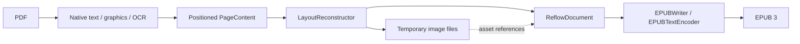

# Architecture

`PDFConverter` composes reconstruction and EPUB writing. It owns validation, the temporary
workspace, overall progress, cleanup and atomic publication. Its public API remains EPUB-only;
the internal reconstruction pipeline and document model are independent of the output format.
There is no application, UI, index, library-store or inference dependency.

The [OS 27 progress-composition evaluation](progress-composition.md) retains ordered,
awaited client callbacks and explicit publication completion; native progress trees remain
a possible client-side presentation choice.

## Two intermediate representations

Both representations are custom Swift values in memory. Neither is HTML, an XML DOM, a PDFKit
object graph or a serialized interchange file.

`PageContent` is the spatial extraction representation. Each physical page contains bounds,
positioned `TextLine` values, font sizes, monospaced/wrap hints, optional validated structure associations, graphic rectangles and fallback
flags. A text line contains `InlineText`: raw Unicode text runs with bold, italic, superscript and subscript style flags.
Geometry remains in unrotated PDF page coordinates with a bottom-left origin. This stage retains
the evidence needed to infer reading order, paragraphs, image crops and word joins.

`ReflowDocument` is the logical, output-independent representation:

| Value | Content |
| --- | --- |
| Metadata | Title, language and optional author |
| Ordered blocks | Paragraph, heading with logical identifier and level, preformatted text, page-bottom footnote, image, source-page boundary |
| Inline text | Text runs carrying bold/italic/superscript/subscript flags, interspersed with source-page boundaries |
| Image block | Logical asset identifier, alternative text and caption |
| Asset registry | Identifier, local file URL and image format |
| Block provenance | Physical source page where the block begins |

Source-page boundaries can occur inside a paragraph or a repaired word. They add no visible
text. This keeps navigation/provenance separate from typography. Hyphen repair edits the text
run itself; it never searches or edits markup. The same value model supports assertions about
reading order, styles and source boundaries without creating a publication.

The logical document deliberately has no XHTML, CSS, EPUB namespaces, ZIP paths or chapter file
boundaries. Raw `<`, `&` and other source characters stay raw until a writer escapes them for
its format. Headings currently form flat navigation; list markers and code use preformatted
blocks backed by the same `InlineText` runs as paragraphs. Preformatted reconstruction retains
native emphasis and scripts; inserted newlines/indentation are unstyled, and the EPUB writer
escapes raw text before adding inline elements inside `<pre>`. Equations and most tables preserved as images are image references, not reconstructed
math trees or semantic tables. A text table whose shaded rows and rules the layout can read is a
table block of rows and cells (header rows, column spans, styled cell text with source-page
boundaries) that the EPUB writer serializes as `<table>` (#54). A table's own title and description
are caption paragraphs of that block, serialized as `
` elements of the table's `<caption>`, not
headings or prose before it (#113). A body cell that names its row is a row-header cell, serialized
as `<th scope="row">`; a borderless table with capital column headings is a table block too (#121).
Output independence does not
imply richer PDF understanding.

## Reconstruction boundary

`PDFReflowLibPipeline.reconstruct` returns the logical document plus conversion counts and warnings.
The caller supplies a workspace and keeps it alive until serialization finishes. The pipeline
can run without calling `EPUBWriter`, as the direct PDF-to-model test demonstrates.

`NativeTextReader` obtains PDFKit line selections, geometry and attributed runs; it immediately
copies text and style flags into values. A process-wide library lock serializes this synchronous
page-extraction step across converter instances to mitigate the observed PDFKit `NSFont` exception
under concurrent attributed extraction (#21). Cancellation is checked before acquisition,
between 50 ms timed waits while the lock is contended, and after acquisition. A cancelled
waiter can return while another extraction still holds the lock; a PDFKit call already
executing cannot be interrupted. The wait interval is not a hard cancellation-latency guarantee,
and each timed wait still blocks its worker thread. Concurrent imports trade extraction
throughput for serialization. The lock is released before
progress callbacks, OCR, graphics work and writing. It preserves attributed styles and does not
marshal work to the main actor. Host PDFKit calls outside `NativeTextReader` do not participate
in the lock, so this is a bounded mitigation rather than a framework-wide thread-safety guarantee.
See [the concurrency evidence](../measurements/pdfkit-concurrency/record.md) and
[contention cancellation evidence](../measurements/extraction-cancellation/record.md).

Explicit Core Text/Foundation baseline offsets preserve
inline scripts; tiny positioning noise and full-line OCR offsets do not become script styles.
Font size alone does not establish a superscript. PDFKit can measure a split piece's baseline on
the note marker it holds (9/11 page 362's `”12`, after a closing quote kerned back over the
period): a piece of closing punctuation uniformly lowered by 0.2–0.5 of its size, each followed
by a one- to three-digit run at 0.4–0.7 of that size at offset zero, is re-measured from the
punctuation, so the marker reads as raised (#11). Reconstruction attaches such a piece, on the
previous line's row and within half a body size of its end, to that line without a space, as it
attaches a detached digit marker. A bounded native drop-cap pattern uses the
following body runs' font size and a top-aligned body-height `readingRect` for ordering. The
original `rect` remains the full ink bounds for graphic intersections and crop preservation;
paragraph-join geometry is unchanged. A lowered oversized single initial followed by substantial,
consistently sized, normal-baseline prose supplies the evidence. It is not an inline subscript.
Ambiguous styles, monospaced initials and missing native attributes do not supply this evidence.
Initial-word spacing and PDF structure-tag consumption are separate concerns. When adjacent similarly sized attributed runs
jump by more than the inline-script range and one carries a full-line offset, native extraction
inserts a missing word boundary. Existing whitespace and line-ending hyphens remain unchanged;
drop caps with different sizes and opposite inline scripts do not supply this evidence. This
handles PDFKit selections that concatenate multiple visual lines, not arbitrary within-line
spacing or OCR spelling repair. `NativeSpacingReader` scans a page's text-show operators for two
bounded word-boundary repairs: a Type3 TJ array whose tiny adjustment contradicts a PDFKit space
removes that space, and a font change on one baseline whose measured gap (simple-font Widths, Tm
scale, TJ adjustments that precede a string; a trailing adjustment moves no glyph of its show) is
at least 0.15 em between a letter or digit on either side inserts the space PDFKit drops after a
mathematical variable or digit set in its own font (#43; Wallace's CMR12 digits before EC-font
prose, #110). Shows are decoded
through one-byte ToUnicode maps (bfchar and bfrange, ligatures and surrogate pairs; for a simple
font, Adobe PDF Library's one-byte entries under a `<0000> <FFFF>` codespace are read as one byte,
as `MarkedTextReader` reads its space codes, #104), or, for a Type1 font with no ToUnicode map,
through a `WinAnsiEncoding` (codes 32–126 as ASCII, `Differences` names from a small glyph-name
table, #110), and must spell
the line exactly apart from PDFKit's own spaces; rotated shows, Form XObjects and fonts without
Widths or maps supply no evidence, and unsupported text state still disqualifies the page: a `gs`
whose ExtGState sets a font or does not resolve, nonzero `Tc`/`Tw`/`Ts`, `Tr`, `Tz`, and shows
without their own positioning (so Adobe, Word and GPO books with character or word spacing still
yield no evidence, #110).
Object-only selections are discarded before attributed-string access
to avoid unnecessary PDFKit image-attachment decoding. `GraphicsReader` scans bounded Core Graphics paint
operations and nested Form XObjects. It resolves shading resources and bounds gradient regions
with conservative clipping, Form bounds and optional shading bounds. Core Graphics rasterizes
the original region; the model stores an image asset, not an editable gradient. Unsafe or
page-spanning bounds retain the page fallback. A path's, image's or form box's footprint is only
the part the clip in force lets show (the clip is a conservative bounding rectangle, so no visible
mark is lost), and a path or image wholly outside its clip paints nothing: illustrations routinely
draw streamlines, arrows, photographs and maps far beyond the frame that clips them, and their raw
extents claimed the column beside the figure (#77, #98, #52). The same clipped footprints feed the
page-sized-graphic signal, so an image merely placed larger than the page no longer marks a page
image-backed. The reader also records every painted footprint
with whether it was a rectangle-only path (`re`, filled or stroked) painted outside `/Figure`
marked content. `TintDetector` then lets the page's text decide what those rectangles are (#54):
a cluster of them holding at least three wide prose lines that no solid ink touches, making up
at least a third of the block's lines, is a tinted text block (a sidebar frame, a tint band,
cell shading, or four thin strokes closing such a box). Its rectangles seed no crops; the thin
rules inside it that touch only each other are row and column separators; and solid ink inside
it keeps the block's full-width band between the prose above and below it as one image, so a
chart's axis labels that PDFKit cannot extract stay with the chart. A rectangle holding no
text, a bar chart, a flowchart node, a figure whose labels PDFKit merges into short fragments,
a box with fewer than three prose lines and a ruled grid whose cells are not shaded keep their
images exactly as before, unless the table reader reads that grid as a text table with a header
on its own band and two body rows, no ink inside and no text below or beside it (Fed page 46's
Table 3.1, #65). PDFKit returns such a table's cells on one baseline as one line, so extraction
first finds the grid's column joints (collinear rule segments abutting at the same x in at least
three rule rows) and splits a line crossing a joint where PDFKit's own rectangle selections show
at least one em of whitespace around it and the pieces spell the line exactly; titles and prose
crossing a joint have only word spaces and stay whole. A borderless table's merged rows are split
the same way without rules (#121, FAA page 131): where PDFKit keeps one row's two short cells apart
(two to ten ems, each at most fifteen ems wide), the rows chained to that pair at no more than 1.8
ems' leading, in the same size, are read against that gap, and their crossing lines are cut where
the selections show two ems of whitespace, only when the run opens with a heading in capitals on
both sides, at least three rows hold text on both sides, an em of whitespace is common to every
row and nothing painted lies within it. The page-sized-graphic review signal still reads the painted regions
before tint removal. `OCRReader` uses Vision when policy requests it.
`StructureTreeReader` parses a separate Core Graphics document into value-only page/MCID
associations and exact owner paths. It checks structural parent links, page identity, RoleMap
resolution, duplicate references and bounded traversal; a false `MarkInfo/Marked` flag alone
is not grounds to discard a populated tree. No Core Graphics object survives the parsing pool.
ParentTree ownership is checked against those exact paths only when extracting the relevant
page, using `PDFPageSource`'s eight-page document window. Sparse ParentTree arrays can contain
many null slots; loading them all into one Core Graphics document causes avoidable peak memory.
`MarkedTextReader` matches explicitly positioned text-show origins to unique native line
rectangles. Unknown glyph-cursor advancement, Form XObjects that could show text, missing/duplicate
MCIDs, ambiguous geometry and incomplete groups retain spatial reconstruction. A form, and every
form it draws, is scanned once per page (bounded depth and operator budget): one that runs no
text-showing operator cannot place or own a line and leaves the page's tags standing (the Dietary
Guidelines' and FAA handbook's figures, #75); a form that shows text, draws an unresolvable
resource or exhausts the budget still invalidates the page. OCR text and image-backed pages
with any invisible (mode 3) text do not inherit native tags; visible native text drawn over a
page-sized background image or tint (a chapter opener's photograph) keeps its validated tags while
still reporting `unverifiedTextLayer` (#72). Invisible text never associates in any case: a show
in rendering mode 3 outside an `/Artifact` invalidates the page, while one inside an artifact, which
carries no structure, costs nothing (the Fed's running head, #91). A show whose every code the current
simple font maps to U+0020 (through its ToUnicode map, or code 32 under a standard named encoding)
draws nothing, so it places no line and costs no group; its identifier still counts as shown (PDFKit
trims trailing spaces from line boxes, so such shows often lie past every line: FAA, DGA). A validated `P` group set in heading type keeps its tag above the
text it introduces when its lines read as a pull quote (the rule below). Such a group is read as a
title when the next text in its column is ordinary text on its edge (#67), or when every line is
set in a heading or label style the book repeats on three or more pages, even directly above
another heading: extraction records the size, body size and all-bold flag of each page's
heading-size lines outside painted graphics and running heads, as it records label styles (FAA's
16-point `Chapter 4` over its 48-point title, #84), or when it stands directly over a smaller title
on its left edge (at most 90% of its size), which it introduces (DGA page 7's `Special Populations &
Considerations` over `Infancy & Early Childhood`, #111). A one-off title-page imprint stays a paragraph. Origin matching is conservative association evidence, not full
font decoding or proof of the author's semantic correctness.

Supported roles are P and H1–H6 through grouping containers and transparent inline spans.
Complete groups can reorder only within uninterrupted tagged-text runs; unmatched lines and
preserved images are barriers. Captions, list-like text and headings of 200 or more characters
fall back as well, with one exception: a paragraph group whose only list line opens it and was
rejoined from a marker piece PDFKit split off (the FAA handbook tags each bullet item as one `P`)
is exactly one item. It keeps its tag order, loses the absorbed piece from its line count, and is
emitted as the list item the same text is when untagged (#81). A paragraph group that holds a
heading-type line above body text falls back too (FAA page 203 tags `Introduction`, its paragraph
and the next section as one `P`, #84). A source can also tag one paragraph in pieces: where a
paragraph group's first line continues the previous group's last line (same edge and type, ordinary
leading, the upper line filling the page's justified measure, and either a lowercase start, a
hyphen or slash break, or a column that marks its paragraphs with space or is justified and sets
space somewhere on its edge), the two read as one paragraph, and a group continuing a caption or
list group that falls back falls back with it (#75). The same evidence joins a paragraph group to
the untagged paragraph above it, and an untagged line to the group above it, where the other piece's
group fell back beside a figure (#89); a table row, which spreads few characters over the measure,
never joins. A paragraph group that reads as a title (a capital first, no closing punctuation, no
leader on it or on the entry beneath, not centred over the column's text) is emitted as a heading
ranked by size when every line is bold in a recurring label or heading style, or when it is one
body-size line wholly in italic and title case over a wider body line on its own edge (#90) or over the list it
heads, its marker on that edge or up to 2.5 em inside it (#97). Removed furniture or
image-contained lines invalidate incomplete groups.
Validated paragraph identities prevent heuristic cross-page joins into different paragraphs.
Heading levels belong to the neutral model and serialize as h1–h6; navigation remains flat.
`structureFallback` warns about partial/unsupported mapping. A document-wide tree warning is
attached to page 1 and describes document scope. Table/figure/alternate-text semantics, Form
content, generic H roles, general link ownership and arbitrary reading order remain unsupported.
Traversal is bounded to 200,000 visits and depth 64; association caps text anchors/lines at
10,000 each and rectangle comparisons at two million per page. Limit exhaustion uses fallback,
not partial ordering. Cancellation is checked during traversal and text scanning.

`LayoutReconstructor` handles whitespace cuts, paragraphs, styled word joins and
cross-page continuation. A paragraph continues across a source page when the previous page's
last body paragraph and the next page's first body paragraph, in reading order, meet the join
evidence: preserved images, figure captions and bare margin folios that furniture removal kept
are stepped over (and stay on their page, ahead of the joined paragraph, while headings directly
above that paragraph move with it past them, #63); two different
validated paragraph identities refuse; the next text starts lowercase; the previous text lacks
terminal punctuation past closing quotes and superscript note markers; the previous paragraph's
last line reads as prose and fills its column (a justified column's shared right edge, three
quarters of a ragged column's measure, or a line-ending hyphen); the next paragraph's first line
is not a retained running header with a folio word; and no other prose lies below or right of
that last line or above or left of that first line, counting body-sized wide text inside a
preserved region so that a figure which swallowed the real neighbour blocks the join rather
than corrupting the text. The same evidence joins a paragraph at one column's foot to the next
paragraph at a column head to its right on the same page (#111): they are adjacent in reading order
apart from figures, captions and folios (which then follow the joined paragraph); the head line is
higher than the foot line; and no prose lies below the foot line in its span, between the two
columns, or above the head line in its span, searched only beneath the lowest line, figure or box
over the head line that crosses the gutter, so a section band bounds its section from the stacked
sections above. A line that begins with a number or single letter followed by a
period or parenthesis and a space, or a number and parenthesis set tight against a minus sign
(`1)− 2`), is a preformatted list item unless it wraps an open paragraph: the
previous line must read as prose, end without terminal punctuation and reach a right edge
that at least three same-size lines of the column share within a quarter body size, and the
line must sit on the column's majority left edge (or outdent from an indented opening line)
at ordinary line spacing. Bullets never continue prose; ragged-right columns, hanging-indent
continuations and OCR lines that Vision marks as unwrapped keep the list representation.
The pieces of a prose row PDFKit splits at inline mathematics rejoin before classification (#95).
A joined row whose radicand opens it with a minus sign before a number or variable (`− 1 √ , and
it is…`) reads as prose, while a line that opens with a minus on its own keeps the list
representation (#109). Paragraph lines attach at ordinary spacing, overlapping by up to 0.4 body
sizes. A line that an inline expression makes taller than the page's ordinary line at its size
(Wallace's minus, times and radical glyphs extend a rectangle 8.5 points past the type), at most
twice that height and set as prose on its paragraph's measure, may overlap by its extra height
as well, and its gap is not taken as the paragraph's leading for the added-space rule (#71, #109).
A list item's wrapped line joins the item under the same allowance; an item's own line also
earns it when it reads as a sentence, because it is set on the item's measure rather than the
paragraph's (Wallace page 2's 17-point license bullets over 9.9-point lines, #115).
A coded weather report set over several lines is one preformatted block (#96). A run opens on a
line holding only report characters (capitals, digits, `/ + -`) with at least three groups of the
METAR, TAF or PIREP formats (date-time `161753Z`, wind `14021G26KT`, visibility `3/4SM`, sky
`OVC012CB`, temperature `18/17`, altimeter `A2970`, valid period `1112/1212`, change groups,
report types and modifiers, coded weather, PIREP fields, and a station before its date-time
group), or on a lone report type above such a line. It continues through lines in the same column
at ordinary leading and size that hold only report characters, carry a group (or follow `RMK`)
and do not open another report. A wrapped line joins with a space; the line after a lone report
type and a line opening a TAF change group (`FM1500`, `TEMPO`, `BECMG`, `PROB30`) keep their
break. The source sets each report line as a paragraph of its own, so this format evidence, not
layout, is what separates a wrapped METAR from a TAF's change groups.
Joined lines meet at a space except in three cases. A line-ending hyphen before a lowercase
letter is removed when the book's vocabulary knows the joined word and not the compound. When it
knows neither, the hyphen is also removed when the book uses another inflected form of the joined
word (an ending `s es d ed ing ly` taken off, a dropped `e` restored, and an ending put back:
`sep-` + `arates` beside `separate`), no such form of the compound, and the halves are not both
book words, with at least six letters in all (#115). Otherwise it is kept. The vocabulary skips the word that opens a lowercase line after a line-end hyphen
or soft hyphen, because it is the rest of a broken word (`es-` + `timates.html`), unless it holds
a hyphen of its own (`straight-` + `and-level`); the same letters seen anywhere else count (#101). A slash after a letter, digit or slash before a letter or digit joins
(`runway/` + `taxiway`, #70). A break inside a web address joins (#79). The address is the run
of URL characters ending the line: it has a scheme, starts with `www.` or opens with a domain
and a slash, and holds a dot. It continues without a space after `_ = & ? # % ~` that follows a
letter or digit, or after a percent escape. It also continues after a dot that follows a letter
or digit when the next line starts lowercase or with a word that is not a bare number
(`https://www.` + `federalreserve.gov`, `10.1080/14693062.` + `2022.2061405`), after a hyphen
before a digit or capital, and before a line opening with `/ . _ ? # = & % ~` and a letter or
digit. A hyphen before a lowercase letter inside an address is decided by the book's own
addresses (#88), because typesetters hyphenate inside addresses (`federalreserve.gov/monetary-` +
`policy/…`) as well as breaking at real hyphens (`page1-` + `econ/…`). Vocabulary collection also
records every address seen on a line, lowercased and without scheme or `www.`: its prefixes that
end at `/ . ? # & = :`, and its segments between them. An address ending its line gives up its
last segment, and a line's first word without a scheme or `www.` gives up its first segment. The
hyphen goes when the address through the broken segment is seen joined and not hyphenated, and
stays when it is seen hyphenated and not joined; failing that, the broken segment decides the
same way. Failing both, it goes only when the letters beside it, with no digit next to them, join
into a book word and are not both words (`communi-` + `cations.htm`; NOAA's `es-` + `timates.html`,
where `es` is a book word from DOI segments). Otherwise it stays and the
page warns (`uncertainHyphen`). A period after a closing parenthesis, or before a capital, ends
the sentence. The same test keeps a list item's first wrapped line after a marker line ending
inside an address (`(AIM)—www.faa.` + `gov/…`).
`FootnoteDetector` recognizes page-bottom footnotes: a line of three or more dash characters
after at least three body-size lines, followed to the end of the page only by untagged
proportional lines at most 90% of that body size, in one column at close spacing, each note
opening with a superscript run of one to three digits that count up across the page. The
separator is dropped and each note becomes a footnote block after the body; a marker-less
first note is admitted only when the previous page ended in a footnote, and the pipeline then
joins it to that note with the page boundary inline, so the page's body follows the completed
note (`joinContinuedFootnote`); when `appendPage` has already joined the body across that
page, the boundary stays in the paragraph and the note simply absorbs the continuation. Body
continuation steps over footnote blocks, and a footnote block trailing the continued paragraph
is placed after the joined paragraph rather than ahead of it, because its reference sits inside
that paragraph and note text must not precede its marker; such a note is then reached from
the next page's anchor. A footnote beneath the previous page's last line does not count as
prose below it (`endsColumn`). Drawn rules, symbol markers, recognized or synthetic text
layers, images below the separator and any body-size line after it keep spatial prose. A body
marker that PDFKit detached past a justified line's right edge (one to three digits, below
80% of body size, starting where the line ends and raised inside its box) rejoins that line as
a superscript. `NumberedNoteDetector` recognizes a chapter's endnotes on a page whose running
head reads `NOTES TO CHAPTER N`: consecutive numbered starts at one indent, wrapped lines at
one dedented edge (which may open with `p. 11` or an initial), an unnumbered line at the
indent as a further paragraph of the current note, and a larger `N+1 Title` line followed by
note 1 as the next chapter's opening, which switches the scope mid-page. A head naming two
consecutive chapters (`NOTES TO CHAPTERS 9-10`) opens with the first and is accepted only when the
page switches to the second. A list inside a note continues that note (#80). It opens after at
most 1.6 body sizes of space, with a bullet at or inside the note indent or with `1.` (or
`1 and 2.`) one to three body sizes inside it. Bullets wrap to one hanging edge; numbered items
count up and wrap back to the note indent, and an unnumbered line at their edge is a further
paragraph. Each item is a further paragraph of the note, and the next note may follow a numbered
list after the same added space. A numbered list whose last line runs to the list's right edge
is still open at the page's end; the pipeline hands it to the next physical page (#87), which
resumes it from its first line when the item the list expects comes at or before the page's
first note start: either above the open note's successor, at the list's inset inside that
note's indent (9/11 page 545's `10.` above note 108), or as the page's first start, numbered
as the list expects rather than as the chapter's next note (page 544's items 7–9 under note
107). A resumed page may hold no note of its own; one whose resumed reading refuses is read
on its own. The pipeline also hands each notes page's last note to the next physical page (#11).
When that page's first note start is the next note of the same chapter, the lines above it are
that note's text if every one reads as note text: a wrapped line at the dedented edge the page's
notes share, or an unnumbered line of at least ten letters at the note indent opening a further
paragraph, in the notes' type at their spacing. Otherwise those lines stay spatial prose. A first
line at the dedented edge continues the previous page's last paragraph whatever opens it (a
capital, a digit, a quote or a bracket: 9/11 pages 473, 508, 532, 546 and 580–582), so the page
join takes that reading in place of the lowercase and sentence-end tests, while the previous
paragraph's last line must still fill its column (page 583's last bullet ends short and page
584's flush-left paragraph after it stays separate) and no prose may lie below it or above the
first line. The first start is the
first numbered line on the edge most numbered lines share, so a dedented `5.This` or a year
does not set the indent. Each note paragraph carries a `NoteKey` (number, chapter scope); a
page-bottom footnote carries one with page scope; a note's later paragraphs and marker-less
continuations carry none. Images, tags, OCR or synthetic text, lettered lists and list items
that do not follow those shapes still refuse the page. Heading-size evidence excludes text already preserved inside images
when at least three remaining lines and 200 characters support the dominant reflowable font size.
Candidates within 10% of that supported body size are suppressed, while the original 25%
page-size threshold still applies. This retains existing modestly larger section headings. Short titles
beside images retain the existing page evidence. The separate page-size estimate still governs
whitespace cuts and paragraph geometry. Below that threshold, a section label set at least 15%
over the supported body (acmart's `ABSTRACT`, the 9/11 report's `1.1 INSIDE THE FOUR FLIGHTS`)
is a heading when it starts with a capital or digit, ends without sentence punctuation, has clear
space above it or continues a label of the same size, and is either set in capitals or shorter
than the column's prose. A wider line that still fits the column qualifies when it is set in a
label style the book establishes: the extraction pass records, per page, the size, body size
and all-bold flag of the narrow labels outside painted graphics and margins, and a style seen on
three or more pages admits a title set nearly the column's width (FAA's `Crew Resource Management
(CRM) and`, #73). A book's smallest sub-headings, set in bold at body size up to 15% over it
(FAA's 10-point Helvetica-Bold `Radius of Turn` and 11-point Times-BoldItalic `Fixed-Pitch
Propeller` over 10-point Times), are labels only in such a recurring style: the line is entirely
bold, no wider than 90% of the column's prose, has clear space above it, and a paragraph opens
directly beneath it on its left edge in non-bold body type; extraction records these styles
beside the larger ones, and their smaller sizes rank below the book's titles (#76). Where no tag
sets it apart, a body-size line wholly in italic is such a label in a recurring italic style
(`LabelStyle` flags italic only on a line that is not bold), when it is in title case, not a figure
or table caption, and opens body text that is not italic on its edge or the list it heads (FAA's
untagged `Southerly Turning Errors`, `Drugs`; #97). A sub-heading of either kind set over two
lines is one label when both lines share a style the book already repeats, the second stacks
under the first on its edge at heading leading and ends no sentence, and the paragraph opens
beneath the second line (FAA's `The Professional Air Traffic Controllers` / `Organization (PATCO)
Strike`; the pair is no style evidence of its own; #102). A tinted box's top line is a title
in the box's own text size when the box's next lines continue on its edge at that size and the
title is set off from them by more than their leading (a two-line title keeps its lines at that
leading or tighter), reads as a title, and ends no sentence before any note marker: the Fed's
8-point demibold sidebar titles, which PDFKit reports without bold (#100). A leading
bracket or quote is skipped for the capital test (`(EMAS)`). A figure caption paragraph ends at
a line at least 15% larger than the caption line above it and at body size or above, so it never
absorbs the title that follows it (#63), and at a body-size line at least 5% larger that shares
neither the caption line's left edge nor its centre (#82); list markers, lone folios and pages with three or more folio-ending
labels (a contents page) are excluded, and the pieces of one heading row that PDFKit split at a
gap (`3.1` / `Limitations …`) join when no more than three ems apart, so two columns' titles on
one row stay two headings. The lines of a title set over several lines are one heading
when each stacks under the previous at the same size and ordinary heading leading, sharing the
left edge, the centre or the right edge (or, under a numbered first line, hanging past the number
by no more than 0.6 em per character of the number and an em for its space: Replay Clocks'
`OVERHEAD`, #83), the heading so far does not end a sentence and the line
does not open a numbered or `Chapter N` heading of its own; a run of two or more such lines that
ends in terminal punctuation with at least eight words is a chapter opener's pull quote and
reflows as one paragraph; a line ending in a dot leader of four or more dots (with or without its
folio, which can be numbered within a chapter or a lettered part: `…1-1`, `…G-1`, #97) is a contents
entry and never a heading (#55). A chapter opener's display numeral that
PDFKit fuses with its title (a 70-point `1` before a 24-point `Overview …`) gives the line the
title's size, and a run at least twice the size of every run beside it is never a script, so the
numeral is neither a subscript nor the line's heading size. Each typographic heading block carries its font size; once
every page is reconstructed, the sizes of the whole document rank into tiers 7% apart, the
largest tier keeps level 2 and each smaller tier is one level deeper (to 6), so equal sizes get
equal levels on every page and a title outranks the author names beneath it, while tagged
headings keep their validated levels (#43). Text rotated a quarter turn extracts as a line far taller than wide; one along
at least a quarter of the outer margin of an otherwise horizontal page is a stamp and is omitted
with `furnitureRemoved`, while shorter rotated credits stay paragraphs and rotated text is never
a heading. An `Algorithm N` caption directly beneath a thin rule, over a second rule of the same
extent and a closing rule further down, makes the listing between those rules one preserved
region with the caption reflowed. This spatial fallback does not guarantee heading precision in arbitrary mixed layouts. `FurnitureDetector` removes short outermost margin rows supported by
at least three neighboring or alternating physical pages, stable vertical position and typography.
The top candidate band is the outer 20% of page height, which admits a slip opinion's running
head under a deep head margin (rows at 85% and 82%); the footer band remains 7% to retain existing
whitespace-cut behavior around illustrated rows. Textual headers require separation from inward
content. Beneath an outermost row made only of candidates, the next row inward (within three of
its line heights, at least half a line height clear of the body) is a second header row that is
removed only together with every line of the row above it, so a two-row head (title row with
folio, opinion row) goes as a unit and a repeated line beneath unrepeated titles stays.
Boundary page numbers use a consistent physical-page offset; chapter-page folios, numbered (`5-17`) or lettered for an appendix (`C-2`, #90), retain their prefix and use glyph height
so fallback font estimates do not break matching; a bare folio is a candidate even on a page with no
other line. A line that is nothing but a canonical Roman numeral in 1–400 (one letter included) is a
bare folio keyed by its offset the same way, so the FAA's front-matter folios `iii` … `xvi` go (#105). Internal digits remain meaningful. Matching body titles, nearby captions and a page's
only text are retained, except a blank page's lone folio in a folio run (FAA `A-8` and `G-36`,
Wallace pages 175 and 437; #97), which leaves the page's boundary without text. Each affected page reports
`furnitureRemoved`; clients can disable removal with `removeRepeatedHeadersAndFooters`.
This is conservative spatial evidence, not validated PDF tag consumption or a universal header
classifier. Synthetic invisible-text layers retain the established whole-document repeated-margin
rule in the outer 7%, because their typography does not supply native font evidence. Narrow whitespace cuts require substantial text on both sides, so
short name/description cells do not become independent prose columns. Before a column gutter is
cut, a single text line that stands alone between horizontal whitespace bands (at 0.8 body) is
cut off first when both columns still run beside each other beneath it, so a centred title or a
section label heads every column rather than the one the widest gutter leaves it in (#47); a
band of two or more lines is column content, and a column whose neighbour has ended keeps its
own tail. When no gutter separates every element and no horizontal band exists, a gutter
measured over text lines alone is cut provided every element still lies wholly on one side, so a
figure whose rectangle overhangs the prose joins the column it heads (#56); a row-banded grid is
cut into its rows first. A horizontal cut that leaves one or two heading-type lines (1.25 body, not
list lines) alone beneath the last band of more than 1.1 body in the part above is moved to that band,
so the heading reads with the content below it rather than inside the columns above it; and where
no cut exists at all, a heading-type line and the figures in its row, with nothing else reaching into
the row's height, separate the content above the row from the content below it, each part cut on its
own (DGA pages 4 and 9, #103). `TableRegionDetector`
recognizes aligned numeric dot-leader rows with a nearby textual header and preserves their
complete region with `imageRegion` warnings. It also recognizes borderless statistical tables
whose column headers are underlined: a row of at least three thin underlines, or one short
piece underlined whole away from the left margin, followed by at least three tightly leaded
rows carrying numbers, becomes one region. It does not infer general table semantics.
`ShadedTableDetector` reads a tinted block of shaded bands and the rules between them as a
table (#54): band edges and rules crossing half the block give the rows (rows reach beyond the
bands only where rules subdivide the rest of the box, so a title and introduction above the
first band stay outside), the lines' shared left edges give the columns, a single first-column
line that crosses the columns or sits on a full-width band of its own is a section row spanning
them, and a first row on its own band with text in two columns is the header, whose cells span
empty columns beside them. The header's band may be split into one band per column (Fed page
97, #121): at least two side-by-side bands through the row, together spanning 90% of the table,
each holding some of the row's lines and no other row's, with every line of the row on one.
When at least two body rows have a first cell with a letter in it, a value beside it and a
label no other row repeats, those first cells are row headers; an empty first cell stays a data
cell, and one labelled row, a repeated label or a label without a value leaves every cell a
data cell (the Fed tags exactly these cells `TH /Scope /Row`; PDFKit reports every Fed table
font as the same face, so a bold label column is not visible). One pair of columns reads as one when PDFKit merged a narrow cell
into its neighbour, as the Fed's "Regulation (by letter and name)" header names it. Cell lines
join like paragraph lines. Text outside the rows, a body line crossing a column, a section row
in another size, fewer than two columns or two body rows (a header on column bands counts as one,
as it did when it was read as a body row) leave the block to ordinary reflow.
The lines inside the block above the table's first row are its caption when, scanned upward from
the table, they are body-sized description lines (at most six) under one to three title lines at
least 15% larger, one line per row on one left edge and no more than two body sizes apart; the
scan stops at anything else, such as a box's own prose above the table, and without a title line
there is no caption (#113). Tagged `Table`/`TR`/`TH`/`TD` structure is not consumed: the tag
survey found every table the geometry reads cell-for-cell identical to its tags, and the remaining
tagged tables either lie inside preserved figures or share merged lines between cells (see the
[table caption and tag evidence](../measurements/table-captions-and-tags/record.md)).
`BorderlessTableDetector` reads untagged lines under a heading of two or more capital lines on one
baseline (each at most fifteen ems wide, two to ten ems apart) as a table: the baselines beneath
it at no more than 1.8 ems' leading, in the same size and at most fifteen ems wide, among the lines
overlapping the heading's width widened by an em, with each line in the column whose heading it
overlaps most and an em of whitespace between neighbouring columns. A baseline with text in two
columns starts a row, one with text in a single column continues the row above, and every body
row must fill every column, with at least two body rows; no row headers are inferred (FAA tags
page 131's first cells `TD`). See the
[table header and borderless-table evidence](../measurements/table-headers-and-borderless/record.md).
Tinted boxes are read as units: their elements are ordered among themselves, the box follows
the lines beside it and precedes the lines below it, as its image did, and paragraphs never
join across its edge. Small text inside reflowed boxes and tables does not lower the heading
body-size estimate.
A thin painted rule beneath prose is that text's decoration and seeds no crop; a rule inside a
short mathematical line (a radical's vinculum, an exercise bar) or between a word-free term and
a term starting beneath it (a fraction bar) keeps those lines in one crop, and an isolated rule
remains a crop unless it is page decoration (#66): touching no other graphic or crop seed and
spanning at least half of the page's text, with no text within one body size of it, or only a
running head's row of text no larger than 1.2× body between it and the page edge (within the
outer 12% of the page) with all other text beyond it. A rule directly beneath a heading keeps
its crop. Art behind a title is judged from the title lines (at least 1.25 body, carrying a word)
that a painted cluster touches (#111, #112): a drop shadow, which the titles' rectangles cover for at
least 60% and which reaches no further than one type size beyond them while other lines at most graze
it, is decoration (FAA's appendix and chapter-opener titles); a band no taller than twice its one
title's row, level with it and touching no other text, keeps only its part beyond a title that
overhangs its end, and is dropped when it holds the whole title (DGA's section bands). Paint order
is not in the page model, so a figure behind a title is told apart by extending well beyond it or
holding other text. A line with an equals sign seeds a formula crop only when that sign
is outside a web address's query string (`print.php3?ReportID=145`, `item_id=1645&content_type_id=7`),
so notes citing such addresses keep their text (#80), and never in a bold title that spells out a
mnemonic's letter (`V = EnVironment`, `A = Aircraft`: one capital, the sign, then words; #97), nor
in a contents entry with its leader (FAA page 6's plain `A = Aircraft……2-8`, Wallace's `6.3
Trinomials where a =1……221`; #102). A formula candidate that continues in lower case, from the left
edge or hanging indent of the one line above it, a sentence that line leaves open is that sentence's
end, not a display (FAA page 251's `Remember` / `“weight x arm = moment.”`), and a formula's margin
stops short of a sentence on its own row (a capital, a full stop, function words, no term or
operator: page 298's `The height of the cloud base is 3,180 feet AGL.`; #112). Rows of divisor bars beneath equations are not table headers. Whole-line expansion admits the lines a graphic
captures and the other pieces of their rows, then trims the crop away from lines it merely
touches. It does not chain from text line to text line through overlapping leading, so a
label underline, a column rule or an inline equation beside tightly leaded prose does not
absorb the paragraph or column (#36); a line whose rectangle genuinely overlaps admitted text
is still admitted whole rather than clipped. Graphic-region merging and expansion repeat until
the bounds stabilize, so a merged crop cannot cut through a newly intersecting text line.
Only text outside those regions reflows. `FractionRegionDetector` groups short horizontal bars with nearby compact
mathematical terms above and below, optionally including a nearby equation prefix. It leaves
long rules, prose, code and connected table grids to existing handling. Whole-line expansion
supplies the crop margin once; fraction detection does not repeatedly enlarge already complete
regions. Arbitrary mathematical structures remain outside this bounded detector. Attachment placeholders become word boundaries at native extraction,
with empty selections discarded before layout, vocabulary, OCR selection and coverage counting.

Existing text over a graphic covering more than 75% of the page gets `unverifiedTextLayer` and
an accompanying source-page image under the default reference policy. This conservative review signal does not establish that
text is OCR, detect every corrupted layer, or assess individual table cells. Fresh OCR keeps
its separate `ocrUsed` notice; image-only fallbacks keep `pageImageFallback`.

`TextEncodingCheck` covers the born-digital counterpart: a simple font in the page resources
(or a nested Form) with a `Differences` encoding of index-style glyph names and no `ToUnicode`
map is structural evidence read from the Core Graphics page dictionary, and an embedded English
function-word list plus a 300-pair common-bigram table judge the extracted words. Both must
agree before extraction reports `damagedTextEncoding`, makes the page an OCR candidate under
automatic policies, recommends a source-page reference and withholds the page's words from the
hyphen-repair vocabulary. No glyph programs are decoded and no network or model is involved.

`GraphicsReader` tracks text rendering mode across saved graphics state and nested forms. When
all observed text uses invisible mode 3 and a graphic covers most of the page, extraction skips
attributed text and marks the page's typography as synthetic. Layout then uses ordinary prose
rather than Courier/code or font-size heading inference; numbered lists retain their existing
representation. Mixed visible/invisible text, text clipping and unsupported streams do not enter
this path. Source images and unverified-layer warnings remain. This does not recover headings
from the scan or correct inherited transcription, and it is not a PDFKit leak fix.

PDFKit extracts text the rendering never shows, and its selections carry no paint order or clip
(#74, #85). `GraphicsReader` therefore also places every text show without decoding glyphs: in
horizontal writing each show's baseline is exact and its start is exact after a positioning
operator, otherwise a lower bound (glyph advances are never negative; kerning and negative
spacing are counted). Rotated, mirrored and vertical text is a thick ray from its origin. Each
show records the clip in force as an over-approximating bounding box (an empty clipping path
changes nothing). An image or single-rectangle fill is an opaque cover only when nothing can let
what is beneath it show through: full fill alpha, Normal blend, no soft mask, no overprint, no
pattern, no image mask, soft mask or optional content, outside transparency-group forms, and
bounded by exact axis-aligned rectangle clips. After tag association, `HiddenTextFilter` drops a
native line only when a positioned show starts inside it and every show that could put a glyph on
it is hidden for the line's whole bounds: wholly outside its clip, or beneath a later cover. A run
that visibly starts in another native line on a baseline apart from every hidden start does not
count against the line (the clipped FAA caption overprinting the visible one it replaced). Rotated
text keeps every line its ray could reach. Pages with unsupported drawing, unplaceable text or any
invisible (mode 3) text are skipped, and when covers would hide at least half a page's lines the
text is the image's transcription layer (the CDC comic letters its balloons under the artwork), so
only the clip applies there. Tagged groups that lose a line keep true line counts. No warning is
added; a removed head that furniture removal used to take no longer reports `furnitureRemoved`.

`PageRasterizer` renders source-composited regions to bounded rasters. Client policy independently
selects PNG, JPEG quality, or the smaller encoding for full-page images and cropped regions.
The asset registry records the actual format and file URL; the writer uses matching extensions
and MIME types. Encoding selection retains at most one raster and two candidate files at a time.
Supplementary reference policy is independent of mandatory fallback pages and region preservation.
Omitted recommended references have explicit warnings that refer to the source PDF.
See [conversion options](conversion-options.md). Whole-page crop/rotation is
computed in page units, with explicit scaling to raster pixels. Annotation drawing compensates
for PDFKit's own crop/rotation transform so annotations and source content share coordinates.

`PDFPageSource` reopens the PDF in eight-page windows and between extraction and reconstruction.
Synchronous page work drains autoreleased objects. Image-only fallbacks skip unused formatting
extraction. These limits reduce retained work without imposing a hard cap on Apple framework
allocations or fixing the attributed-text framework leak.

## Two passes over the pages

`PDFReflowLibPipeline.reconstruct` runs extraction as one pass that keeps only document-wide
evidence: the hyphen-repair vocabulary, margin-furniture candidates, note-heading pages, chapter
matches and the running character budget. Each extracted page is handed to a `PageStore`.
Reconstruction is a second pass that loads one page at a time and needs only that page and
its stripped predecessor for cross-page continuation. `FurnitureDetector` is phased to match:
`collect` records one page's candidates, `resolve` decides removals from the whole ledger, and
`apply` edits one page. Its `strip` entry point runs the same phases over an array, so the
array and streamed paths cannot diverge. Furniture warnings keep their position between
extraction and reconstruction warnings.

`PageStore` encodes each extracted page as a binary property list in the workspace and
reloads it once during reconstruction, removing the file on reload and the directory when
reconstruction finishes, so the workspace holds only assets afterwards. Equal values share one
slot in that encoding, so a negative zero can reload as positive zero; no reconstruction step
reads the sign of zero. The structure index is released after extraction. The
[page-retention measurement](../measurements/page-retention/record.md) compared this spill
store with keeping pages resident and with repeating extraction: all three produced
byte-identical output against the pre-change converter on the complete corpus, and spilling
had the lowest peak footprint on every book where retained pages matter, on the Mac and on a
physical iPhone. The alternatives were retired afterwards; the measured sources are retained
as a patch beside the record. The logical blocks still accumulate until writing finishes;
streaming them to the writer is separate work.

## Serialization and resource lifetime

Assets live under a neutral workspace directory, outside the EPUB layout. The model holds URLs
and identifiers, not decoded images or large byte buffers. `EPUBWriter` assigns safe archive
paths from counters and streams those files directly into ZIP entries; it does not copy the
whole image collection into another staging tree. Asset identifiers are opaque and cannot
choose archive paths. Model validation rejects missing/duplicate assets and empty documents.

`EPUBTextEncoder` owns XML escaping, style tags, page markers and figure markup. `EPUBWriter`
owns spine splitting, heading/page navigation, OPF metadata, CSS, resource naming and
ZIPFoundation packaging. It accepts a `ReflowDocument` and an output-size ceiling, with no PDF
or OCR dependency. EPUB progress is combined with pipeline progress by `PDFConverter`; only
publication emits completion. Each stage checks cancellation at its available boundaries.
The writer serializes each block once and writes completed spine documents as it goes. It keeps
one current body string plus navigation/filename lists; it does not first build a second collection
of all chapter blocks. Packing checks the complete UTF-8 body markup against a 60,000-byte target
before admitting a block. A standalone source-page marker travels with the following content;
inline markers retain their exact location. A short trailing run of headings (at most 6,000 bytes)
moves with its navigation entries into the next document instead of ending the previous one, and
stays with an oversized block that follows it. Other oversized individual paragraphs, headings, code
blocks or figures occupy their own document without being split or losing styles. This is a soft body-size
target, excluding document metadata, and is not a memory ceiling.

`ChapterBoundaryReader` separately admits a conservative bookmark scheme: at least two
root-level English `Chapter 1 ...` through `Chapter N ...` entries, consecutive Arabic numbers
and strictly increasing local destination pages. Local direct/named destinations and GoTo
actions are supported. Missing, remote, duplicate or backward chapter destinations reject the
sequence. Nested, Roman-numbered, unnumbered and other-language schemes keep ordinary packing.
Each candidate additionally needs its chapter number and full title on adjacent native text
lines among the first six lines in the upper half of its page. Matching normalizes whitespace
and case, permits a publication-name prefix, and rejects freshly recognized pages and exclusively
invisible image-backed text. It does not detect every inherited OCR layer.
Only matching candidates become chapter boundaries. This is a bounded supported scheme, not
general bookmark interpretation or heading classification.

A root outline that numbers its chapters without the word (`1 “WE HAVE SOME PLANES”`) is read
under a separate `numbered` scheme, matched on its page by a bare numeral line plus the title
with spaces ignored (outline labels lose them: `AIMS ATTHE`). It supplies chapter evidence for
note references only and never a spine boundary.

Before linking, `NumberedNoteDetector.scopeByContinuity` keys a notes page to the chapter its
numbering continues when the printed head is contradicted from both sides (#87): the head names
one chapter M and the page's notes, not starting at 1, continue the previous physical page's
last note in another chapter N; M's note 1 is on another page and M's numbers collide with
this page's there; and N claims none of them. 9/11 page 496, headed `NOTES TO CHAPTER 4` over
chapter 3's notes 93–112, is the case. Numbers restarting at 1 never move a page, and each
decision is recorded in the link summary (`rescopedPages`).

`NoteLinker` runs last in reconstruction, after every join. A superscript run of one to three
digits in a body paragraph or a preserved list item (a `preformatted` block opening with a
list marker; code is never scanned) is a reference marker; a linked list item stays
preformatted, with only its marker changed; its page (the block's page, advanced by inline
boundaries) selects the scope: a page-bottom footnote of that number on the same page, else
the chapter endnote of that number in the page's chapter, where the chapter is the last matched
chapter opening at or before the page and a `NOTES TO CHAPTER N` page is not body. A marker
whose chapter is unknown, whose number has no note in scope, or whose number two notes claim
in one scope stays a plain superscript; equal numbers are never joined across chapters. Linked
markers become `InlineText.Element.noteReference` (digits, remaining styles, `NoteKey`), and
the pipeline result carries a `NoteLinker.Summary` of markers found, linked, unscoped, missing
and ambiguous. `EPUBWriter` serializes a reference as `<a epub:type="noteref"
role="doc-noteref" href="…#note-c1-4">4</a>`, the first reference to a note carrying
`id="noteref-c1-4"`, and gives a referenced note its id (`
`, or the id on `div.footnote`) with its printed number wrapped in
`<a role="doc-backlink" epub:type="backlink">` back to that first reference. Ids are
content-derived (`c<chapter>-<number>`, `p<page>-<number>`), so they survive any spine split;
links are written as fragments, packing reserves the longest file name for each, and the
writer qualifies links that cross spine files once every document is packed. Unreferenced
notes and unlinked markers are written exactly as before, so a book without recognized notes
is byte-identical.

The logical document carries these physical chapter-start pages; reconstruction keeps their
source markers standalone and prevents cross-boundary paragraph joins. The writer flushes the
preceding document before each such marker, then applies the same byte-size subdivisions within
the chapter. Existing heading/page navigation resolves to the resulting files. Bookmarks do
not manufacture headings or new link semantics. Vocabulary and furniture evidence remain
document-wide; whether positioned pages stay resident is the retention strategy described above.
Progress reports serialization work by input blocks, then metadata completion and archive entries.
The reconstruction endpoint is clamped to its allocated fraction so floating-point rounding cannot
make the first writing update step backward.

The entry-byte budget remains independent of an optional final ZIP-file cap. `PDFConverter`
checks final archive size before publication and uses the same cleanup path on failure.

The model is internal, `Sendable` and `Equatable`. It has no public persistence or compatibility
promise. Another writer can consume it without changing extraction/reconstruction; a public
non-EPUB API or a persistent model would need an explicit resource-lifetime contract. There is
no speculative writer registry or additional export format.

The real-document corpus starts with the FAA handbook, including known fidelity defects and a
Mac memory gate. Broader qualification needs source-derived reading order, text/image coverage
and physical-device measurements. Tagged-PDF semantics, richer structure and stronger detection
belong in reconstruction; new output syntax belongs in writers.

Development corpus acquisition is separate from the Swift runtime. A standard-library Python
fetcher reads pinned URLs, byte counts and SHA-256 identities from `corpus/manifest.json` and
atomically publishes verified PDFs into ignored `corpus/cache/`. Cache hits are reverified;
failed refreshes leave existing copies intact. Conversion and tests remain offline unless a
developer explicitly runs the fetcher. Corpus licenses and owner clearance are separate from
the library's MIT license.

Repository source and test directories follow SwiftPM conventions: `Sources/PDFReflowLib/`,
`Sources/PDFReflowLibCLI/` and `Tests/PDFReflowLibTests/`. Supporting directories and the
`fixtures/` test-resource directory use lowercase names. Public module and product names remain
unchanged. Recorded measurement outputs retain historical paths and hashes from their measured builds.

Opt-in corpus quality signaling is checked separately from EPUB validity and resource limits.
`tools/check_corpus_quality.py` applies manifest expectations to a real-document evaluation:
page-specific warnings on a valid conversion, or an explicitly approved quality-refusal diagnostic
with no published output or false completion. The converter currently has no quality-refusal API;
this development contract exposes gaps without changing runtime behavior.
